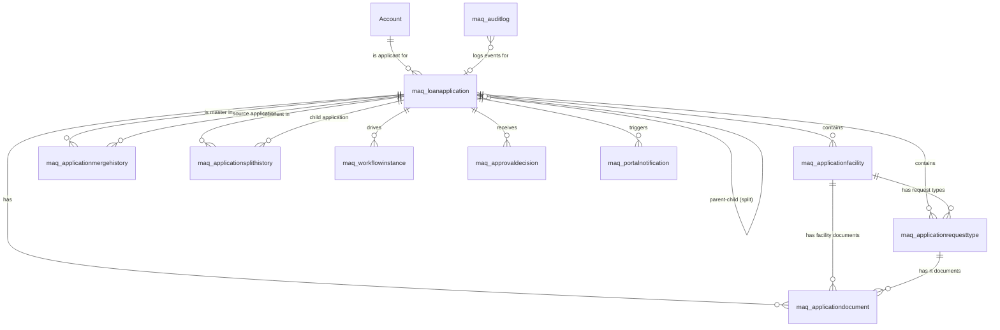
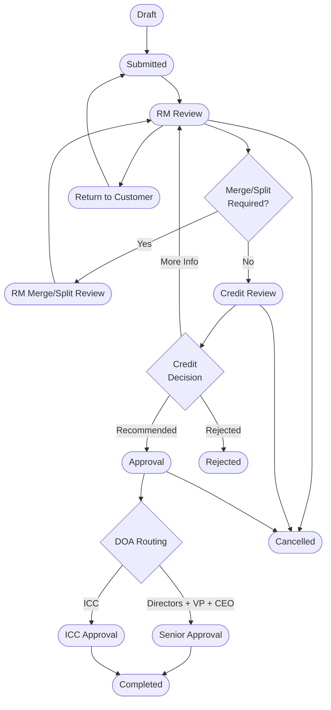

# Solution Architecture Document
## Customer Loan Portal & RM Workspace
**Architect Agent**
**Date:** 2026-05-06
**Version:** 1.1 — Revised to align with approved BRD v1.1 (Dynamics CRM on-premise, BMP module — no Dataverse / Power Automate / BPF)

---

## 1. Architecture Overview

The solution is a two-surface enterprise lending origination system:

- **Surface A — Customer Portal:** Next.js web application, internet-facing, authenticated via Azure AD B2C.
- **Surface B — RM Workspace:** Dynamics CRM on-premise custom entities, forms, JavaScript web resources, and HTML pages — internal network, authenticated via on-premise Active Directory / Windows Authentication.
- **Integration Spine:** Node.js + Fastify + Prisma backend API serving the portal and bridging to Dynamics CRM on-premise via the CRM Web API (OData endpoint) or Organization Service over a secured integration network path.

```
┌─────────────────────────────────────────────────────────────────┐
│                        CUSTOMER (Internet)                       │
│                                                                 │
│   ┌──────────────────────────────────────────────┐              │
│   │         Next.js Customer Portal               │              │
│   │    (TypeScript + Tailwind + shadcn/ui)        │              │
│   │    Auth: Azure AD B2C / MSAL.js              │              │
│   └──────────────────┬───────────────────────────┘              │
└──────────────────────┼──────────────────────────────────────────┘
                       │ HTTPS REST
                       ▼
┌─────────────────────────────────────────────────────────────────┐
│                    BACKEND API LAYER (DMZ / Cloud)               │
│                                                                 │
│   ┌──────────────────────────────────────────────┐              │
│   │       Fastify + TypeScript + Prisma           │              │
│   │       PostgreSQL (Portal Draft State)         │              │
│   │       Zod schemas on all routes              │              │
│   │       pino structured logging               │              │
│   └────────┬─────────────────────┬──────────────┘              │
│            │                     │                              │
│   Azure Blob Storage     CRM On-Prem Web API                    │
│   (Documents)            (OData / Org Service)                  │
└─────────────────────────────────────────────────────────────────┘
                                   │
                    Secured network path (VPN / private link)
                                   ▼
┌─────────────────────────────────────────────────────────────────┐
│              DYNAMICS CRM ON-PREMISE LAYER                       │
│                                                                 │
│   ┌──────────────────────────────────────────────┐              │
│   │     CRM Custom Entities + Forms               │              │
│   │     JS Web Resources (merge/split wizards)   │              │
│   │     Command Bar Buttons + Ribbon             │              │
│   │     Subgrids + Quick View Forms              │              │
│   └──────────────────┬───────────────────────────┘              │
│                      │                                           │
│   ┌──────────────────▼───────────────────────────┐              │
│   │     BMP Module (Bank's Internal Engine)       │              │
│   │     (Stage transitions, task assignments,     │              │
│   │      DOA-based approval routing,             │              │
│   │      notifications, SLA monitoring)          │              │
│   └──────────────────────────────────────────────┘              │
└─────────────────────────────────────────────────────────────────┘
                                   │
                    On-Premise Active Directory
┌─────────────────────────────────────────────────────────────────┐
│         RM / CREDIT / APPROVERS (Internal Network)               │
└─────────────────────────────────────────────────────────────────┘
```

---

## 2. Architecture Decision Records

### ADR-001: Portal Framework — Next.js
**Decision:** Next.js 15 (App Router) with TypeScript and Tailwind CSS.
**Rationale:** Constitutional default. Server-side rendering improves initial load for dashboard; App Router enables layout-level auth guards.
**Rejected alternatives:** Pure React SPA (no SSR), Power Pages (insufficient flexibility for custom wizard UX).

### ADR-002: Backend API — Fastify + Prisma + PostgreSQL
**Decision:** Node.js + Fastify v5 + Prisma v5 + PostgreSQL.
**Rationale:** Constitutional default. PostgreSQL holds portal-side draft state (drafts not yet in CRM). Dynamics CRM on-premise is the system of record post-submission.
**Note:** Two stores: PostgreSQL for draft/session state; CRM on-premise for all submitted records. This avoids polluting CRM with incomplete drafts.

### ADR-003: Dynamics CRM On-Premise as System of Record (Post-Submission)
**Decision:** Once an application is submitted, Dynamics CRM on-premise is the single source of truth. Portal reads application status from CRM via the backend API.
**Rationale:** All RM, credit, and BMP workflow happens in CRM on-premise. Dual-write would create sync complexity.

### ADR-004: Authentication Split — B2C for Portal, On-Premise AD for CRM
**Decision:** Azure AD B2C for customer-facing portal; on-premise Active Directory / Windows Authentication for CRM users.
**Rationale:** B2C supports external customer identity with MFA, SSPR, custom branding. On-premise AD manages RM/Credit/Approver access to Dynamics CRM on-premise as per existing bank infrastructure.

### ADR-005: JavaScript Web Resources for Merge/Split Wizards (Not PCF)
**Decision:** Custom HTML + JavaScript web resources hosted inside Dynamics CRM on-premise for the Merge Wizard and Split Wizard.
**Rationale:** PCF (PowerApps Component Framework) requires Dataverse/cloud deployment pipelines. For on-premise CRM, JavaScript web resources with the Xrm object model are the correct extension mechanism. Full React can be bundled into a web resource if needed.

### ADR-006: Draft State in PostgreSQL, Not CRM
**Decision:** Draft applications stored in PostgreSQL. Only submitted applications written to Dynamics CRM on-premise.
**Rationale:** CRM write operations via Organization Service carry overhead; incomplete records create noise in RM views. Draft → Submit triggers the CRM write via the integration layer.

### ADR-007: Request Type Conflict Matrix
Per CEO mandate, the following request type conflicts are enforced:

| Request Type A | Conflicts With | Reason |
|---------------|---------------|--------|
| Renewal | Rescheduling | Renewal resets terms; Rescheduling changes payment schedule — mutually exclusive on same facility |
| Renewal | Extension of Drawdown | Renewal closes current period; drawdown extension extends it |
| Limit Increase | Ownership Change | Ownership change may invalidate credit assessment backing the limit increase |
| Rescheduling | Extension of Drawdown | Both modify repayment timeline; conflicting instructions |

---

## 3. System Boundaries

| Boundary | Owner | Protocol |
|----------|-------|----------|
| Customer Browser → Next.js Portal | Frontend | HTTPS |
| Next.js Portal → Fastify API | Internal | HTTPS REST (JWT bearer) |
| Fastify API → PostgreSQL | Internal | Prisma (TCP) |
| Fastify API → CRM On-Premise Web API | Integration | HTTPS OData (service account credentials / OAuth on-prem) |
| Fastify API → Azure Blob Storage | Internal | Azure Storage SDK (SAS tokens) |
| Fastify API → Email Service | Internal | SMTP / bank email relay |
| RM Browser → CRM On-Premise | Internal | HTTPS (on-prem AD / Windows Auth) |
| CRM JS Web Resource → CRM | Internal | Xrm object model (in-process, synchronous) |
| BMP Module → CRM Entities | Internal | CRM plugin / Organisation Service (in-process) |
| BMP Module → Email / Notifications | Internal | Bank's internal notification infrastructure |

---

## 4. Dataverse Data Model

### 4.1 Entity Design Principles
- All custom entities use the `maq_` publisher prefix (matching the bank's existing CRM customisation prefix convention).
- All entities are Organisation-owned to support team-level sharing and security roles.
- Every entity includes: `createdon`, `createdby`, `modifiedon`, `modifiedby` (Dynamics CRM standard audit fields).
- All primary keys are CRM GUIDs (uniqueidentifier). No integer primary keys.
- Entities are deployed on-premise as part of the bank's Dynamics CRM solution; no Dataverse or cloud deployment.

### 4.2 Entity Definitions

#### 4.2.1 maq_loanapplication (Loan Application)
| Field | Logical Name | Type | Notes |
|-------|-------------|------|-------|
| Application ID (PK) | maq_loanapplicationid | Unique Identifier | Auto-generated GUID |
| Reference Number | maq_referencenumber | Text (50) | Format: APP-YYYYMMDD-NNNN; auto-generated |
| Customer | maq_customerid | Lookup (Account) | Required |
| Status | maq_status | Option Set | Draft, Submitted, RM Review, Merge/Split Review, Credit Review, Approval, CAD Review, Documentation, Facility Creation, Disbursement, Completed, Rejected, Cancelled, Merged, Branched |
| Total Facilities Count | maq_totalfacilities | Whole Number | Calculated |
| Total Amount Requested | maq_totalamount | Currency | Calculated |
| Submitted Date | maq_submitteddate | DateTime | Set on submit |
| Assigned RM | maq_assignedrmid | Lookup (SystemUser) | Auto-assigned by territory |
| Parent Application | maq_parentapplicationid | Lookup (maq_loanapplication) | Set on split (child points to parent) |
| Is Master (Merge) | maq_ismaster | Boolean | True if this is the merge master |
| Merge/Split Type | maq_mergesplittype | Option Set | None, Merged Into, Split From, Master |
| Customer Remarks | maq_customerremarks | Multiline Text | |
| Draft Data (JSON) | maq_draftdata | Multiline Text | Portal draft state; cleared on submit |
| Workflow Stage | maq_workflowstage | Text | Current BPF stage name |
| Priority | maq_priority | Option Set | Standard, High, Urgent |

**Relationships:**
- Many → 1: Account (Customer)
- 1 → Many: maq_applicationfacility
- 1 → Many: maq_applicationrequesttype
- 1 → Many: maq_applicationdocument
- 1 → Many: maq_applicationmergehistory (as master)
- 1 → Many: maq_applicationsplithistory (as parent or child)
- Self-referential: maq_parentapplicationid

**Security Roles:**
- RM: Read/Write/Append (own team records, Business Unit scope)
- Credit: Read/Append (assigned records at credit stage, Organisation scope read)
- Approver: Read/Append (assigned records at approval stage)
- Portal Integration Service Account: Create/Read (restricted to own customer's records via server-side filtering)

---

#### 4.2.2 maq_applicationfacility (Application Facility)
| Field | Logical Name | Type | Notes |
|-------|-------------|------|-------|
| Facility Line ID (PK) | maq_applicationfacilityid | Unique Identifier | |
| Application | maq_applicationid | Lookup (maq_loanapplication) | Required |
| Facility Type | maq_facilitytype | Option Set | Existing, New |
| Existing Facility Reference | maq_existingfacilityref | Text | CIF + Facility code |
| Facility Name | maq_facilityname | Text (100) | |
| Product Type | maq_producttype | Option Set | Term Loan, Overdraft, LC, LG, Trade Finance, Revolving, etc. |
| Currency | maq_currency | Option Set | PKR, USD, EUR, GBP, etc. |
| Current Limit | maq_currentlimit | Currency | Pulled from existing facility data |
| Requested Amount | maq_requestedamount | Currency | |
| Tenor (Months) | maq_tenor | Whole Number | |
| Purpose | maq_purpose | Multiline Text | |
| Expiry Date | maq_expirydate | Date | |
| Line Sequence | maq_linesequence | Whole Number | Ordering within application |

---

#### 4.2.3 maq_applicationrequesttype (Application Request Type)
| Field | Logical Name | Type | Notes |
|-------|-------------|------|-------|
| Request Type ID (PK) | maq_applicationrequesttypeid | Unique Identifier | |
| Application | maq_applicationid | Lookup (maq_loanapplication) | Required |
| Facility Line | maq_applicationfacilityid | Lookup (maq_applicationfacility) | Required |
| Request Type | maq_requesttype | Option Set | New Facility, Renewal, Limit Increase, Rescheduling, Extension of Drawdown, Ownership Change, Facility Amendment |
| Status | maq_status | Option Set | Pending, In Review, Approved, Rejected |
| Amount Requested | maq_amountrequested | Currency | Request-type-specific amount |
| Customer Remarks | maq_customerremarks | Multiline Text | |
| RM Notes | maq_rmnotes | Multiline Text | |
| Is Conflict Flagged | maq_isconflictflagged | Boolean | Set by validation engine |
| Conflict Reason | maq_conflictreason | Text | |

**Business Rule:** Duplicate prevention — no two records with same maq_applicationid + maq_applicationfacilityid + maq_requesttype combination.

---

#### 4.2.4 maq_applicationdocument (Application Document)
| Field | Logical Name | Type | Notes |
|-------|-------------|------|-------|
| Document ID (PK) | maq_applicationdocumentid | Unique Identifier | |
| Application | maq_applicationid | Lookup (maq_loanapplication) | Required |
| Facility Line | maq_applicationfacilityid | Lookup (maq_applicationfacility) | Optional (some docs are app-level) |
| Request Type | maq_applicationrequesttypeid | Lookup (maq_applicationrequesttype) | Optional |
| Document Type | maq_documenttype | Option Set | Financial Statements, KYC, Property Documents, Board Resolution, Trade Documents, Other |
| Document Name | maq_documentname | Text (200) | Original filename |
| Blob Storage URL | maq_blobstorageurl | Text (500) | Azure Blob SAS URL (short-lived) |
| Blob Storage Path | maq_blobstoragepath | Text (500) | Permanent path (container/path) |
| File Size (KB) | maq_filesizekb | Whole Number | |
| MIME Type | maq_mimetype | Text (100) | |
| Is Required | maq_isrequired | Boolean | Driven by document checklist config |
| Upload Status | maq_uploadstatus | Option Set | Pending, Uploaded, Verified, Rejected |
| Uploaded By (Portal) | maq_uploadedbyportal | Text | Customer portal user email |

---

#### 4.2.5 maq_applicationmergehistory (Merge History)
| Field | Logical Name | Type | Notes |
|-------|-------------|------|-------|
| Merge History ID (PK) | maq_applicationmergehistoryid | Unique Identifier | |
| Master Application | maq_masterapplicationid | Lookup (maq_loanapplication) | Required |
| Source Application | maq_sourceapplicationid | Lookup (maq_loanapplication) | Required |
| Merged By | maq_mergedby | Lookup (SystemUser) | Required |
| Merged On | maq_mergedon | DateTime | Required |
| Merge Notes | maq_mergenotes | Multiline Text | |
| Facilities Moved | maq_facilitiesmovedcount | Whole Number | |
| Request Types Moved | maq_requesttypesmovedcount | Whole Number | |

**Business Rule:** Append-only — no update or delete.

---

#### 4.2.6 maq_applicationsplithistory (Split History)
| Field | Logical Name | Type | Notes |
|-------|-------------|------|-------|
| Split History ID (PK) | maq_applicationsplithistoryid | Unique Identifier | |
| Parent Application | maq_parentapplicationid | Lookup (maq_loanapplication) | Required |
| Child Application | maq_childapplicationid | Lookup (maq_loanapplication) | Required |
| Split By | maq_splitby | Lookup (SystemUser) | Required |
| Split On | maq_spliton | DateTime | Required |
| Facilities Moved | maq_facilitiesmoved | Multiline Text | JSON array of moved facility IDs |
| Request Types Moved | maq_requesttypesmoved | Multiline Text | JSON array of moved request type IDs |
| Split Reason | maq_splitreason | Multiline Text | |

**Business Rule:** Append-only — no update or delete.

---

#### 4.2.7 maq_auditlog (Audit Log)
| Field | Logical Name | Type | Notes |
|-------|-------------|------|-------|
| Audit Log ID (PK) | maq_auditlogid | Unique Identifier | |
| Entity Name | maq_entityname | Text (100) | Table logical name |
| Record ID | maq_recordid | Text (100) | GUID of the record changed |
| Action Type | maq_actiontype | Option Set | Create, Update, Delete, StatusChange, MergeInitiated, MergeCompleted, SplitInitiated, SplitCompleted, WorkflowAdvanced, ApprovalDecision |
| Actor User ID | maq_actoruserid | Text | Azure AD Object ID |
| Actor Name | maq_actorname | Text (200) | Display name |
| Actor Source | maq_actorsource | Option Set | Portal, CRM, PowerAutomate, System |
| Timestamp | maq_timestamp | DateTime | UTC |
| Old Value | maq_oldvalue | Multiline Text | JSON |
| New Value | maq_newvalue | Multiline Text | JSON |
| Correlation ID | maq_correlationid | Text (100) | For cross-system tracing |
| Description | maq_description | Multiline Text | Human-readable summary |

**Security:** Read-only for all roles. Create by service accounts only.

---

#### 4.2.8 maq_portalnotification (Portal Notification)
| Field | Logical Name | Type | Notes |
|-------|-------------|------|-------|
| Notification ID (PK) | maq_portalnotificationid | Unique Identifier | |
| Customer | maq_customerid | Lookup (Account) | Required |
| Application | maq_applicationid | Lookup (maq_loanapplication) | |
| Title | maq_title | Text (200) | |
| Message | maq_message | Multiline Text | |
| Notification Type | maq_notificationtype | Option Set | StatusChange, ActionRequired, DocumentRequired, Decision |
| Is Read | maq_isread | Boolean | Default: false |
| Read On | maq_readon | DateTime | |
| Channel | maq_channel | Option Set | InPortal, Email, Both |
| Sent On | maq_senton | DateTime | |

---

#### 4.2.9 maq_workflowinstance (Workflow Instance)
| Field | Logical Name | Type | Notes |
|-------|-------------|------|-------|
| Workflow Instance ID (PK) | maq_workflowinstanceid | Unique Identifier | |
| Application | maq_applicationid | Lookup (maq_loanapplication) | Required |
| Current Stage | maq_currentstage | Option Set | All workflow stages |
| Stage Entered On | maq_stageenteredon | DateTime | |
| Stage Owner | maq_stageownerid | Lookup (SystemUser) | |
| SLA Due Date | maq_sladuedate | DateTime | |
| Is SLA Breached | maq_isslabreached | Boolean | |
| BPF Instance ID | maq_bpfinstanceid | Text | Dataverse BPF process ID |

---

#### 4.2.10 maq_approvaldecision (Approval Decision)
| Field | Logical Name | Type | Notes |
|-------|-------------|------|-------|
| Decision ID (PK) | maq_approvaldecisionid | Unique Identifier | |
| Application | maq_applicationid | Lookup (maq_loanapplication) | |
| Decision Stage | maq_decisionstage | Option Set | RM, Credit, CAD, FinalApproval |
| Decision | maq_decision | Option Set | Approved, Rejected, ReturnedForRevision, Escalated |
| Decided By | maq_decidedbyid | Lookup (SystemUser) | |
| Decided On | maq_decidedon | DateTime | |
| Conditions | maq_conditions | Multiline Text | Approval conditions if any |
| Rejection Reason | maq_rejectionreason | Multiline Text | |

---

## 5. ERD Diagram



---

## 6. API Architecture

### 6.1 API Design Principles
- REST over HTTPS, OpenAPI 3.0 specification.
- All routes protected by JWT bearer token (Azure AD / B2C).
- Zod validation schemas on all request bodies and query params.
- Standard error envelope: `{ success: false, code: string, message: string, details?: unknown }`.
- Standard success envelope: `{ success: true, data: T, meta?: { total, page, pageSize } }`.
- Idempotency headers required on POST/PUT.

### 6.2 Route Table

| Method | Path | Service | Auth | Description |
|--------|------|---------|------|-------------|
| GET | /health | System | None | Health check |
| GET | /api/v1/facilities | FacilityService | Customer JWT | Get customer facilities from Dataverse |
| POST | /api/v1/applications/draft | ApplicationService | Customer JWT | Create draft (PostgreSQL) |
| PUT | /api/v1/applications/:id | ApplicationService | Customer JWT | Update draft |
| POST | /api/v1/applications/:id/submit | ApplicationService | Customer JWT | Submit → write to Dataverse |
| POST | /api/v1/applications/:id/documents | DocumentService | Customer JWT | Upload document to Azure Blob |
| GET | /api/v1/applications/:id/status | ApplicationService | Customer JWT | Get status from Dataverse |
| POST | /api/v1/applications/merge | MergeService | RM JWT | Merge applications |
| POST | /api/v1/applications/:id/split | SplitService | RM JWT | Split application |
| GET | /api/v1/rm/dashboard | RMService | RM JWT | RM dashboard summary |
| POST | /api/v1/applications/:id/validate | ValidationService | Customer JWT | Validate before submit |
| GET | /api/v1/applications/:id/workflow | WorkflowService | Customer/RM JWT | Get workflow status |
| GET | /api/v1/applications | ApplicationService | Customer JWT | List customer applications |
| GET | /api/v1/notifications | NotificationService | Customer JWT | Get portal notifications |
| PUT | /api/v1/notifications/:id/read | NotificationService | Customer JWT | Mark notification read |

---

## 7. Workflow Design

### 7.1 Stage Diagram



### 7.2 Stage Transition Rules

All stage transitions are managed by the bank's internal **BMP (Business Process Management) configurable module** on Dynamics CRM on-premise. No Power Automate flows are used.

| From Stage | To Stage | Trigger | Actor | BMP Module Action |
|-----------|---------|---------|-------|-------------------|
| Draft | Submitted | Customer submits via portal | Portal (API write) | BMP creates RM Review task; sends notification to assigned RM |
| Submitted | RM Review | RM opens and claims application | RM | BMP sends customer acknowledgment notification |
| RM Review | RM Merge/Split Review | RM initiates merge/split | RM | BMP locks application; notifies RM of pending merge/split |
| RM Merge/Split Review | RM Review | Merge/Split operation completes | System | BMP unlocks application; returns to RM Review stage |
| RM Review | Return to Customer | RM returns application | RM | BMP notifies customer via portal notification and email |
| RM Review | Credit Review | RM submits to credit | RM | BMP creates Credit Analyst task; notifies credit team |
| Credit Review | Approval | Credit recommends approval | Credit Analyst | BMP routes to Credit Manager for sign-off |
| Credit Manager | DOA Routing | Credit Manager approves | Credit Manager | BMP evaluates DOA rules (amount + request type) → routes to Directors+VP+CEO or ICC |
| Approval | Completed | Final approver approves | Director/ICC | BMP marks application completed; notifies RM and customer |
| Any (except Final) | Rejected | Credit/Approver rejects | Credit/Approver | BMP sends rejection notification with reason to RM and customer |
| Any (except Final) | Cancelled | RM/Credit cancels | RM/Credit | BMP sends cancellation notification to customer |

**Note:** Optional stages FFD, Technical, and EPD are configured as skippable steps in the BMP module. The BMP module determines routing based on DOA configuration — no hard-coding in application code.

---

## 8. Merge Algorithm

```
FUNCTION MergeApplications(masterAppId, sourceAppIds[], performedByUserId):

  1. VALIDATE — All applications exist and belong to same customer
  2. VALIDATE — All applications in eligible status (Submitted, RM Review)
  3. VALIDATE — No active non-reversible workflow tasks on any application
  4. FOR EACH sourceApp IN sourceAppIds:
       FOR EACH facility IN sourceApp.facilities:
         VALIDATE — No duplicate (masterApp.facilities already has same facility + same request type)
  5. BEGIN TRANSACTION
     FOR EACH sourceApp IN sourceAppIds:
       FOR EACH facility IN sourceApp.facilities:
         facility.applicationId = masterAppId
         SAVE facility
       FOR EACH requestType IN sourceApp.requestTypes:
         requestType.applicationId = masterAppId
         SAVE requestType
       FOR EACH document IN sourceApp.documents:
         document.applicationId = masterAppId
         SAVE document
       sourceApp.status = "Merged"
       sourceApp.mergedIntoApplicationId = masterAppId
       SAVE sourceApp
       CREATE MergeHistory(master=masterAppId, source=sourceApp.id, by=performedByUserId)
       WRITE AuditLog(action=MergeCompleted, ...)
  6. Recalculate masterApp totals (facility count, total amount)
  7. Reset masterApp workflow to "RM Review" stage
  8. COMMIT TRANSACTION
  9. Trigger PA-005: Notify RM of completed merge
```

---

## 9. Split Algorithm

```
FUNCTION SplitApplication(parentAppId, selectedFacilityIds[], selectedRequestTypeIds[], performedByUserId):

  1. VALIDATE — parentApp exists
  2. VALIDATE — parentApp status NOT in [Approved, Disbursement, Completed, Rejected, Cancelled]
  3. VALIDATE — performedBy has Split privilege in Dataverse
  4. VALIDATE — selectedFacilityIds.length >= 1
  5. VALIDATE — parentApp.facilities.length - selectedFacilityIds.length >= 1 (at least one remains)
  6. FOR EACH facilityId IN selectedFacilityIds:
       VALIDATE — No non-reversible workflow task on this facility
  7. BEGIN TRANSACTION
  8. childRefNumber = parentApp.referenceNumber + "-B" + GetNextBranchSequence(parentAppId)
  9. CREATE childApp:
       referencenumber = childRefNumber
       customerid = parentApp.customerid
       status = "Submitted"
       parentapplicationid = parentAppId
       mergesplittype = "Split From"
       assignedrmid = parentApp.assignedrmid
  10. FOR EACH facilityId IN selectedFacilityIds:
        facility.applicationId = childApp.id
        SAVE facility
  11. FOR EACH requestTypeId IN selectedRequestTypeIds:
        requestType.applicationId = childApp.id
        SAVE requestType
  12. FOR EACH document WHERE document.facilityId IN selectedFacilityIds:
        document.applicationId = childApp.id
        SAVE document
  13. parentApp.mergesplittype = "Branched"
  14. Recalculate parentApp and childApp totals
  15. CREATE SplitHistory(parent=parentAppId, child=childApp.id, by=performedByUserId)
  16. WRITE AuditLog(action=SplitCompleted, ...)
  17. Reset childApp workflow to "Submitted"
  18. COMMIT TRANSACTION
  19. Trigger PA-001 for childApp (new submission notification)
```

---

## 10. Security Model

### 10.1 Dynamics CRM On-Premise Security Roles

| Role | Loan Application | Facility | Request Type | Document | Merge History | Split History | Audit Log | Approval Decision |
|------|-----------------|----------|-------------|----------|--------------|--------------|-----------|------------------|
| RM | Read/Write (BU scope) | Read/Write | Read/Write | Read/Write | Read/Create | Read/Create | Read | Read |
| FFD / Technical / EPD Officer | Read (assigned) | Read | Read | Read | Read | Read | Read | Read/Create |
| Credit Analyst | Read (assigned) | Read | Read/Write | Read | Read | Read | Read | Read/Create |
| Credit Manager | Read (org scope) | Read | Read | Read | Read | Read | Read | Read/Create |
| Credit Director / BFD Director / VP / CEO | Read (org scope) | Read | Read | Read | Read | Read | Read | Read/Create |
| ICC Member | Read (org scope) | Read | Read | Read | Read | Read | Read | Read/Create |
| Admin | Full | Full | Full | Full | Full | Full | Full | Full |
| Portal Integration Service Account | Read/Create (filtered by CIF) | Read/Create | Read/Create | Read/Create | None | None | Create | None |

### 10.2 Field-Level Security (CRM On-Premise Field Security Profiles)

| Field | Restricted To |
|-------|--------------|
| maq_rmnotes on request type | RM, Credit, Admin |
| maq_approvaldecision.conditions | Approver roles, Credit, Admin |
| maq_approvaldecision.rejectionreason | RM, Credit, Admin (not exposed to customer portal) |
| Customer financial exposure fields | Credit, RM, Admin |
| DOA threshold fields | Admin only |

### 10.3 Segregation of Duties

- RM who submitted application to credit cannot be the credit approver (enforced by BMP module role check).
- Merge/split actions gated by a custom CRM privilege `maq_CanMergeSplit` assigned only to the RM security role.
- Final approval requires role membership in one of: Credit Director, BFD Director, VP, CEO, or ICC — configured in the BMP DOA module.
- Portal integration service account has no delete privilege on any entity.

### 10.4 Portal Security

- Azure AD B2C: OAuth 2.0 authorization code flow with PKCE.
- API validates JWT on every request; extracts customer CIF from B2C claims.
- All CRM queries from the backend are filtered server-side by customer CIF — no cross-customer data leakage possible.
- Rate limiting: 100 requests/minute per customer token.
- Document SAS URLs expire after 15 minutes.
- Backend API communicates with CRM on-premise over a secured internal network path (VPN or private link); CRM is never directly internet-accessible.

---

## 11. Infrastructure & DevOps

### 11.1 Infrastructure Services

| Service | Location | Use |
|---------|----------|-----|
| Azure App Service (Premium v3) | Cloud | Host Next.js customer portal |
| Azure Container Apps | Cloud | Host Fastify backend API (containerised) |
| Azure Database for PostgreSQL Flexible Server | Cloud | Portal draft application state |
| **Dynamics CRM On-Premise** | On-Premise (bank DC) | System of record for all submitted applications, RM workspace, BMP workflow |
| Azure Blob Storage | Cloud | Customer document storage (portal uploads) |
| Azure AD B2C | Cloud | Customer portal authentication |
| On-Premise Active Directory | On-Premise | CRM user authentication (RM, Credit, Approvers) |
| Bank Email Relay / SMTP | On-Premise / Bank infra | CRM and BMP notifications |
| Azure Key Vault | Cloud | Secrets for portal and API (CRM credentials, Blob keys, B2C config) |
| Azure Application Insights | Cloud | APM, structured logging, and alerts for portal and API |
| Azure CDN | Cloud | Static asset delivery for customer portal |
| VPN / Private Link / ExpressRoute | Network | Secured connectivity between cloud API layer and on-premise CRM |

### 11.2 CI/CD Pipeline (GitHub Actions)

```
Push → Lint → Type Check → Unit Tests → Build →
Integration Tests → Docker Build → Push to ACR →
Deploy to Staging → E2E Tests (Playwright) →
Manual Approval Gate → Deploy to Production
```

### 11.3 Environments

| Environment | Purpose | Data |
|------------|---------|------|
| Development | Developer local + sandbox D365 | Synthetic |
| Staging | Integration + UAT | Masked production copy |
| Production | Live | Real |

---

## 12. Portal Screen Architecture

### 12.1 Next.js App Router Structure

```
app/
  (auth)/
    login/page.tsx          — Azure AD B2C login redirect
    callback/page.tsx       — Auth callback handler
  (portal)/
    layout.tsx              — Authenticated layout with sidebar nav
    dashboard/page.tsx      — Customer dashboard
    applications/
      new/page.tsx          — Start new application
      [id]/page.tsx         — Application detail / tracking
      [id]/edit/page.tsx    — Edit draft application
    notifications/page.tsx  — Notification list
  api/                      — Next.js route handlers (BFF layer)
components/
  application/
    ApplicationWizard.tsx   — Multi-step wizard orchestrator
    StepFacilitySelection.tsx
    StepRequestTypes.tsx
    StepDocumentUpload.tsx
    StepReviewSubmit.tsx
  dashboard/
    FacilityCard.tsx
    ApplicationStatusCard.tsx
    StatusTimeline.tsx
  shared/
    StatusBadge.tsx
    DocumentUploadZone.tsx  — react-dropzone wrapper
    NotificationBell.tsx
```

### 12.2 RM Workspace (Dynamics CRM On-Premise) Structure

```
CRM Solution: MaqsadLoanOrigination (maq_)

  Custom Entities (main views + forms):
    - maq_loanapplication (main grid + main form)
    - maq_applicationfacility (related subgrid on loan application form)
    - maq_applicationrequesttype (related subgrid — multiselect per facility)
    - maq_applicationdocument (related subgrid)
    - maq_applicationmergehistory (related subgrid)
    - maq_applicationsplithistory (related subgrid)
    - maq_approvaldecision (related subgrid)
    - maq_auditlog (related subgrid — read-only)

  BMP Module Integration:
    - Workflow stages managed by BMP: Submitted → RM Review → 
      RM Merge/Split Review → Credit Review → Approval → 
      Completed / Rejected / Cancelled
    - DOA-based routing (FFD/Technical/EPD optional → Credit → 
      Credit Manager → Directors+VP+CEO or ICC) configured in BMP

  Ribbon / Command Bar Buttons (CRM Ribbon Workbench):
    - Review Application
    - Merge Applications (opens JS web resource Merge Wizard dialog)
    - Split/Branch Application (opens JS web resource Split Wizard dialog)
    - Request More Information
    - Submit to Credit
    - Return to Customer
    - Cancel Application

  JavaScript Web Resources (replacing PCF — on-prem compatible):
    - maq_mergewizard.html: Multi-app comparison + merge execution dialog
    - maq_splitwizard.html: Facility/request type selection + split dialog
    - maq_customerexposure.html: Customer 360 financial summary panel
    - maq_applicationtimeline.html: Visual audit timeline
    - maq_application.js: Main form logic (field validation, ribbon enable rules)
    - maq_facilitygrid.js: Facility subgrid event handlers
```

---

*Architecture Document v1.1 — Revised for Dynamics CRM on-premise. Approved for Build Phase.*
