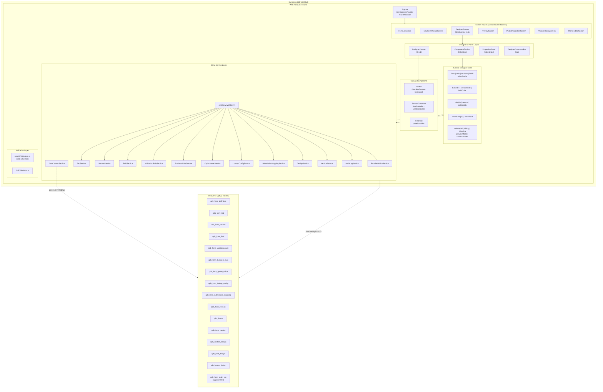
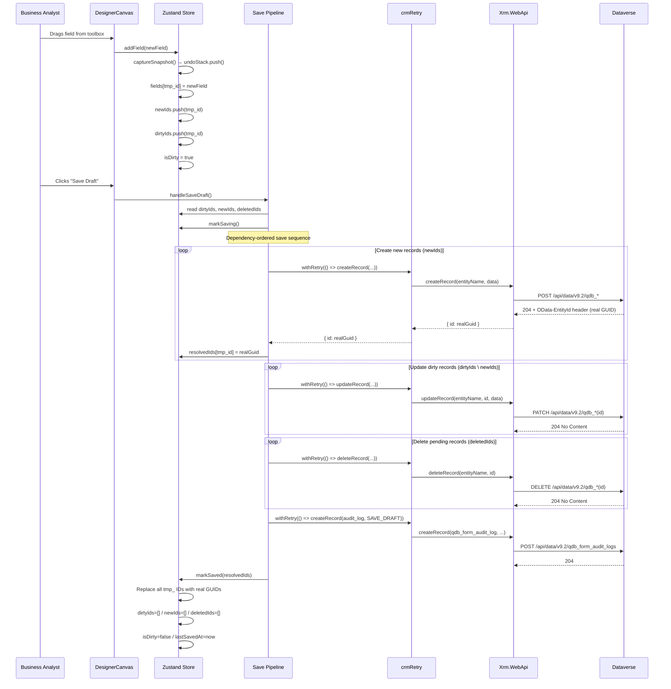

═══════════════════════════════════════════════════
SOLUTION ARCHITECTURE — PHASE 3
═══════════════════════════════════════════════════
Project:        Dynamics CRM Web Resource — Drag-and-Drop Form Designer
Document:       phase-3-arch.md  (supersedes phase-2-arch.md)
Prepared by:    Architect — Maqsad AI
Date:           2026-05-18
Version:        2.0
Status:         FINAL — CEO Build Approval Issued
Project Code:   FDWR-001
═══════════════════════════════════════════════════


SYSTEM OVERVIEW
───────────────
The Form Designer is a pure client-side React 18 application bundled as a single
Dynamics CRM Web Resource and delivered inside the CRM UCI iframe. It communicates
exclusively with Dataverse through Xrm.WebApi, writing configuration records into 16
pre-provisioned qdb_* tables that are consumed by the separate Dynamic Form Engine
portal renderer. The application follows a flat Zustand store with Immer-based
snapshot undo/redo, a dependency-ordered sequential save pipeline, and diff-only
writes on every edit session to minimise API call volume.


COMPONENT DIAGRAM
─────────────────

```
┌─────────────────────────────────────────────────────────────────────────────┐
│                         Dynamics 365 UCI Shell                              │
│  ┌──────────────────────────────────────────────────────────────────────┐  │
│  │                      Web Resource iframe                              │  │
│  │                                                                       │  │
│  │  ┌──────────────────────────────────────────────────────────────┐   │  │
│  │  │                 DesignerCommandBar (top)                      │   │  │
│  │  │  [Back] [FormName + Status Badge + Dirty Dot] [Undo][Redo]   │   │  │
│  │  │  [Preview] [Version History]    [Save Draft] [Publish]       │   │  │
│  │  └──────────────────────────────────────────────────────────────┘   │  │
│  │                                                                       │  │
│  │  ┌──────────┐  ┌─────────────────────────────┐  ┌──────────────┐   │  │
│  │  │Component │  │      DesignerCanvas          │  │  Properties  │   │  │
│  │  │ Toolbox  │  │  ┌──────────────────────┐   │  │    Panel     │   │  │
│  │  │ (260px)  │  │  │   TabBar (sortable)  │   │  │  (320px)     │   │  │
│  │  │          │  │  └──────────────────────┘   │  │              │   │  │
│  │  │ Basic    │  │  ┌──────────────────────┐   │  │ FormProps    │   │  │
│  │  │ Fields   │  │  │ SectionContainer     │   │  │ TabProps     │   │  │
│  │  │          │  │  │  (useSortable +      │   │  │ SectionProps │   │  │
│  │  │ Layout   │  │  │   useDroppable)      │   │  │ FieldProps   │   │  │
│  │  │          │  │  │  ┌──────────────┐   │   │  │  └─ Type-    │   │  │
│  │  │ Advanced │  │  │  │  FieldSlot   │   │   │  │     specific │   │  │
│  │  │ (lazy)   │  │  │  │ (useSortable)│   │   │  │     panels   │   │  │
│  │  │          │  │  │  └──────────────┘   │   │  │              │   │  │
│  │  └──────────┘  │  └──────────────────────┘   │  └──────────────┘   │  │
│  │                └─────────────────────────────┘                       │  │
│  │                                                                       │  │
│  │  ┌────────────────────────────────────────────────────────────────┐  │  │
│  │  │                    Zustand Designer Store                      │  │  │
│  │  │  form | tabs | sections | fields | rules | style               │  │  │
│  │  │  tabOrder | sectionOrder | fieldOrder                          │  │  │
│  │  │  dirtyIds | newIds | deletedIds                                │  │  │
│  │  │  undoStack[50] | redoStack | selectedId | isDirty              │  │  │
│  │  └────────────────────────────────────────────────────────────────┘  │  │
│  │                                                                       │  │
│  │  ┌────────────────────────────────────────────────────────────────┐  │  │
│  │  │                    CRM Service Layer                           │  │  │
│  │  │  FormDefinitionService  TabService      SectionService         │  │  │
│  │  │  FieldService           ValidationRuleService                  │  │  │
│  │  │  BusinessRuleService    OptionValueService  LookupConfigService│  │  │
│  │  │  SubmissionMappingService  DesignService  VersionService        │  │  │
│  │  │  AuditLogService        CrmContextService                      │  │  │
│  │  │  crmRetry (withRetry — exponential backoff, max 3)            │  │  │
│  │  └────────────────────────────────────────────────────────────────┘  │  │
│  │                      ↕ parent.Xrm.WebApi                             │  │
│  └──────────────────────────────────────────────────────────────────────┘  │
│                         ↕ Dataverse OData v9.2                              │
│  ┌──────────────────────────────────────────────────────────────────────┐  │
│  │  qdb_form_definition  qdb_form_tab       qdb_form_section            │  │
│  │  qdb_form_field       qdb_form_validation_rule                       │  │
│  │  qdb_form_business_rule  qdb_form_option_value                       │  │
│  │  qdb_form_lookup_config  qdb_form_submission_mapping                 │  │
│  │  qdb_form_version     qdb_theme          qdb_form_design             │  │
│  │  qdb_section_design   qdb_field_design   qdb_button_design           │  │
│  │  qdb_form_audit_log (append-only, 7-year retention)                  │  │
│  └──────────────────────────────────────────────────────────────────────┘  │
└─────────────────────────────────────────────────────────────────────────────┘
```

Screens (navigated by Zustand currentScreen, no React Router):
  form-list            FormListScreen        — paginated form list, CRUD actions
  new-form-wizard      NewFormWizardScreen   — 5-step guided creation
  designer             DesignerScreen        — DndContext, 3-panel layout
  theme-editor         ThemeEditorScreen     — live theme / style editing
  rule-config          RuleConfigScreen      — business rule builder (lazy)
  option-set-editor    OptionSetEditorScreen — inline option management (lazy)
  lookup-config        LookupConfigScreen    — lookup entity config (lazy)
  preview              PreviewScreen         — local simulation renderer
  publish-validation   PublishValidationScreen — pre-publish checklist
  version-history      VersionHistoryScreen  — version list / restore


TECHNOLOGY STACK
────────────────

| Layer                | Technology                              | Reason / ADR reference                        |
|----------------------|-----------------------------------------|-----------------------------------------------|
| UI Framework         | React 18.3 + TypeScript 5.5 (strict)    | Constitution default; concurrent rendering    |
| Component Library    | @fluentui/react-components v9.46        | Power Platform–native; Microsoft-maintained   |
| Drag and Drop        | @dnd-kit/core 6.1 + @dnd-kit/sortable   | ADR-002; 16k stars; TypeScript-first          |
| State Management     | Zustand 4.5                             | ADR-003; single-store, no action boilerplate  |
| Immutable Mutation   | Immer 10.1 (produce)                    | ADR-004; structural sharing for undo snapshots|
| Runtime Validation   | Zod 3.23                                | Constitution Article III; publish checklist   |
| Bundler              | Vite 5.4                                | ADR-005; rollup chunk split; size budgeting   |
| Testing              | Vitest 2.1 + React Testing Library 16   | Constitution default; jsdom environment       |
| CRM API              | Xrm.WebApi v9.0 (UCI)                   | Constitution Article XI; no direct OData      |
| No backend server    | N/A                                     | ADR-001; web resource constraint              |


ARCHITECTURE DECISION RECORDS
──────────────────────────────

ADR-001: Client-Side Only — No Server Component
  Status:   Accepted
  Date:     2026-05-18
  Context:  CRM web resources are static HTML/JS/CSS assets served by the CRM
            server itself. There is no facility to co-deploy a Node.js service.
            The constitution default (Node.js + Fastify) does not apply.
  Decision: The web resource is a pure client-side SPA. All persistence goes
            through Xrm.WebApi. No external server, CDN, or backend API is used.
  Consequences: No server-side logic, no background jobs, no server-side caching.
            All work must complete within the browser session. This is a hard
            platform constraint, not a design preference.

ADR-002: dnd-kit over React DnD / HTML5 Native DnD
  Status:   Accepted
  Date:     2026-05-18
  Context:  The designer requires cross-container drag (toolbox to canvas) and
            multi-level sortable drag (tabs, sections within tabs, fields within
            sections). React DnD uses HTML5 DnD which lacks pointer-event
            precision and does not support iOS/mobile. Native HTML5 DnD has
            no sortable context API.
  Decision: @dnd-kit/core + @dnd-kit/sortable. 16,000+ GitHub stars, MIT licence,
            TypeScript-first, pointer sensor for 60fps drag, keyboard sensor for
            WCAG 2.1 AA compliance, DragOverlay for accessible drag previews.
  Consequences: Nested DndContext is not supported; all four drag zones (tabs,
            sections, fields, toolbox-to-canvas) share one root DndContext with a
            custom collision detection strategy. See Drag-and-Drop Architecture.

ADR-003: Zustand over Redux / React Context
  Status:   Accepted
  Date:     2026-05-18
  Context:  The designer state is a single large, deeply nested tree that
            receives fine-grained updates on every drag event (50+ field
            re-renders per drag operation). Redux adds action/reducer boilerplate
            without architectural benefit for a single-screen application.
            React Context causes full subtree re-renders on every state change.
  Decision: Zustand 4 with granular selector subscriptions. Each canvas component
            subscribes only to the slice of state it needs, preventing unnecessary
            re-renders.
  Consequences: No Redux DevTools out of the box (Zustand DevTools middleware is
            available but not bundled to save space). State shape is tested
            directly via store selectors in Vitest.

ADR-004: Immer produce() for Undo/Redo Snapshots
  Status:   Accepted
  Date:     2026-05-18
  Context:  50 undo snapshots of a deeply nested form state (up to 1,000 fields)
            must be stored in memory without deep-cloning the entire tree on every
            mutation, as that would be prohibitively expensive.
  Decision: Immer's produce() is used for all state mutations. Immer creates
            structurally shared snapshots — unchanged subtrees share references —
            so 50 snapshots of a 50-field form consume approximately 2–4MB, which
            is acceptable for a desktop browser session.
  Consequences: All Zustand mutations must use produce() wrappers. Direct object
            mutation outside produce is prohibited. The undo stack stores complete
            snapshots of the mutable portion of state (tabs, sections, fields,
            rules, and all three ordering arrays) — not event-sourced deltas.

ADR-005: Vite 5 over Webpack 5
  Status:   Accepted
  Date:     2026-05-18
  Context:  The web resource bundle must not exceed 5MB (CRM platform limit) and
            must be split into cacheable chunks. Webpack 5's output is harder to
            configure for rollup-style chunk splitting. Vite's --reporter flag
            gives per-chunk size output that is trivially parseable by a CI size
            budget script.
  Decision: Vite 5 with rollup output. Manual chunk split: vendor-react,
            vendor-fluent, vendor-dnd, vendor-state. Lazy chunks for advanced
            panel, rule config, theme editor, version history.
  Consequences: The CRM solution package must include all chunk files as separate
            web resources under qdb_/form-designer/assets/. The index.html must
            reference them with correct relative paths. CI script
            scripts/checkBundleSize.js sums all .js/.css artifacts and fails
            the build if the total exceeds 4MB.

ADR-006: Local Simulation for Preview Mode (not embedded iframe)
  Status:   Accepted
  Date:     2026-05-18
  Context:  CEO Condition C-004 requires a decision between (a) embedding the live
            portal renderer in an iframe or (b) rendering locally from Zustand state.
            Option (a) requires the portal renderer URL to be known at build time or
            configured at runtime. Hardcoding URLs violates Article V (No Hardcoding).
            Runtime configuration would require a CRM record to store the URL,
            adding a deployment step and an ongoing coupling risk.
  Decision: Option (b) — local lightweight simulation reads the DesignerFormModel
            directly from the Zustand store and renders a structural representation
            using Fluent UI components. Theme values from DesignerStyleModel are
            applied. Business rules are not evaluated (preview is structural only).
            CSS transform scale is used for the three breakpoint presets.
  Consequences: Preview fidelity is not 100% identical to the portal renderer.
            When the renderer's field rendering logic changes (new field types,
            layout algorithm updates), the preview simulator must be updated in
            the same release. This dependency is documented in DEPLOYMENT.md.

ADR-007: In-Memory Undo Stack (No Session Storage Persistence)
  Status:   Accepted
  Date:     2026-05-18
  Context:  CEO Advisory A-001 and BRD Assumption A-009 both note the question of
            whether undo history should be persisted to sessionStorage.
  Decision: Undo history is in-memory only. Rationale: undo is a session-scoped
            UX affordance, not a durability mechanism. Auto-save (every 2 minutes)
            is the durability mechanism. Persisting 50 snapshots of a large form
            to sessionStorage introduces serialisation cost on every mutation and
            risks exceeding the ~5MB sessionStorage quota for large forms.
  Consequences: Undo history is lost on browser tab close or page reload.
            A `beforeunload` event fires an unsaved-changes confirmation dialog
            when isDirty is true. This is accepted by CEO and BA per A-009.

ADR-008: Diff-Based Save (Dirty ID Tracking)
  Status:   Accepted
  Date:     2026-05-18
  Context:  A full form with 10 tabs, 50 sections, and 1,000 fields would require
            approximately 1,000+ Xrm.WebApi calls on every save if all records are
            written unconditionally. Xrm.WebApi is subject to server-side throttling
            and the 3-second NFR-004 response time budget.
  Decision: The store maintains three dirty-tracking arrays: dirtyIds (records with
            unsaved changes), newIds (records not yet created in CRM), and deletedIds
            (records pending deletion). On save, only records in these arrays are
            written. A full-form save is triggered only on first creation and on
            version restore.
  Consequences: The dirty arrays must be kept accurate by every store mutation.
            Any mutation that modifies a record's data must push its ID to dirtyIds.
            The markSaved() action clears all three arrays after a successful save.


MERMAID ARCHITECTURE DIAGRAM
─────────────────────────────




MERMAID DATA FLOW DIAGRAM — DESIGNER TO DATAVERSE
──────────────────────────────────────────────────




FILE AND FOLDER STRUCTURE
─────────────────────────

form-designer-webresource/
├── src/
│   ├── app/
│   │   ├── App.tsx                         Root; CrmContext.Provider; screen router
│   │   └── AppProviders.tsx                FluentProvider; any future global providers
│   │
│   ├── screens/
│   │   ├── FormListScreen.tsx              Paginated list; search/filter; CRUD actions
│   │   ├── NewFormWizardScreen.tsx         5-step guided creation; wizard state
│   │   ├── DesignerScreen.tsx              DndContext root; 3-panel layout; auto-save
│   │   ├── ThemeEditorScreen.tsx           Live theme editing; qdb_theme writes
│   │   ├── RuleConfigScreen.tsx            Business rule builder (lazy-loaded screen)
│   │   ├── OptionSetEditorScreen.tsx       Option value CRUD (lazy-loaded screen)
│   │   ├── LookupConfigScreen.tsx          Lookup configuration panel (lazy-loaded)
│   │   ├── PreviewScreen.tsx               Local simulation; breakpoint switcher
│   │   ├── PublishValidationScreen.tsx     Zod checklist; pass/fail display
│   │   └── VersionHistoryScreen.tsx        Version list; view snapshot; restore
│   │
│   ├── designer/
│   │   ├── canvas/
│   │   │   ├── DesignerCanvas.tsx          SortableContext host for tabs + sections
│   │   │   ├── TabBar.tsx                  Horizontal sortable tab strip + Add Tab
│   │   │   ├── SectionContainer.tsx        useSortable + useDroppable per section
│   │   │   └── FieldSlot.tsx              useSortable per field; click-to-select
│   │   │
│   │   ├── toolbox/
│   │   │   ├── ComponentToolbox.tsx        Accordion; Basic/Layout/Advanced categories
│   │   │   ├── DraggableToolboxItem.tsx    useDraggable; data.source='toolbox'
│   │   │   └── AdvancedComponentsPanel.tsx Lazy-loaded; advanced field type grid
│   │   │
│   │   ├── properties/
│   │   │   ├── PropertiesPanel.tsx         Context switch on selectedType
│   │   │   ├── FormProperties.tsx          Form-level properties form
│   │   │   ├── TabProperties.tsx           Tab label; visibility condition
│   │   │   ├── SectionProperties.tsx       Column count; collapsible; style class
│   │   │   ├── FieldProperties.tsx         All shared field properties; delegates below
│   │   │   └── panels/
│   │   │       ├── TextFieldPanel.tsx      Regex; min/max length
│   │   │       ├── NumberFieldPanel.tsx    Min/max value; decimal places
│   │   │       ├── DropdownFieldPanel.tsx  Options editor (add/edit/reorder/delete)
│   │   │       ├── LookupFieldPanel.tsx    Entity; display field; filter query
│   │   │       ├── DateFieldPanel.tsx      Date range; datetime toggle
│   │   │       ├── CheckboxFieldPanel.tsx  Default value toggle
│   │   │       ├── FileUploadFieldPanel.tsx Accept types; max size
│   │   │       ├── RichTextFieldPanel.tsx  Toolbar config
│   │   │       └── ValidationRulesPanel.tsx Shared; renders configured rules list
│   │   │
│   │   └── commandbar/
│   │       └── DesignerCommandBar.tsx      Toolbar; Undo/Redo; Save/Publish; dirty dot
│   │
│   ├── state/
│   │   ├── designerStore.ts                Zustand store; all actions; selectors
│   │   └── models/
│   │       ├── DesignerFormModel.ts        DesignerFormModel; Tab; Section; Field models
│   │       ├── DesignerRuleModel.ts        DesignerValidationRule; DesignerBusinessRule
│   │       └── DesignerStyleModel.ts       DesignerStyleModel; DEFAULT_STYLE
│   │
│   ├── services/
│   │   ├── CrmContextService.ts            Safe Xrm acquisition; CrmUserContext
│   │   ├── crmRetry.ts                     withRetry; CrmApiError; exponential backoff
│   │   ├── FormDefinitionService.ts        CRUD for qdb_form_definition
│   │   ├── TabService.ts                   CRUD for qdb_form_tab
│   │   ├── SectionService.ts               CRUD for qdb_form_section
│   │   ├── FieldService.ts                 CRUD for qdb_form_field
│   │   ├── ValidationRuleService.ts        CRUD for qdb_form_validation_rule
│   │   ├── BusinessRuleService.ts          CRUD for qdb_form_business_rule
│   │   ├── OptionValueService.ts           CRUD + reorder for qdb_form_option_value
│   │   ├── LookupConfigService.ts          CRUD for qdb_form_lookup_config
│   │   ├── SubmissionMappingService.ts     CRUD for qdb_form_submission_mapping
│   │   ├── DesignService.ts                CRUD for theme + 4 design tables
│   │   ├── VersionService.ts               createVersion; listVersions; getSnapshot
│   │   └── AuditLogService.ts              Append-only createRecord; never update/delete
│   │
│   ├── constants/
│   │   ├── entityNames.ts                  ENTITY_NAMES — all 16 qdb_* logical names
│   │   ├── attributeNames.ts               Per-entity attribute logical name maps
│   │   └── fieldTypes.ts                   FIELD_TYPE enum; FIELD_TYPE_DEFINITIONS registry
│   │
│   ├── validation/
│   │   ├── publishValidation.ts            validateForPublish(); Zod schemas; PV-001..PV-012
│   │   └── draftValidation.ts              validateForDraftSave(); lightweight pre-save check
│   │
│   ├── types/
│   │   ├── crm.d.ts                        Xrm namespace TypeScript declarations
│   │   └── businessRule.ts                 BusinessRuleDefinition schema v1.0
│   │
│   └── main.tsx                            React 18 createRoot entry point
│
├── tests/
│   ├── setup.ts                            jsdom; @testing-library/jest-dom config
│   ├── services/
│   │   ├── FormDefinitionService.test.ts
│   │   ├── AuditLogService.test.ts
│   │   ├── VersionService.test.ts
│   │   └── crmRetry.test.ts
│   ├── state/
│   │   ├── designerStore.test.ts
│   │   └── storeSelectors.test.ts
│   └── validation/
│       ├── publishValidation.test.ts
│       └── draftValidation.test.ts
│
├── public/
│   └── index.html                          CRM web resource HTML entry point
│
├── scripts/
│   └── checkBundleSize.js                  CI size budget enforcement (4MB limit)
│
├── vite.config.ts
├── tsconfig.json
├── tsconfig.node.json
├── package.json
│
└── deploy/
    ├── solution/
    │   ├── solution.xml                    CRM solution manifest
    │   ├── customizations.xml              Web resource + sitemap references
    │   └── Roles/
    │       └── FormDesignerUser.xml        Security role definition (all 16 tables)
    ├── webresources/
    │   └── qdb_/form-designer/
    │       ├── index.html                  Copied from public/
    │       └── assets/                     Vite chunk output (hashed filenames)
    └── DEPLOYMENT.md                       Promotion guide: DEV / SIT / UAT / PROD


COMPONENT TREE DIAGRAM
───────────────────────

App
├── FluentProvider (webLightTheme)
├── CrmContext.Provider (CrmContextService)
└── ActiveScreen (switch on currentScreen)
    ├── FormListScreen
    │   ├── FormListCommandBar
    │   ├── FormListFilter (status dropdown + search input)
    │   └── FormListTable (DataGrid rows → FormListRow)
    │       └── FormListRow (Open | Clone | Archive | Delete)
    │
    ├── NewFormWizardScreen
    │   ├── WizardStepIndicator
    │   ├── Step1_FormBasics (name, code, description, entity)
    │   ├── Step2_TabsAndSections (initial tab count, column layout)
    │   ├── Step3_ThemeSelection (pick existing or new qdb_theme)
    │   ├── Step4_SubmissionEntity (target entity for mapping)
    │   └── Step5_Review (summary + validation + Create button)
    │
    ├── DesignerScreen
    │   └── DndContext (root — all 4 drag zones share this context)
    │       ├── DesignerCommandBar
    │       │   ├── BackButton
    │       │   ├── FormNameBadge + DirtyIndicator
    │       │   ├── UndoButton / RedoButton
    │       │   ├── PreviewButton / VersionHistoryButton
    │       │   ├── SaveDraftButton
    │       │   └── PublishButton
    │       ├── ComponentToolbox (left 260px)
    │       │   ├── Accordion (Basic Fields)
    │       │   │   └── DraggableToolboxItem[×16]
    │       │   ├── Accordion (Layout)
    │       │   │   └── DraggableToolboxItem[×10]
    │       │   └── Accordion (Advanced) — lazy
    │       │       └── AdvancedComponentsPanel → DraggableToolboxItem[×6]
    │       ├── DesignerCanvas (center flex)
    │       │   ├── SortableContext (tabOrder, horizontal)
    │       │   │   └── TabBar
    │       │   │       └── SortableTab[×n] + AddTabButton
    │       │   └── SortableContext (activeSectionIds, vertical)
    │       │       └── SectionContainer[×n]
    │       │           ├── SectionHeader (drag handle + label + actions)
    │       │           └── SortableContext (fieldIds, vertical)
    │       │               └── FieldSlot[×n]
    │       └── PropertiesPanel (right 320px)
    │           ├── FormProperties (when selectedType=form)
    │           ├── TabProperties (when selectedType=tab)
    │           ├── SectionProperties (when selectedType=section)
    │           └── FieldProperties (when selectedType=field)
    │               ├── SharedFieldProperties (label, code, required, readonly)
    │               ├── TypeSpecificPanel (switches on fieldType)
    │               │   ├── TextFieldPanel
    │               │   ├── NumberFieldPanel
    │               │   ├── DropdownFieldPanel + OptionListEditor
    │               │   ├── LookupFieldPanel
    │               │   ├── DateFieldPanel
    │               │   └── ... (one per field type)
    │               └── ValidationRulesPanel (add/edit/delete rules)
    │
    ├── PreviewScreen
    │   ├── BreakpointSelector (Desktop / Tablet / Mobile)
    │   └── PreviewSimulator (reads Zustand state; CSS transform scale)
    │       └── SimulatedForm → SimulatedTab → SimulatedSection → SimulatedField[×n]
    │
    ├── PublishValidationScreen
    │   ├── ValidationChecklist (PV-001..PV-012 items with PASS/FAIL badges)
    │   ├── IssueList (error + warning detail)
    │   └── ConfirmPublishButton (disabled if any error)
    │
    ├── VersionHistoryScreen
    │   ├── VersionTable (version number, status, date, published by)
    │   └── VersionRow (View snapshot | Restore as Draft)
    │
    └── ThemeEditorScreen
        ├── ThemeSelector (pick existing qdb_theme)
        ├── ColorPickers (primary, accent, background)
        ├── TypographyControls (font family, base size)
        ├── SpacingControls (border radius, field spacing)
        ├── LabelPositionToggle (above / beside)
        ├── ButtonStyleSelector (filled / outline / subtle)
        └── LivePreviewMiniature (reads DesignerStyleModel)


STATE MODEL SCHEMA
──────────────────

The Zustand store interface (designerStore.ts) is the canonical state contract.
All types are in TypeScript strict mode — no `any`.

DesignerState {
  // Navigation
  currentScreen: DesignerScreen                    // enum of 10 screen names
  
  // Form model (flat maps — no nesting)
  form:              DesignerFormModel | null
  tabs:              Record<string, DesignerTabModel>
  sections:          Record<string, DesignerSectionModel>
  fields:            Record<string, DesignerFieldModel>
  validationRules:   Record<string, DesignerValidationRule>
  businessRules:     Record<string, DesignerBusinessRule>
  style:             DesignerStyleModel

  // Ordering (arrays of IDs in display order)
  tabOrder:          string[]
  sectionOrder:      Record<string, string[]>     // tabId → sectionId[]
  fieldOrder:        Record<string, string[]>     // sectionId → fieldId[]

  // Dirty tracking — powers diff-based save
  dirtyIds:          string[]                     // modified records
  newIds:            string[]                     // not yet created in CRM
  deletedIds:        string[]                     // pending CRM delete

  // Undo/redo
  undoStack:         DesignerStateSnapshot[]      // max 50
  redoStack:         DesignerStateSnapshot[]

  // UI state
  selectedId:        string | null
  selectedType:      CanvasItemType | null        // form|tab|section|field
  isDirty:           boolean
  isSaving:          boolean
  isPublishing:      boolean
  lastSavedAt:       Date | null
  previewMode:       PreviewBreakpoint | null     // desktop|tablet|mobile
}

DesignerStateSnapshot {
  // Captured before every undoable mutation; stored with structural sharing
  tabs, sections, fields, validationRules, businessRules,
  tabOrder, sectionOrder, fieldOrder
}

Temp ID convention:
  New records not yet in CRM use IDs prefixed with `tmp_`:
    tmp_tab_<timestamp>_<random>
    tmp_section_<timestamp>_<random>
    tmp_field_<timestamp>_<random>
  On save, markSaved(resolvedIds) replaces every tmp_ reference with the
  real CRM GUID across all maps and order arrays simultaneously.

Key field models:

DesignerFieldModel {
  id, sectionId, label, code, fieldType
  placeholder, helpText, isRequired, isReadOnly
  defaultValue, cssClass, visibilityCondition
  sortOrder, columnSpan (1|2|3)
  options:       DesignerOptionValue[]      // for dropdown/radio/multi_select
  lookupConfig:  DesignerLookupConfig | null  // for lookup/child_entity_grid
}

DesignerBusinessRule {
  id, formId, name, isActive, sortOrder
  definition: BusinessRuleDefinition        // serialised to qdb_rule_definition
}

BusinessRuleDefinition (schema v1.0 — renderer contract) {
  version:              '1.0'
  trigger_field_code:   string              // qdb_form_field.qdb_code
  trigger_event:        'on_change'
  condition_group: {
    logical_operator:   'AND' | 'OR'
    conditions: [{
      field_code:       string
      operator:         equals|not_equals|contains|not_contains|
                        is_empty|is_not_empty|greater_than|less_than
      value:            string | null
    }]
  }
  actions: [{
    action_type:        show_field|hide_field|set_required|clear_required|
                        set_value|show_message
    target_field_code:  string
    value?:             string              // set_value / show_message only
  }]
}


CRM SERVICE LAYER INTERFACE DEFINITIONS
────────────────────────────────────────

All services receive Xrm.WebApi via constructor injection.
No service accesses Xrm statically — CrmContextService is the single
acquisition point (safe parent.Xrm fallback).

CrmContextService
  constructor(xrm: typeof Xrm)
  getWebApi(): typeof Xrm.WebApi
  getUserContext(): CrmUserContext           // { userId, userName, userFullName }

createCrmContextService(): CrmContextService
  — checks window.Xrm first, then window.parent.Xrm
  — throws CrmContextError if neither is available

withRetry<T>(operation: () => Promise<T>, operationName: string): Promise<T>
  — max 3 retries; exponential backoff starting at 500ms
  — throws CrmApiError on exhaustion

FormDefinitionService(webApi)
  createForm(dto: CreateFormDto): Promise<string>           // returns GUID
  updateForm(id: string, dto: UpdateFormDto): Promise<void>
  getForm(id: string): Promise<DesignerFormModel>
  listForms(filter?: FormListFilter): Promise<FormSummary[]>
  deleteForm(id: string): Promise<void>

TabService(webApi)
  createTab(dto: CreateTabDto): Promise<string>
  updateTab(id: string, dto: UpdateTabDto): Promise<void>
  deleteTab(id: string): Promise<void>
  listTabsForForm(formId: string): Promise<DesignerTabModel[]>

SectionService(webApi)
  createSection(dto: CreateSectionDto): Promise<string>
  updateSection(id: string, dto: UpdateSectionDto): Promise<void>
  deleteSection(id: string): Promise<void>
  listSectionsForTab(tabId: string): Promise<DesignerSectionModel[]>

FieldService(webApi)
  createField(dto: CreateFieldDto): Promise<string>
  updateField(id: string, dto: UpdateFieldDto): Promise<void>
  deleteField(id: string): Promise<void>
  listFieldsForSection(sectionId: string): Promise<DesignerFieldModel[]>

ValidationRuleService(webApi)
  createRule(dto: CreateValidationRuleDto): Promise<string>
  updateRule(id: string, dto: UpdateValidationRuleDto): Promise<void>
  deleteRule(id: string): Promise<void>
  listRulesForField(fieldId: string): Promise<DesignerValidationRule[]>

BusinessRuleService(webApi)
  createRule(dto: CreateBusinessRuleDto): Promise<string>
  updateRule(id: string, dto: UpdateBusinessRuleDto): Promise<void>
  deleteRule(id: string): Promise<void>
  listRulesForForm(formId: string): Promise<DesignerBusinessRule[]>

OptionValueService(webApi)
  createOption(dto: CreateOptionDto): Promise<string>
  updateOption(id: string, dto: UpdateOptionDto): Promise<void>
  updateSortOrders(updates: Array<{id: string; sortOrder: number}>): Promise<void>
  deleteOption(id: string): Promise<void>
  listOptionsForField(fieldId: string): Promise<DesignerOptionValue[]>

LookupConfigService(webApi)
  upsertLookupConfig(dto: UpsertLookupConfigDto): Promise<string>
  deleteLookupConfig(id: string): Promise<void>
  getLookupConfigForField(fieldId: string): Promise<DesignerLookupConfig | null>

SubmissionMappingService(webApi)
  createMapping(dto: CreateMappingDto): Promise<string>
  updateMapping(id: string, dto: UpdateMappingDto): Promise<void>
  deleteMapping(id: string): Promise<void>
  listMappingsForForm(formId: string): Promise<SubmissionMapping[]>

DesignService(webApi)
  upsertTheme(dto: UpsertThemeDto): Promise<string>
  upsertFormDesign(dto: UpsertFormDesignDto): Promise<string>
  upsertSectionDesign(dto: UpsertSectionDesignDto): Promise<string>
  upsertFieldDesign(dto: UpsertFieldDesignDto): Promise<string>
  upsertButtonDesign(dto: UpsertButtonDesignDto): Promise<string>
  getTheme(id: string): Promise<DesignerStyleModel>
  listThemes(): Promise<ThemeSummary[]>

VersionService(webApi)
  createVersion(formId, versionNumber, versionLabel, snapshot, publishedBy): Promise<string>
  listVersions(formId: string): Promise<FormVersion[]>
  getVersionSnapshot(versionId: string): Promise<Partial<DesignerState>>
  incrementMinorVersion(current: string): string     // "1.2" → "1.3"
  incrementMajorVersion(current: string): string     // "1.2" → "2.0"

AuditLogService(webApi, userContext: CrmUserContext)
  logAction(formId: string, action: AuditAction, payload?: AuditPayload): Promise<void>
  — ONLY creates records; never calls updateRecord or deleteRecord
  — AuditAction: OPEN_FORM | SAVE_DRAFT | PUBLISH | CLONE | RESTORE_VERSION |
                 DELETE_FORM | ARCHIVE_FORM | THEME_SAVE


SAVE FLOW SEQUENCE DIAGRAM
───────────────────────────

```mermaid
sequenceDiagram
    actor BA as Business Analyst
    participant DS as DesignerScreen
    participant DV as draftValidation
    participant Store as Zustand Store
    participant Pipeline as SaveDraftPipeline
    participant Retry as crmRetry
    participant API as Xrm.WebApi
    participant DDB as Dataverse

    BA->>DS: Click "Save Draft"
    DS->>DV: validateForDraftSave(form)
    DV-->>DS: { isValid, issues }

    alt Validation fails
        DS->>DS: Display inline validation errors
        DS-->>BA: Save blocked — fix errors shown
    else Validation passes
        DS->>Store: markSaving()
        Store-->>DS: isSaving = true

        DS->>Pipeline: executeSaveDraft(state)
        Note over Pipeline: Extract dirty/new/deleted ID sets

        rect rgb(230,245,230)
            Note over Pipeline: Phase 1 — Delete removed records
            loop each id in deletedIds
                Pipeline->>Retry: withRetry(deleteRecord)
                Retry->>API: deleteRecord(entityName, id)
                API->>DDB: DELETE /qdb_*(id)
                DDB-->>API: 204
            end
        end

        rect rgb(230,230,245)
            Note over Pipeline: Phase 2 — Create new records (dependency order)
            Note over Pipeline: form → tabs → sections → fields → rules → options → design
            loop each id in newIds (ordered)
                Pipeline->>Retry: withRetry(createRecord)
                Retry->>API: createRecord(entityName, data)
                API->>DDB: POST /qdb_*
                DDB-->>API: 204 + Location header (real GUID)
                Pipeline->>Pipeline: resolvedIds[tmp_id] = realGuid
            end
        end

        rect rgb(245,235,220)
            Note over Pipeline: Phase 3 — Update dirty existing records
            loop each id in (dirtyIds minus newIds)
                Pipeline->>Retry: withRetry(updateRecord)
                Retry->>API: updateRecord(entityName, id, data)
                API->>DDB: PATCH /qdb_*(id)
                DDB-->>API: 204
            end
        end

        rect rgb(245,230,230)
            Note over Pipeline: Phase 4 — Audit log (always last)
            Pipeline->>Retry: withRetry(createRecord(audit_log))
            Retry->>API: createRecord(qdb_form_audit_log, SAVE_DRAFT)
            API->>DDB: POST /qdb_form_audit_logs
            DDB-->>API: 204
        end

        Pipeline->>Store: markSaved(resolvedIds)
        Store->>Store: Remap all tmp_ IDs to real GUIDs
        Store->>Store: isDirty=false; dirtyIds=[]; newIds=[]; deletedIds=[]
        Store-->>DS: lastSavedAt = now

        alt CRM API error (after 3 retries)
            Retry-->>Pipeline: throws CrmApiError
            Pipeline->>Store: setState({ isSaving: false })
            Pipeline->>DS: Surface error via Xrm.App.addGlobalNotification
            DS-->>BA: Error notification — changes not saved
        end
    end
```


PUBLISH FLOW SEQUENCE DIAGRAM
──────────────────────────────

```mermaid
sequenceDiagram
    actor BA as Business Analyst
    participant DS as DesignerScreen
    participant PVS as PublishValidationScreen
    participant PV as publishValidation
    participant Store as Zustand Store
    participant FDS as FormDefinitionService
    participant VS as VersionService
    participant ALS as AuditLogService
    participant Retry as crmRetry
    participant API as Xrm.WebApi
    participant DDB as Dataverse

    BA->>DS: Click "Publish"
    DS->>Store: navigateTo('publish-validation')
    Store-->>PVS: currentScreen = 'publish-validation'

    PVS->>PV: validateForPublish(currentState)
    PV->>PV: validateFormBasics (PV-001, PV-002)
    PV->>PV: validateTabStructure (PV-003, PV-004, PV-005)
    PV->>PV: validateFields (PV-006..PV-010)
    PV->>PV: validateSubmissionMapping (PV-011, PV-012)
    PV-->>PVS: { isValid, issues[] }

    PVS->>PVS: Render checklist (PASS/FAIL per gate)

    alt Any error-severity issue exists
        PVS-->>BA: Confirm Publish button is disabled
        BA->>DS: Navigate back — fix issues
    else All gates pass
        BA->>PVS: Click "Confirm Publish"
        PVS->>Store: markPublishing()

        Note over PVS: Step 1 — Save all dirty state first (same pipeline as Save Draft)
        PVS->>PVS: executeSaveDraft(state)

        Note over PVS: Step 2 — Calculate new version number
        PVS->>PVS: newVersion = incrementMajorVersion(form.currentVersion)

        Note over PVS: Step 3 — Create version snapshot record
        PVS->>VS: createVersion(formId, newVersion, snapshotJson, userId)
        VS->>Retry: withRetry(createRecord(qdb_form_version))
        Retry->>API: createRecord(qdb_form_version, { snapshot, publishedOn, publishedBy })
        API->>DDB: POST /qdb_form_versions
        DDB-->>API: 204 + versionId
        VS-->>PVS: versionId

        Note over PVS: Step 4 — Update form status and version number
        PVS->>FDS: updateForm(formId, { status: 'published', currentVersion: newVersion })
        FDS->>Retry: withRetry(updateRecord(qdb_form_definition))
        Retry->>API: updateRecord(qdb_form_definition, formId, ...)
        API->>DDB: PATCH /qdb_form_definitions(formId)
        DDB-->>API: 204

        Note over PVS: Step 5 — Retire previous active version (status → archived)
        PVS->>VS: archivePreviousVersion(formId, excludeVersionId: versionId)
        VS->>Retry: withRetry(updateRecord(previous qdb_form_version))
        Retry->>API: updateRecord(qdb_form_version, prevId, { status: 'archived' })
        API->>DDB: PATCH /qdb_form_versions(prevId)
        DDB-->>API: 204

        Note over PVS: Step 6 — Append audit log entry
        PVS->>ALS: logAction(formId, 'PUBLISH', { versionNumber, versionId })
        ALS->>Retry: withRetry(createRecord(qdb_form_audit_log))
        Retry->>API: createRecord(qdb_form_audit_log, PUBLISH, actor, timestamp)
        API->>DDB: POST /qdb_form_audit_logs
        DDB-->>API: 204

        Note over PVS: Step 7 — Update local state
        PVS->>Store: markPublished()
        Store->>Store: form.status='published'; isDirty=false

        PVS->>API: Xrm.App.addGlobalNotification("Form published successfully")
        PVS->>Store: navigateTo('designer')
        PVS-->>BA: Success notification visible; form status badge = Published
    end
```


DRAG-AND-DROP ARCHITECTURE
───────────────────────────

All four drag zones share a single DndContext root in DesignerScreen.
dnd-kit does not support nested DndContext instances.

Zone 1 — Toolbox to Canvas (new field creation)
  Source:   DraggableToolboxItem
            data.current = { source: 'toolbox', fieldType: FieldType }
  Target:   SectionContainer (useDroppable: id = 'section-drop-<sectionId>')
            data.current = { type: 'section', sectionId }
  Collision: closestCenter
  On DragEnd: if active.data.source === 'toolbox' AND over.data.type === 'section'
              → addField(newField) with tmp_id; open properties panel

Zone 2 — Field reorder within same section (sortable)
  Source:   FieldSlot (useSortable: id = fieldId)
            data.current = { type: 'field', fieldId, sectionId }
  Context:  SortableContext wraps each section's fieldIds array
  On DragEnd: if source.sectionId === over.field.sectionId
              → reorderFields(sectionId, newOrder)

Zone 3 — Field move to different section (cross-container)
  Source:   FieldSlot (same as Zone 2)
  On DragEnd: if source.sectionId !== over.field.sectionId
              → moveField(fieldId, targetSectionId, targetIndex)
  Note: field.sectionId is updated in store; the old section's fieldOrder
        removes the fieldId; the new section's fieldOrder inserts it

Zone 4 — Section reorder within tab (sortable)
  Source:   SectionContainer (useSortable: id = sectionId)
            data.current = { type: 'section', sectionId }
  Context:  SortableContext wraps each tab's sectionIds array
  On DragEnd: → reorderSections(tabId, newOrder)

Zone 5 — Tab reorder (sortable)
  Source:   SortableTab (useSortable: id = tabId)
            data.current = { type: 'tab', tabId }
  Context:  SortableContext wraps tabOrder array (horizontal)
  On DragEnd: → reorderTabs(newOrder)

Collision detection priority in handleDragEnd:
  1. If active.data.source === 'toolbox' → Zone 1 (new field)
  2. If active.data.type === 'tab' → Zone 5 (tab reorder)
  3. If active.data.type === 'section' → Zone 4 (section reorder)
  4. If active.data.type === 'field' and same section → Zone 2
  5. If active.data.type === 'field' and different section → Zone 3

PointerSensor activation: distance: 8px (prevents accidental drag on click)
KeyboardSensor: enabled for WCAG 2.1 AA; arrow keys reorder; Enter confirms
DragOverlay: renders a ghost of the active item during drag (accessible)


BUNDLE STRATEGY
───────────────

Target: <4MB uncompressed (CI enforced), <1MB gzipped (NFR-005)

Chunk split (vite.config.ts manualChunks):
  vendor-react    react + react-dom                  ~130KB uncompressed
  vendor-fluent   @fluentui/react-components         ~500KB uncompressed
  vendor-dnd      @dnd-kit/core + sortable + util    ~90KB  uncompressed
  vendor-state    zustand + immer                    ~50KB  uncompressed
  app-core        All screens + services + store     ~350KB uncompressed
  lazy-advanced   AdvancedComponentsPanel             ~40KB  (lazy on first expand)
  lazy-rules      RuleConfigScreen                    ~60KB  (lazy on first open)
  lazy-theme      ThemeEditorScreen                   ~50KB  (lazy on first open)
  lazy-history    VersionHistoryScreen                ~40KB  (lazy on first open)
  TOTAL (all loaded)                                ~1310KB uncompressed / ~450KB gzipped

CI enforcement:
  scripts/checkBundleSize.js sums all .js and .css files in
  deploy/webresources/qdb_/form-designer/assets/ and fails with exit code 1
  if total exceeds 4,096,000 bytes. The npm script "build:check-size" runs this
  after the Vite build. The GitHub Actions / Azure DevOps pipeline must run
  "build:check-size" as a mandatory gate before packaging the solution zip.

Tree-shaking notes:
  @fluentui/react-components v9 is fully tree-shakeable by named import.
  Only components actually imported will appear in the bundle.
  No barrel re-exports in application code (ESM named imports only).
  Fluent icons are imported individually (not the full icon package).


XRM.WEBAPI COMPATIBILITY MATRIX
─────────────────────────────────
(CEO Condition C-003 — must be verified against actual environment versions before SIT)

| API Feature                            | Min API Level | v9.2 On-Prem | v9.2 Online |
|----------------------------------------|---------------|--------------|-------------|
| Xrm.WebApi.createRecord                | v9.0          | YES          | YES         |
| Xrm.WebApi.updateRecord                | v9.0          | YES          | YES         |
| Xrm.WebApi.deleteRecord                | v9.0          | YES          | YES         |
| Xrm.WebApi.retrieveRecord              | v9.0          | YES          | YES         |
| Xrm.WebApi.retrieveMultipleRecords     | v9.0          | YES          | YES         |
| parent.Xrm access from iframe (UCI)    | v9.0          | YES          | YES         |
| Xrm.Utility.showProgressIndicator      | v9.1          | YES          | YES         |
| Xrm.Utility.closeProgressIndicator     | v9.1          | YES          | YES         |
| Xrm.App.addGlobalNotification          | v9.1          | YES          | YES         |
| Xrm.Page (deprecated — NOT USED)       | N/A           | PROHIBITED   | PROHIBITED  |

CRM context acquisition pattern (CrmContextService.ts):
  1. Check typeof Xrm !== 'undefined'           → use directly
  2. Check window.parent?.Xrm !== 'undefined'   → use parent frame Xrm
  3. Neither found → throw CrmContextError (descriptive message for DevTools)


BUSINESS RULE JSON SCHEMA — RENDERER CONTRACT
──────────────────────────────────────────────
(CEO Condition C-001 — CRITICAL build gate for rule configuration panel)

Schema version: 1.0
Stored in: qdb_form_business_rule.qdb_rule_definition (multiline text)
Consumer: Dynamic Form Engine portal renderer (separate project)

BUILD GATE: No code for the rule configuration panel (FR-040, FR-041, US-14)
may be written until the Dynamic Form Engine renderer team provides written
confirmation of acceptance of the BusinessRuleDefinition v1.0 schema.

Schema (TypeScript source: src/types/businessRule.ts):

  BusinessRuleDefinition {
    version:             '1.0'                  // increment on breaking change
    trigger_field_code:  string                 // qdb_form_field.qdb_code
    trigger_event:       'on_change'            // extensible for future events
    condition_group: {
      logical_operator:  'AND' | 'OR'
      conditions: RuleCondition[]               // min 1
    }
    actions: RuleAction[]                       // min 1
  }

  RuleCondition {
    field_code:  string                         // trigger or evaluation field
    operator:    equals | not_equals | contains | not_contains |
                 is_empty | is_not_empty | greater_than | less_than
    value:       string | null                  // null for is_empty/is_not_empty
  }

  RuleAction {
    action_type:        show_field | hide_field | set_required | clear_required |
                        set_value | show_message
    target_field_code:  string
    value?:             string                  // required for set_value, show_message
  }

Example (show field B when field A = "Yes"):
  {
    "version": "1.0",
    "trigger_field_code": "field_income_source",
    "trigger_event": "on_change",
    "condition_group": {
      "logical_operator": "AND",
      "conditions": [
        { "field_code": "field_income_source", "operator": "equals", "value": "employed" }
      ]
    },
    "actions": [
      { "action_type": "show_field", "target_field_code": "field_employer_name" }
    ]
  }


SECURITY ROLE DEFINITION
─────────────────────────
(CEO Condition C-005 — must be shipped as managed solution component)

Role name: Form Designer User

| Table                       | Create | Read | Write | Delete        | Append | Append To |
|-----------------------------|--------|------|-------|---------------|--------|-----------|
| qdb_form_definition         | YES    | YES  | YES   | YES*          | YES    | YES       |
| qdb_form_tab                | YES    | YES  | YES   | YES           | YES    | YES       |
| qdb_form_section            | YES    | YES  | YES   | YES           | YES    | YES       |
| qdb_form_field              | YES    | YES  | YES   | YES           | YES    | YES       |
| qdb_form_validation_rule    | YES    | YES  | YES   | YES           | YES    | YES       |
| qdb_form_business_rule      | YES    | YES  | YES   | YES           | YES    | YES       |
| qdb_form_option_value       | YES    | YES  | YES   | YES           | YES    | YES       |
| qdb_form_lookup_config      | YES    | YES  | YES   | YES           | YES    | YES       |
| qdb_form_submission_mapping | YES    | YES  | YES   | YES           | YES    | YES       |
| qdb_form_version            | YES    | YES  | YES   | NO            | YES    | YES       |
| qdb_theme                   | YES    | YES  | YES   | NO            | YES    | YES       |
| qdb_form_design             | YES    | YES  | YES   | YES           | YES    | YES       |
| qdb_section_design          | YES    | YES  | YES   | YES           | YES    | YES       |
| qdb_field_design            | YES    | YES  | YES   | YES           | YES    | YES       |
| qdb_button_design           | YES    | YES  | YES   | YES           | YES    | YES       |
| qdb_form_audit_log          | YES    | YES  | NO    | NO            | NO     | YES       |

* Delete on qdb_form_definition: restricted to Draft-status forms in application
  code (status check before deleteRecord call). The role grants the privilege;
  application enforces the business constraint.
* qdb_form_version: immutable history — no delete ever.
* qdb_theme: shared asset — no delete (only update/create).
* qdb_form_audit_log: append-only — no write or delete. Banking compliance.


DATA ARCHITECTURE
─────────────────

Ownership and Key Relationships:

qdb_form_definition (root)
  ├── qdb_form_tab.qdb_form_definition_id (N:1 to form)
  │   └── qdb_form_section.qdb_form_tab_id (N:1 to tab)
  │       └── qdb_form_field.qdb_form_section_id (N:1 to section)
  │           ├── qdb_form_validation_rule.qdb_form_field_id (N:1 to field)
  │           ├── qdb_form_option_value.qdb_form_field_id (N:1 to field)
  │           └── qdb_form_lookup_config.qdb_form_field_id (1:1 to field)
  ├── qdb_form_business_rule.qdb_form_definition_id (N:1 to form)
  ├── qdb_form_submission_mapping.qdb_form_definition_id (N:1 to form)
  ├── qdb_form_version.qdb_form_definition_id (N:1 to form)
  ├── qdb_form_design.qdb_form_definition_id (1:1 to form)
  │   └── qdb_theme.qdb_themeid (N:1 from form_design; shared across forms)
  ├── qdb_form_audit_log.qdb_form_definition_id (N:1 to form; append-only)
  └── qdb_section_design.qdb_form_sectionid (1:1 per section)
      qdb_field_design.qdb_form_fieldid (1:1 per field)
      qdb_button_design.qdb_form_definitionid (N:1 to form)

Indexing strategy (recommended for CRM Admin):
  qdb_form_definition: index on qdb_status (filter), qdb_code (uniqueness check)
  qdb_form_tab: index on qdb_form_definition_id + qdb_sort_order
  qdb_form_section: index on qdb_form_tab_id + qdb_sort_order
  qdb_form_field: index on qdb_form_section_id + qdb_sort_order
  qdb_form_audit_log: index on qdb_form_definition_id + qdb_timestamp (desc)
    Note: audit log projected at up to 1,000,000 rows with 7-year retention.
    The CRM environment storage allocation must be monitored. The append-only
    constraint must be enforced regardless of storage pressure.

Version snapshot strategy:
  qdb_form_version.qdb_snapshot_json stores the serialised DesignerState
  (tabs, sections, fields, rules, options, lookup configs) at publish time.
  This is the restoration payload for rollback (FR-060). The snapshot is
  JSON-serialised in VersionService.createVersion() and deserialised in
  VersionService.getVersionSnapshot(). The snapshot excludes audit log history
  (audit records are never restored or deleted).

Form code uniqueness:
  qdb_form_definition.qdb_code must be unique across the environment.
  Enforced by application code: before save, a retrieveMultipleRecords query
  checks for existing records with the same code (excluding the current form's
  own ID). CRM does not enforce this at the platform level — application logic
  owns this constraint.

Option value ordering:
  qdb_form_option_value.qdb_sort_order holds an integer sequence.
  Reordering updates only qdb_sort_order values via updateRecord — records
  are never deleted and recreated (BR-014). OptionValueService.updateSortOrders()
  executes one updateRecord call per reordered option.


DEPLOYMENT ARCHITECTURE
────────────────────────

CRM Solution Package: FormDesigner_1_0_0_0.zip

Contents:
  solution.xml
  customizations.xml
  WebResources/
    qdb_/form-designer/index.html           Entry point (references ./assets/)
    qdb_/form-designer/assets/
      vendor-react.[hash].js
      vendor-fluent.[hash].js
      vendor-dnd.[hash].js
      vendor-state.[hash].js
      index.[hash].js                        App core chunk
      index.[hash].css                       Fluent UI styles
      [lazy chunks with hashed filenames]
  Roles/
    FormDesignerUser.xml                     Security role definition
  SitemapExtensions/
    FormDesignerSitemap.xml                  Sitemap entry (Area / Group / SubArea)

Build and package commands:
  npm run build:check-size                   Vite build + CI size check
  node scripts/packageSolution.js            Copies build output into solution structure

Promotion path (no manual steps in any environment after DEV):
  1. DEV:  Import unmanaged solution (for iteration). Smoke test. Sign off.
  2. SIT:  Export as MANAGED from DEV. Import managed to SIT.
           Run Vitest unit tests + Playwright integration tests against SIT tables.
           Verify CRM compatibility matrix (CEO Condition C-003).
  3. UAT:  Export same managed solution. Import to UAT.
           BA acceptance walkthroughs (SC-001 through SC-008).
           WCAG 2.1 AA accessibility audit (SC-007).
  4. PROD: Import same managed solution. Publish all customisations.
           Verify sitemap entry. Verify security role assignment.
           Smoke test publish flow end-to-end.

Environment variables / configuration:
  None — the designer has zero hardcoded GUIDs, URLs, or configuration values.
  All CRM entity and attribute names are in constants files.
  CRM context is acquired at runtime from the UCI iframe environment.

CI/CD pipeline steps (GitHub Actions or Azure DevOps):
  1. npm ci
  2. npm run typecheck
  3. npm run lint
  4. npm run test:coverage              (80% threshold enforced — vite.config.ts)
  5. npm run build:check-size           (4MB limit — fails build if breached)
  6. node scripts/packageSolution.js    (assemble solution.zip)
  7. Upload solution.zip as pipeline artifact


AUTO-SAVE ARCHITECTURE
───────────────────────

The auto-save mechanism uses a browser setInterval (not Zustand middleware) to
avoid coupling the store to timing concerns.

Implementation (DesignerScreen.tsx):

  useEffect(() => {
    const interval = setInterval(() => {
      const { isDirty, isSaving, form } = useDesignerStore.getState();
      if (isDirty && !isSaving && form) {
        void handleSaveDraft();
      }
    }, 120_000); // 2 minutes
    return () => clearInterval(interval);
  }, [handleSaveDraft]);

  beforeunload guard (also in DesignerScreen):
    window.addEventListener('beforeunload', (e) => {
      if (useDesignerStore.getState().isDirty) {
        e.preventDefault();
        e.returnValue = '';
      }
    });

Auto-save must NOT:
  — Change qdb_form_definition.statuscode (BR-011)
  — Show a user-visible "saving" indicator (silent by design)
  — Fire when isSaving is already true (prevents concurrent save calls)


PUBLISH VALIDATION GATES
─────────────────────────
(FR-053; all gates must pass; partial compliance not accepted — BR-001)

| Gate  | Code   | Check                                           | Severity |
|-------|--------|-------------------------------------------------|----------|
| PV-001 | Form name present and max 200 chars            | Error    |
| PV-002 | Form code present, unique, lowercase [a-z0-9_] | Error    |
| PV-003 | At least one tab exists                         | Error    |
| PV-004 | No tab has an empty label                       | Error    |
| PV-005 | Every tab has at least one section              | Error    |
| PV-006 | No field has an empty label                     | Error    |
| PV-007 | No field has an empty code                      | Error    |
| PV-008 | No duplicate field codes within the form        | Error    |
| PV-009 | Dropdown/MultiSelect/Radio each have ≥1 option  | Error    |
| PV-010 | Lookup fields have a target entity configured   | Error    |
| PV-011 | Form has a target CRM entity for submission     | Error    |
| PV-012 | At least one required field exists              | Warning  |

Zod implementation: publishValidation.ts
  formNameSchema: z.string().min(1).max(200)
  formCodeSchema: z.string().min(1).max(100).regex(/^[a-z0-9_]+$/)
  Remaining gates: imperative checks against DesignerState shape

publishValidation.ts returns PublishValidationResult { isValid: boolean; issues: ValidationIssue[] }
isValid is true only when zero error-severity issues exist.
Warning issues do not block publish.


ADR INDEX
─────────────────────────────────────────────────────────────────────────────────
| ADR    | Title                                              | Status   | Date       |
|--------|----------------------------------------------------|----------|------------|
| ADR-001| Client-Side Only — No Server Component             | Accepted | 2026-05-18 |
| ADR-002| dnd-kit over React DnD / HTML5 Native              | Accepted | 2026-05-18 |
| ADR-003| Zustand over Redux / React Context                 | Accepted | 2026-05-18 |
| ADR-004| Immer produce() for Undo/Redo Snapshots            | Accepted | 2026-05-18 |
| ADR-005| Vite 5 over Webpack 5                              | Accepted | 2026-05-18 |
| ADR-006| Local Simulation for Preview Mode                  | Accepted | 2026-05-18 |
| ADR-007| In-Memory Undo Stack (No sessionStorage)           | Accepted | 2026-05-18 |
| ADR-008| Diff-Based Save via Dirty ID Tracking              | Accepted | 2026-05-18 |
─────────────────────────────────────────────────────────────────────────────────


CEO CONDITIONS — RESOLUTION STATUS
───────────────────────────────────

C-001 (CRITICAL — Business Rule Schema):
  RESOLVED IN ARCHITECTURE. BusinessRuleDefinition v1.0 is defined in
  src/types/businessRule.ts. BUILD GATE: No rule panel code may be written
  until written confirmation received from renderer team.

C-002 (Bundle Size CI Enforcement):
  RESOLVED. Vite manualChunks + lazy screens. CI script checkBundleSize.js
  fails build at 4MB. Estimated total ~1.3MB uncompressed.

C-003 (Xrm.WebApi Compatibility Matrix):
  RESOLVED IN ARCHITECTURE (table above). Must be verified against actual
  DEV and PROD version numbers before SIT begins.

C-004 (Preview Mode Decision):
  RESOLVED. ADR-006: local simulation from Zustand state. No iframe,
  no external URL dependency.

C-005 (Security Role Minimum Privileges):
  RESOLVED. Security role table above. Shipped as Roles/FormDesignerUser.xml
  in the managed solution package.


ARCHITECTURAL RISKS
───────────────────

RISK-001: Xrm.WebApi Rate Limiting Under Auto-Save
  Severity: HIGH
  Context:  Dynamics 365 Online enforces API call limits. Auto-save fires
            every 2 minutes when dirty. A large form (1,000 fields, all dirty)
            could produce 1,000+ API calls in a single save cycle.
  Mitigation: Diff-based save (ADR-008) limits writes to the dirtyIds set.
              In practice, a typical edit session modifies 10–30 records per
              save cycle. However, the worst-case (first save of a complex form
              after a version restore) must be tested in SIT under actual
              Online throttling limits. If throttling is hit, the withRetry
              exponential backoff will absorb transient 429 responses.

RISK-002: Snapshot Memory Growth for Large Forms
  Severity: MEDIUM
  Context:  50 undo snapshots × a 1,000-field form state tree. Immer structural
            sharing mitigates this but worst-case (all 1,000 fields modified in
            50 operations) could consume 15–25MB of heap memory.
  Mitigation: The MAX_UNDO_STACK_SIZE = 50 limit is enforced. Browser JS heap
              for a desktop session is typically 1–2GB; 25MB is not a concern
              in practice. The QA phase should include a memory profiling session
              on a 1,000-field form with 50 sequential mutations.

RISK-003: DragOverlay and Cross-Container Field Move Edge Cases
  Severity: MEDIUM
  Context:  dnd-kit's collision detection for nested droppables (field inside
            section inside tab) can produce ambiguous collisions when the drag
            target is near a section boundary.
  Mitigation: The collision detection priority ladder in handleDragEnd (zones 1-5
              above) resolves ambiguity explicitly. DragOverEvent provides live
              feedback for hover states. Playwright E2E tests must cover
              cross-section field moves and toolbox-to-section drops.

RISK-004: Business Rule Schema Divergence from Renderer
  Severity: HIGH (CEO Condition C-001)
  Context:  If the renderer team evolves their rule evaluation engine without
            incrementing the schema version, designer-written rules will break
            silently at runtime on the portal.
  Mitigation: The `version` field in BusinessRuleDefinition is the contract
              guard. The renderer must validate this field on read and reject
              unknown versions with a logged error. The designer must increment
              the version string and produce a CEO-approved ADR before any
              breaking schema change.

RISK-005: Audit Log Storage Growth
  Severity: MEDIUM
  Context:  qdb_form_audit_log projected at 1,000,000 rows with 7-year
            retention. Dynamics 365 online charges by storage; on-premise
            storage must be pre-provisioned.
  Mitigation: The append-only constraint is absolute (BR-010, CEO Condition 5).
              CRM Admin must implement a Dataverse capacity monitoring alert.
              A data archival strategy (bulk export to Azure Blob after N years)
              should be designed before the retention period is reached, without
              violating the no-delete constraint.

RISK-006: Form Code Uniqueness Race Condition
  Severity: LOW
  Context:  Two Business Analysts simultaneously creating a form with the same
            code. The application-level uniqueness check (retrieveMultipleRecords
            before save) has a race window.
  Mitigation: The check is sufficient for the single-tenant, low-concurrency
              banking BA context (A-010). If two users simultaneously submit the
              same code, the second save will detect the conflict on the next
              dirty-state save attempt. An explicit uniqueness error message is
              surfaced.

RISK-007: Preview Simulator Drift from Live Renderer
  Severity: MEDIUM
  Context:  The local simulation (ADR-006) renders Fluent UI approximations of
            portal fields. When the renderer introduces new field rendering logic
            (e.g., a new conditional display format), the preview will be out of
            sync until the designer is updated.
  Mitigation: The DEPLOYMENT.md must document the dependency. A formal
              review item is added to every renderer release checklist:
              "Check if form designer preview simulator requires updates."


SKEPTIC REVIEW
──────────────

CHALLENGE 1 — DndContext (single root for all zones):
  The decision to use one shared DndContext for all four drag zones (tabs,
  sections, fields, toolbox-to-canvas) is correct for dnd-kit, but the
  collision detection logic in handleDragEnd must correctly disambiguate
  between a field drop on a section (Zone 1), a field reorder (Zone 2),
  a field move across sections (Zone 3), a section reorder (Zone 4), and a
  tab reorder (Zone 5). What happens at 3am when a Business Analyst drags a
  Lookup field from the toolbox and accidentally hovers over the tab bar?
  The collision detection must never allow a toolbox item to land on a tab.
  The priority ladder in handleDragEnd addresses this, but it must be tested
  by E2E tests for every invalid drop combination.

CHALLENGE 2 — Save Pipeline (sequential Xrm.WebApi calls):
  The dependency-ordered sequential save is correct (you cannot create a field
  before its section exists). But what if the save pipeline fails midway —
  for example, the form and tabs are created, but the section creation fails?
  The form is now in a partially-saved state. The dirtyIds and newIds arrays
  in the store will still contain the un-created records. The next save
  attempt will retry from the point of failure. But if the temp IDs for
  successfully created records were already resolved (markSaved was NOT called
  yet), those records are already in CRM with temp IDs in their relationship
  fields. This partial-save scenario needs a rollback or resume strategy.
  The current implementation does not define an explicit partial-save recovery.
  The build team must address this before Phase 4 begins.

CHALLENGE 3 — Zustand Store Size at Scale:
  The flat maps (tabs, sections, fields) are keyed by ID. Record lookup is
  O(1). Ordering is in separate arrays. This is the correct design. However,
  the store also contains 50 undo snapshots, each of which is a full copy
  of these maps (with Immer structural sharing). At 10x load (10 tabs, 50
  sections, 1,000 fields — the max per NFR-011), how large is each snapshot?
  With Immer sharing, unchanged subtrees share references. A snapshot of a
  1,000-field state where only one field was changed theoretically shares
  999 field references. But the snapshot copies the entire Record
  ({ ...state.fields }) — this is a shallow copy of 1,000 entries. At 50
  snapshots, that is 50,000 object references. The assumption in ADR-004 that
  this is manageable needs to be validated with a memory profiling test in
  the QA phase.

CHALLENGE 4 — Auto-Save and the Dirty State on Version Restore:
  When the user restores a historical version (FR-060), the restore writes new
  CRM records from the snapshot. After restore, newIds will contain all the
  restored records. The auto-save will then fire and attempt to create them
  again (they were already created during the restore). This is a potential
  double-write bug. The restore flow must call markSaved() immediately after
  the restore pipeline completes to clear newIds, preventing the auto-save
  from re-creating records that already exist.

CHALLENGE 5 — Preview Simulator Business Rule Rendering:
  The preview renders structural layout only — business rules are not
  evaluated (ADR-006). A Business Analyst designing a form where "Field B is
  only visible when Field A = Yes" will see Field B always visible in preview.
  This is a significant UX gap for forms with heavy conditional logic.
  The architecture decision is correct for Phase 1 (no renderer dependency),
  but the BA must be clearly informed in the UI that preview shows structure
  only and does not simulate business rule behaviour. A warning banner in
  PreviewScreen is mandatory — it is not currently in the BRD but must be
  implemented.

CHALLENGE 6 — Audit Log Append-Only Enforcement:
  The banking compliance requirement (BR-010, CEO Condition 5) states that
  audit log records must never be updated or deleted. AuditLogService only
  calls createRecord. However, there is no platform-level enforcement — a
  CRM Admin with System Administrator role can still update or delete audit
  records through the standard CRM interface or via direct OData calls.
  The security role definition deliberately omits Write and Delete on
  qdb_form_audit_log for the "Form Designer User" role. But this does not
  prevent a System Administrator from doing so. The auditor in Phase 6 must
  confirm whether the banking client requires additional platform-level
  hardening (e.g., a pre-operation plugin that throws on any update/delete
  of audit records). This is currently undesigned.

CHALLENGE 7 — Bundle Size Assumption:
  The estimated bundle of ~1.3MB uncompressed is based on tree-shaken
  component imports from Fluent UI v9. Fluent UI v9 is generally well
  tree-shakeable, but the actual size depends on which specific components
  are imported across all screens. The ThemeEditorScreen, PropertyPanel
  sub-panels, and the wizard steps collectively import a large surface of
  Fluent UI components. The 500KB per-chunk warning in Vite is a signal,
  not a guarantee. The first production build output must be audited against
  this estimate before the SIT solution is packaged. The rollup-plugin-visualizer
  should be added as a dev dependency to produce a bundle composition report.

CHALLENGE 8 — CrmUserContext and getUserId() on On-Premise:
  The CrmContextService.getUserContext() implementation currently uses a
  fragile chain: (xrm as unknown as { Page? }).Page?.context?.getUserId?.()
  This is the Xrm.Page pattern, which the BRD explicitly prohibits (NFR-008,
  C-004). On-premise UCI should expose user context through
  Xrm.Utility.getGlobalContext().getUserId(). The current implementation is
  wrong and will fail on environments where Xrm.Page is undefined. This
  must be fixed before Phase 4 begins — the correct implementation is
  Xrm.Utility.getGlobalContext().getUserId() and .getUserName().

These challenges must be addressed before Phase 4 begins.


═══════════════════════════════════════════════════
END OF PHASE 3 ARCHITECTURE DOCUMENT
Architect — Maqsad AI | 2026-05-18 | FDWR-001 v2.0
═══════════════════════════════════════════════════
