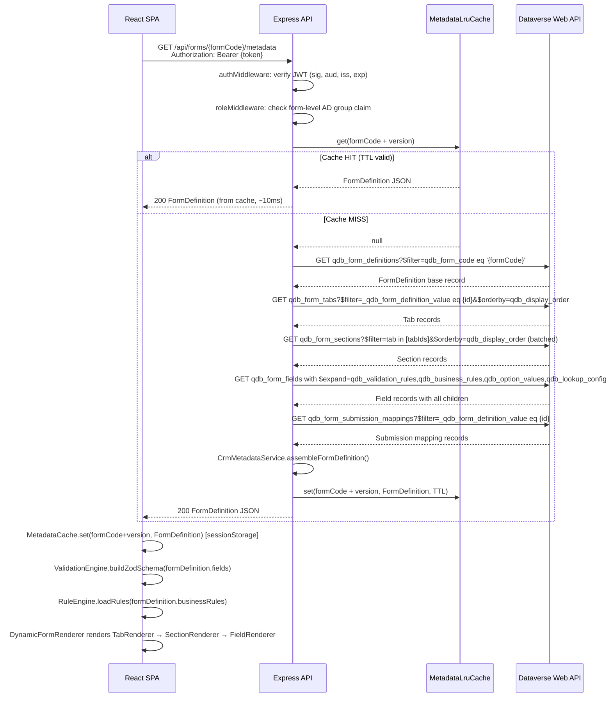
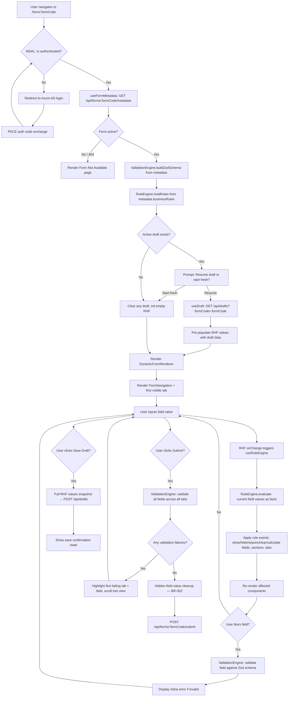
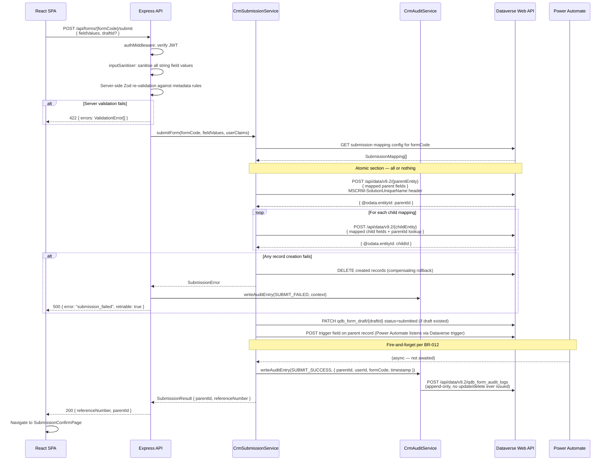
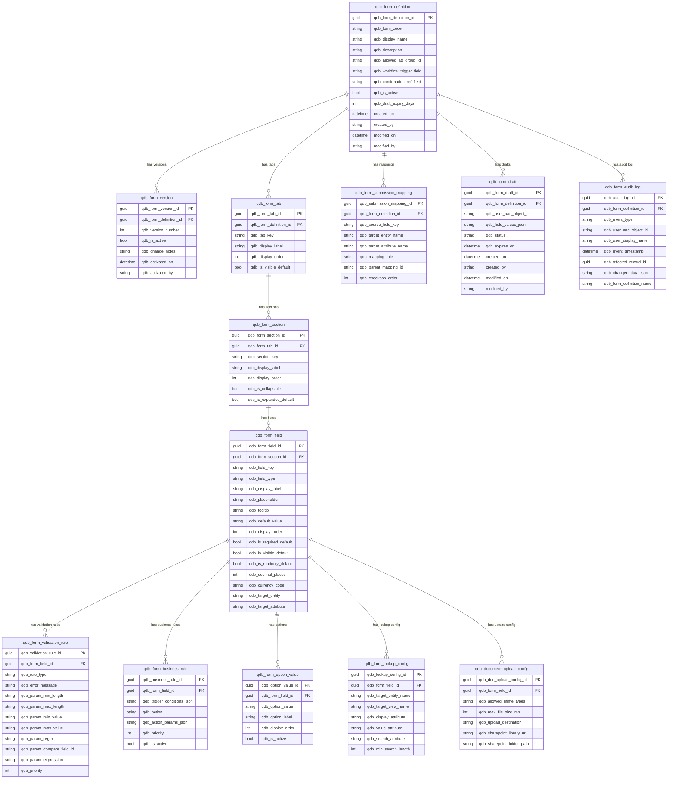

# Phase 3 — Architecture Design
## Dynamic Form Engine Portal — QDB
**Prepared by:** Maqsad AI — Solution Architect
**Date:** 2026-05-08
**Version:** 1.0
**Status:** Complete — Pending CEO Phase 3 Approval

---

## System Overview

The Dynamic Form Engine Portal is a metadata-driven, three-tier web application. A React SPA reads all form definitions from a versioned backend API, evaluates conditional rules client-side using json-rules-engine, validates field values using Zod schemas built at runtime from metadata, and writes completed submissions to Dataverse via a stateless Express API. The system contains no hardcoded forms: adding or modifying a banking form requires only Dataverse configuration record changes, with zero frontend deployment. A backend LRU metadata cache is the primary Dataverse throttling mitigation, keeping the metadata API within the NFR-001 500 ms P95 target under 100+ concurrent users.

---

## 1. High-Level Architecture Diagram

```mermaid
graph TB
    subgraph Browser["Browser — React SPA"]
        MSAL["MSAL Auth Provider<br/>@azure/msal-react"]
        SPA["DynamicFormRenderer<br/>(React + Fluent UI v9)"]
        RE["RuleEngine<br/>(json-rules-engine)"]
        VE["ValidationEngine<br/>(Zod runtime schemas)"]
        RHF["Form State<br/>(React Hook Form)"]
    end

    subgraph Backend["Backend — Node.js Express API (Docker)"]
        AUTH["AuthMiddleware<br/>(JWT verify)"]
        META["MetadataController<br/>+ CrmMetadataService"]
        DATA["DataController<br/>+ CrmDataService"]
        LOOKUP["LookupController<br/>+ CrmLookupService"]
        SUBMIT["SubmissionController<br/>+ CrmSubmissionService"]
        FILE["FileController<br/>+ CrmFileService"]
        AUDIT["AuditController<br/>+ CrmAuditService"]
        CACHE["MetadataCache<br/>(LRU — node-lru-cache)"]
        LOGGER["pino logger<br/>(structured JSON)"]
    end

    subgraph Azure["Azure Platform"]
        AAD["Azure AD / Entra ID<br/>App Registration"]
        KV["Azure Key Vault<br/>(secrets)"]
        BLOB["Azure Blob Storage<br/>(documents — optional)"]
        SWA["Azure Static Web Apps<br/>or Nginx (SPA host)"]
        APPSERVICE["Azure App Service<br/>or AKS (API host)"]
    end

    subgraph Dataverse["Microsoft Dataverse (Qatar region)"]
        DV_META["Config Tables x12<br/>(form definitions)"]
        DV_SUBMIT["Submission Records<br/>(parent + child CRM records)"]
        DV_DRAFT["Draft Records<br/>(qdb_form_draft)"]
        DV_AUDIT["Audit Log<br/>(qdb_form_audit_log)"]
        DV_NOTES["CRM Notes<br/>(document attachments)"]
        PA["Power Automate<br/>(triggered on submit)"]
    end

    subgraph SharePoint["SharePoint Online (optional)"]
        SP_LIB["Document Library<br/>(per form config)"]
    end

    MSAL -->|PKCE auth code flow| AAD
    AAD -->|id_token + access_token| MSAL
    SPA -->|Bearer token + API calls| AUTH
    AUTH -->|validated claims| META
    AUTH -->|validated claims| DATA
    AUTH -->|validated claims| LOOKUP
    AUTH -->|validated claims| SUBMIT
    AUTH -->|validated claims| FILE
    AUTH -->|validated claims| AUDIT
    META --> CACHE
    CACHE -->|cache miss| DV_META
    DATA --> DV_DRAFT
    LOOKUP --> DV_META
    SUBMIT --> DV_SUBMIT
    SUBMIT --> DV_DRAFT
    SUBMIT -->|fire-and-forget| PA
    SUBMIT --> DV_AUDIT
    FILE -->|CRM Notes path| DV_NOTES
    FILE -->|SharePoint path| SP_LIB
    FILE -->|SAS token path| BLOB
    AUDIT --> DV_AUDIT
    Backend --> KV
    SPA --> SWA
    Backend --> APPSERVICE
    RE -->|evaluates against RHF values| RHF
    VE -->|validates against RHF values| RHF
```



---

## 2. Component Architecture

### 2.1 Frontend Component Tree

```
frontend/src/
├── App.tsx                          # MSAL provider, router, auth guard
├── pages/
│   ├── FormPage.tsx                 # Loads metadata, owns form session
│   ├── FormListPage.tsx             # Lists available forms for user
│   ├── SubmissionConfirmPage.tsx    # Post-submit confirmation
│   └── admin/
│       ├── AdminFormListPage.tsx    # Admin: CRUD form definitions
│       ├── AdminFormPreviewPage.tsx # Admin: preview mode (no submission)
│       └── AdminAuditLogPage.tsx    # Admin: read-only audit viewer
├── components/
│   ├── form/
│   │   ├── DynamicFormRenderer.tsx  # Root: owns RHF context, rule/validation engines
│   │   ├── FormNavigation.tsx       # Tab navigation bar + completion indicators
│   │   ├── TabRenderer.tsx          # Renders one tab; applies tab visibility from rules
│   │   ├── SectionRenderer.tsx      # Renders one section; collapsible toggle
│   │   └── FieldRenderer.tsx        # Dispatches to correct field control by fieldType
│   ├── fields/
│   │   ├── TextField.tsx            # type="text"
│   │   ├── TextareaField.tsx        # type="textarea"
│   │   ├── NumberField.tsx          # type="number" + decimal places enforcement
│   │   ├── CurrencyField.tsx        # type="currency" + decimal places + currency symbol
│   │   ├── DecimalField.tsx         # type="decimal" + precision metadata
│   │   ├── DateField.tsx            # type="date"
│   │   ├── DateTimeField.tsx        # type="datetime"
│   │   ├── DropdownField.tsx        # type="dropdown" — Fluent UI Select
│   │   ├── MultiSelectField.tsx     # type="multiselect" — Fluent UI TagPicker
│   │   ├── LookupField.tsx          # type="lookup" — type-ahead via /api/lookup
│   │   ├── CheckboxField.tsx        # type="checkbox"
│   │   ├── RadioGroupField.tsx      # type="radio"
│   │   ├── EmailField.tsx           # type="email" + format validation
│   │   ├── PhoneField.tsx           # type="phone" + format validation
│   │   ├── FileUploadField.tsx      # type="file" — react-dropzone + progress
│   │   ├── RepeatingGridField.tsx   # type="grid" — @tanstack/react-table rows
│   │   └── RichTextField.tsx        # type="richtext" — @tiptap/react
│   ├── ui/
│   │   ├── ValidationMessage.tsx    # Inline error display below field
│   │   ├── SubmitButton.tsx         # Submit + loading state
│   │   ├── SaveDraftButton.tsx      # Draft save + success feedback
│   │   └── FormErrorBanner.tsx      # Banner for tab-level or submission errors
│   └── layout/
│       ├── AuthenticatedLayout.tsx  # Shell: header, user identity, logout
│       └── AdminLayout.tsx          # Admin shell with nav
├── engines/
│   ├── RuleEngine.ts                # Wraps json-rules-engine; evaluates business rules
│   ├── ValidationEngine.ts          # Builds Zod schemas at runtime from ValidationRule[]
│   └── MetadataCache.ts             # Client-side in-memory cache (sessionStorage keyed by formCode+version)
├── services/
│   ├── formMetadataService.ts       # GET /api/forms/:formCode/metadata
│   ├── draftService.ts              # POST/GET/DELETE /api/drafts
│   ├── submissionService.ts         # POST /api/forms/:formCode/submit
│   ├── lookupService.ts             # GET /api/lookup/:entity
│   └── fileService.ts               # POST /api/files/upload
├── hooks/
│   ├── useFormMetadata.ts           # Fetches + caches metadata, returns FormDefinition
│   ├── useRuleEngine.ts             # Subscribes to RHF watch; returns visibility/required map
│   ├── useValidationEngine.ts       # Returns Zod resolver built from metadata
│   └── useDraft.ts                  # Load/save/discard draft lifecycle
├── auth/
│   ├── msalConfig.ts                # MSAL PublicClientApplication configuration
│   ├── AuthProvider.tsx             # MsalProvider wrapper
│   └── useAuthToken.ts              # Extracts Bearer token for API calls
└── types/                           # Re-exports from shared/ package
```

### 2.2 Backend Service Tree

```
backend/src/
├── server.ts                        # Express app bootstrap, middleware chain
├── health.ts                        # GET /health → { status, version, uptime }
├── middleware/
│   ├── authMiddleware.ts            # JWT verify (signature, aud, iss, exp)
│   ├── roleMiddleware.ts            # Azure AD group claim check per form
│   ├── requestLogger.ts             # pino HTTP request logger (correlation_id)
│   ├── inputSanitiser.ts            # DOMPurify-server / validator.js strip
│   └── errorHandler.ts             # Global error boundary → structured response
├── controllers/
│   ├── MetadataController.ts        # GET /api/forms/:formCode/metadata
│   ├── DataController.ts            # GET/POST /api/drafts, GET /api/drafts/:id
│   ├── LookupController.ts          # GET /api/lookup/:entity?search=&view=
│   ├── SubmissionController.ts      # POST /api/forms/:formCode/submit
│   ├── FileController.ts            # POST /api/files/upload
│   └── AuditController.ts           # GET /api/admin/audit (admin only)
├── services/
│   ├── CrmMetadataService.ts        # Fetch + assemble FormDefinition from 12 tables
│   ├── CrmDataService.ts            # Draft CRUD against Dataverse
│   ├── CrmLookupService.ts          # OData query against lookup entity + view
│   ├── CrmSubmissionService.ts      # Atomic parent+child record creation
│   ├── CrmFileService.ts            # Route upload to Notes or SharePoint
│   └── CrmAuditService.ts           # Append-only audit log writes
├── cache/
│   └── MetadataLruCache.ts          # node-lru-cache; keyed by formCode+version
├── crm/
│   ├── DataverseClient.ts           # Typed fetch wrapper (OData v4 + retry + 429 handling)
│   ├── ODataQueryBuilder.ts         # Fluent builder for $select, $filter, $expand, $orderby
│   └── DataverseAuthProvider.ts     # Client credentials flow → Dataverse access_token
└── config/
    └── appConfig.ts                 # Zod-validated env var schema (loaded at startup)
```

---

## 3. Metadata Flow Diagram



---

## 4. Form Rendering Flow Diagram



---

## 5. Submission Flow Diagram



---

## 6. Rule Engine Architecture

### 6.1 Library

`json-rules-engine` v6.x (ISC licence, 3,200+ stars, browser + Node.js compatible). Adopted per github-research.md. Wrapped in a `RuleEngine` service class — the rest of the application never imports `json-rules-engine` directly.

### 6.2 Integration Design

**Facts = current RHF form values.** Every time React Hook Form's `watch()` fires a change event, `useRuleEngine` passes the complete current form values snapshot as the `facts` object to `engine.run(facts)`.

**Conditions = `qdb_form_business_rule` records.** Each record maps 1:1 to a json-rules-engine `Rule` object. The metadata assembler on the backend serialises condition operators into json-rules-engine's `conditions` format (all/any nesting, operator names like `equal`, `notEqual`, `greaterThan`, `lessThan`, `in`, `contains`, `defined`, `undefined`).

**Events = rule engine actions.** Each `BusinessRule` record contains an `action` field with one of: `SHOW_FIELD`, `HIDE_FIELD`, `SHOW_SECTION`, `HIDE_SECTION`, `SHOW_TAB`, `HIDE_TAB`, `REQUIRE_FIELD`, `OPTIONAL_FIELD`, `READONLY_FIELD`, `SET_VALUE`, `CLEAR_VALUE`, `CALCULATE_VALUE`, `FILTER_OPTIONS`, `FILTER_LOOKUP`.

**Evaluation loop:**

```
RuleEngine.evaluate(facts: FormValues): RuleEvaluationResult
  1. engine.run(facts)                  → json-rules-engine runs all loaded rules
  2. Collect triggered event objects    → { type: 'HIDE_FIELD', params: { fieldId } }
  3. Build VisibilityMap                → Map<fieldId, boolean>
  4. Build RequiredOverrideMap          → Map<fieldId, 'required' | 'optional' | 'readonly'>
  5. Build SetValueMap                  → Map<fieldId, unknown>
  6. Return RuleEvaluationResult        → consumed by useRuleEngine hook
```

**React integration:** `useRuleEngine` calls `RuleEngine.evaluate` on every `watch()` update. The resulting maps are stored in component state. `FieldRenderer` reads visibility from `visibilityMap[field.id]` and applies `required` overrides before rendering. Hidden fields are filtered out of the rendered DOM and their RHF values are cleared via `resetField` before submission (BR-002).

**Priority ordering:** Rules are loaded sorted by `qdb_priority` ascending. json-rules-engine evaluates all matching rules. A later `SHOW_FIELD` event does not override an earlier `HIDE_FIELD` event of the same type unless the rule processor explicitly merges them — the `RuleEngine` class applies a last-writer-wins merge within the same action type, respecting priority order.

**Server-side rule evaluation:** The same `RuleEngine` class runs on the backend during submission to re-validate hidden field clearing (BR-002 enforcement server-side). The `shared/` package exports the `BusinessRule` type and the `RuleEvaluationResult` type used by both surfaces.

---

## 7. Validation Engine Architecture

### 7.1 Runtime Schema Builder

`ValidationEngine.buildZodSchema(fields: FieldDefinition[]): ZodObject`

The `buildZodSchema` function iterates over all `FieldDefinition` records and produces a `z.object({})` where each key is the `field.fieldId` and the value is a composed `ZodType` chain built from that field's `ValidationRule[]` records.

**Validation rule to Zod mapping:**

| ValidationRule.ruleType | Zod chain applied |
|---|---|
| `REQUIRED` | `.min(1, message)` on string; `.defined()` on optional |
| `MIN_LENGTH` | `z.string().min(params.minLength, message)` |
| `MAX_LENGTH` | `z.string().max(params.maxLength, message)` |
| `MIN_VALUE` | `z.number().min(params.minValue, message)` |
| `MAX_VALUE` | `z.number().max(params.maxValue, message)` |
| `REGEX` | `z.string().regex(new RegExp(params.pattern), message)` |
| `EMAIL_FORMAT` | `z.string().email(message)` |
| `PHONE_FORMAT` | `z.string().regex(PHONE_REGEX, message)` |
| `DATE_BEFORE` | `z.date().max(resolveDate(params), message)` |
| `DATE_AFTER` | `z.date().min(resolveDate(params), message)` |
| `CROSS_FIELD` | `z.superRefine` on the parent schema — reads sibling field |
| `CUSTOM_EXPRESSION` | **DEFERRED to Phase 2 — see ADR-005** |

Cross-field validation uses `z.superRefine` on the top-level schema object so that one field's rule can read another field's current value.

### 7.2 Client-Side Validation

React Hook Form uses the Zod schema as its `resolver` via `@hookform/resolvers/zod`. The schema is rebuilt whenever metadata is (re-)loaded. Field-level errors surface in `formState.errors[fieldId].message` and are rendered by `ValidationMessage.tsx`.

### 7.3 Server-Side Re-Validation

On every `POST /api/forms/:formCode/submit`, `SubmissionController` calls `ValidationEngine.buildZodSchema` with the same metadata (served from the LRU cache) and runs `schema.safeParse(fieldValues)`. If validation fails, a `422` response is returned with the field-level error map. This closes the bypass gap where a client could POST without running the frontend validation.

### 7.4 Hidden Field Exclusion

Before server-side validation, `SubmissionController` calls `RuleEngine.evaluate(fieldValues)` and removes all `fieldId` keys present in the resulting `hiddenFields` set from `fieldValues`. The Zod schema is then rebuilt with those fields marked optional (since they are absent). This enforces BR-001 (hidden fields must not block submission) and BR-002 (hidden field values must not reach Dataverse).

---

## 8. Metadata Caching Strategy

**Resolves CEO Condition 1 — Dataverse throttling mitigation.**

### 8.1 Backend LRU Cache

**Library:** `node-lru-cache` (28,000+ stars, MIT) — already a transitive dependency of many Node.js projects; zero risk.

**Cache key:** `${formCode}:${formVersion}` — using the version field from `qdb_form_version` ensures that when an admin activates a new form version, the old cache entry is bypassed immediately (version changes, new key).

**TTL:** Configurable via `METADATA_CACHE_TTL_SECONDS` environment variable. Default 300 seconds (5 minutes) in development; 600 seconds (10 minutes) in production. The cached object is the fully assembled `FormDefinition` JSON, not raw Dataverse rows.

**Max entries:** 500 (matches NFR-009 — 500 active form definitions). Memory footprint: each `FormDefinition` for a complex form (50 fields, 20 rules, 100 options) is approximately 80–120 KB. 500 entries = ~60 MB maximum, well within App Service / AKS container limits.

**Cache invalidation on admin publish:** When an admin activates a new form version via the admin API (`PATCH /api/admin/forms/:formCode/activate`), the `MetadataController` calls `MetadataLruCache.delete(formCode + ':' + oldVersion)` to force an immediate cache miss on the next portal request.

### 8.2 Client-Side Session Cache

The SPA caches the `FormDefinition` in `sessionStorage` (keyed by `formCode:version`). This prevents repeat metadata API calls when the user navigates away and returns within the same browser session. PII is never stored in `sessionStorage` — only form structure metadata (NFR-011).

### 8.3 Dataverse Call Reduction Estimate

Without cache: every form page load = 6–8 sequential Dataverse OData calls (form, tabs, sections, fields, options, rules, mappings). Under 100 concurrent users = 600–800 Dataverse API calls per second at form-load time. This would breach Microsoft's per-user Dataverse throttle limits.

With LRU cache (cache hit rate ~95% after warm-up): 100 concurrent users = ~5 cache misses per TTL window = 5 × 6–8 = 30–40 Dataverse metadata calls per 5-minute TTL window. This is well within throttle limits and achieves the NFR-001 500 ms P95 target (cached responses return in <10 ms from memory).

### 8.4 Retry and Back-Off on Cache Miss

On a cache miss, `CrmMetadataService` calls Dataverse via `DataverseClient`, which implements:

- **3 retries** on transient failures (5xx, network timeout)
- **Exponential back-off:** 200ms, 400ms, 800ms with ±10% jitter
- **429 Retry-After header respected:** if Dataverse returns HTTP 429, the client reads the `Retry-After` header and waits the specified duration before retrying
- **Circuit breaker:** after 5 consecutive failures within 60 seconds, `DataverseClient` opens the circuit and returns a `503` upstream — preventing a thundering herd against a throttled Dataverse endpoint

---

## 9. Security Architecture

### 9.1 Authentication Flow — Azure AD PKCE

```
1. SPA initialises MSAL PublicClientApplication with clientId, tenantId, redirectUri
2. User clicks "Sign In" → MSAL initiates loginRedirect() with PKCE code_challenge
3. Azure AD authenticates user (MFA if tenant policy requires)
4. Azure AD redirects to redirectUri with authorization_code
5. MSAL exchanges code + code_verifier for id_token + access_token (Dataverse scope)
6. MSAL stores tokens in sessionStorage (default MSAL cache location)
7. All API calls: MSAL.acquireTokenSilent() → attach as Authorization: Bearer {access_token}
8. Token expiry: MSAL handles silent renewal automatically (refresh token)
```

**Scopes requested:**
- `api://{backendAppId}/access_as_user` — for backend API calls
- `https://{org}.crm4.dynamics.com/user_impersonation` — NOT requested by SPA (backend uses client credentials)

### 9.2 Backend Token Validation (authMiddleware.ts)

Every inbound request passes through `authMiddleware` before reaching any controller. The middleware:

1. Extracts `Authorization: Bearer {token}` header — returns `401` if absent
2. Fetches JWKS from `https://login.microsoftonline.com/{tenantId}/discovery/v2.0/keys` (cached 24h via `jwks-rsa` library)
3. Verifies JWT signature using the matching public key
4. Verifies `aud` claim equals the backend app registration client ID
5. Verifies `iss` claim equals `https://sts.windows.net/{tenantId}/`
6. Verifies `exp` claim is in the future
7. Attaches decoded `claims` object to `req.user` — downstream services read from this, never re-parse the token
8. Returns `401` on any verification failure with no details in the response body (security: do not reveal validation step that failed)

### 9.3 Role-Based Form Access

Each `qdb_form_definition` record has an `qdb_allowed_ad_group_id` attribute (nullable Azure AD group object ID). `roleMiddleware` checks:

- If `qdb_allowed_ad_group_id` is null → form is accessible to all authenticated users
- If set → the middleware checks `req.user.groups` claim for the group ID
- Group membership is asserted via the `groups` overage claim flow: if the user is in more than 200 groups, the `_claim_names` overage pattern is used and the backend calls the Microsoft Graph `memberOf` endpoint to verify membership

### 9.4 Input Sanitisation

`inputSanitiser.ts` middleware runs on all `POST` and `PATCH` requests:

- All string values recursively traversed via `sanitiseObject(body)` using `validator.js` `escape()` for HTML characters
- Rich text fields (type=`richtext`) are sanitised with `isomorphic-dompurify` using an allow-list (basic formatting tags only — no `<script>`, `<iframe>`, `<object>`, `onclick` attributes)
- The sanitised body replaces `req.body` before reaching any controller

### 9.5 File Upload Security

`FileController` enforces before any storage write:

1. **MIME type check:** `file-type` library reads the first bytes of the stream to detect actual MIME type (not trusting the `Content-Type` header or file extension)
2. **Size limit:** `multer` configured with `limits.fileSize = MAX_FILE_SIZE_BYTES` (25 MB hard ceiling per BR-011; per-field limit from metadata applied after multer)
3. **Extension whitelist:** only extensions in the `allowed_mime_types` list from `qdb_document_upload_config` are permitted
4. **Virus scan hook:** `FileController` calls a configurable `VirusScanProvider` interface. In Phase 1, this is a no-op implementation with a warning log. The interface is defined so that QDB can inject their enterprise antivirus (e.g., Defender for Cloud) in Phase 2 without changing the controller
5. **File names:** stored using a UUID-generated name — original filename is stored as metadata only, never used in storage paths

### 9.6 Secrets Management

| Secret | Storage | Access Pattern |
|---|---|---|
| Dataverse client secret | Azure Key Vault | Backend reads at startup via `@azure/keyvault-secrets`; cached in process memory |
| Backend app client ID / tenant ID | Environment variable (App Service config) | Read via `appConfig.ts` Zod-validated env schema |
| MSAL client ID (frontend) | Environment variable baked at build time | Public value — not a secret; safe in static build |
| SharePoint app credentials | Azure Key Vault | Backend reads at startup |
| ACR credentials (CI/CD) | GitHub Actions secrets | Used only in pipeline; never in runtime |

### 9.7 Custom Expression Validation — Safe Execution

**CEO Condition 2 resolved via ADR-005 (Phase 2 deferral).**

The `CUSTOM_EXPRESSION` validation rule type is defined in the Dataverse schema in Phase 1 (the column exists) but no Phase 1 code evaluates it. If a metadata record with `ruleType = CUSTOM_EXPRESSION` is encountered by `ValidationEngine.buildZodSchema`, it is logged as a warning and skipped. A `Phase2FeatureNotImplemented` warning is surfaced in the admin preview mode for any field that uses this rule type. `eval()` and `new Function()` are never called anywhere in the codebase.

### 9.8 Network Boundaries

- The React SPA communicates only with the Express API (same domain or CORS-whitelisted) and with Azure AD (MSAL redirects). It never calls Dataverse directly.
- The Express API is the only service with Dataverse credentials. It communicates with Dataverse over TLS 1.2+ on port 443.
- The Express API communicates with Azure Key Vault over TLS 1.2+ using Managed Identity (no secret-in-config required for KV access).
- All traffic between Azure services uses private endpoints where available within QDB's Azure VNet configuration.
- The portal is served exclusively over HTTPS. No HTTP listener is exposed in production.

---

## 10. Architecture Decision Records

### ADR-001: Express over Fastify
**Status:** Accepted
**Date:** 2026-05-08
**Decided by:** Architect (client mandate)

**Context:**
The Maqsad AI technology constitution (Article II) specifies Fastify as the default Node.js API framework. The QDB BRD constraint C-002 explicitly mandates "Node.js + Express + TypeScript" as the backend framework. Express has 64,000+ GitHub stars and is the most widely deployed Node.js framework in enterprise environments. The client's engineering team has existing Express familiarity.

**Decision:**
Use Express 4.x with TypeScript (`@types/express`). Do not use Fastify for this engagement.

**Consequences:**
- Positive: Aligns with QDB's stated technical constraint; lower onboarding friction for QDB team post-handover.
- Positive: Extensive middleware ecosystem (passport, multer, helmet, express-rate-limit).
- Negative: Fastify is measurably faster (~3x throughput in benchmarks) and has native TypeScript schema validation. Given this API is metadata-serving (primarily I/O bound, with LRU cache absorbing most load), the throughput difference is not the binding constraint.
- Negative: Deviates from constitution default — requires this ADR.
- Mitigation: Apply `helmet` for security headers, `express-rate-limit` for throttle protection, and `compression` middleware to compensate for the absence of Fastify's built-in performance features.

---

### ADR-002: Fluent UI v9 over constitutional frontend default (Tailwind CSS)
**Status:** Accepted
**Date:** 2026-05-08
**Decided by:** Architect (ecosystem fit)

**Context:**
The Maqsad AI constitution defaults to Next.js + Tailwind CSS for frontend web. This engagement uses React SPA (not Next.js — SSR not required for a form portal behind authentication) and Fluent UI v9 instead of Tailwind CSS. The BRD Assumption A-009 states Fluent UI is preferred given the Microsoft ecosystem context. QDB's existing Dynamics CRM and Power Platform surfaces use Fluent design language. Visual consistency between the portal and CRM surfaces reduces user cognitive load and is a specific QDB preference.

**Decision:**
Use `@fluentui/react-components` v9 (Fluent 2) as the UI component library. Use React SPA (Vite + React 18) instead of Next.js.

**Consequences:**
- Positive: Visual consistency with Dynamics CRM and Power Platform surfaces.
- Positive: Fluent UI v9 is TypeScript-native and WCAG 2.1 AA compliant out of the box for standard controls, partially addressing NFR-013.
- Positive: 18,000+ stars, MIT, Microsoft-maintained — low supply risk.
- Negative: No SSR capability (React SPA). Not a concern since the portal is behind authentication and SEO indexing is not a requirement.
- Negative: Tailwind CSS utility classes are not available — custom styling uses Fluent UI's `makeStyles` (Griffel CSS-in-JS). Learning curve for developers familiar only with Tailwind.
- Negative: Deviates from constitution default — requires this ADR.

---

### ADR-003: json-rules-engine for conditional rule evaluation (adopted, not built)
**Status:** Accepted
**Date:** 2026-05-08
**Decided by:** Architect + GitHub Researcher

**Context:**
FR-013 through FR-017 require a client-side rule engine that evaluates conditional logic (show/hide, required/optional, set/clear/calculate values) in real time as field values change. The github-research.md evaluation found `json-rules-engine` (3,200+ stars, ISC licence, runs in browser and Node.js) as the only viable adoption candidate. Building a custom rule engine would be significant IP risk and ongoing maintenance burden.

**Decision:**
Adopt `json-rules-engine` v6.x. Wrap it in a `RuleEngine` service class. Never import `json-rules-engine` directly outside that class. The `BusinessRule` metadata records are serialised into json-rules-engine `Rule` objects by `CrmMetadataService` on the backend before being included in the `FormDefinition` response.

**Consequences:**
- Positive: Battle-tested rule engine with browser + server compatibility. ISC licence is permissive (compatible with commercial banking use).
- Positive: JSON rule format aligns directly with the Dataverse metadata table contract.
- Positive: The abstraction layer (`RuleEngine` class) means the underlying library can be swapped without changes to form rendering components.
- Negative: ISC licence — confirm with QDB legal that ISC is acceptable (it is equivalent to MIT/BSD for commercial use).
- Negative: json-rules-engine does not natively support `CALCULATE_VALUE` with arithmetic expressions. This action type requires a custom event handler that evaluates the expression. In Phase 1, only simple expressions (field + constant, field × constant) are supported via a safe whitelist parser. Complex expressions are deferred per ADR-005.

---

### ADR-004: Native fetch + OData v4 over third-party Dataverse SDK
**Status:** Accepted
**Date:** 2026-05-08
**Decided by:** Architect + GitHub Researcher

**Context:**
The github-research.md evaluation found no Dataverse SDK library meeting the 1,000-star adoption threshold. `dataverse-ify` (450 stars) and `xrm-webapi` (380 stars, stale) were both rejected. The Dataverse Web API is a well-specified OData v4 endpoint. The Maqsad AI constitution (CRM cloud constraints) already mandates Dataverse Web API v9.2 with TypeScript.

**Decision:**
Build a thin `DataverseClient` class wrapping native `fetch` with typed request/response generics, an `ODataQueryBuilder` for composing `$select`, `$filter`, `$expand`, and `$orderby` clauses, and a `DataverseAuthProvider` for client credentials token acquisition. No third-party CRM SDK is introduced.

**Consequences:**
- Positive: Zero third-party CRM dependency. No version conflict risk.
- Positive: Full control over request headers (MSCRM-SolutionUniqueName, OData-Version, Prefer: return=representation).
- Positive: Retry and circuit breaker logic can be implemented precisely to Dataverse's documented throttling behaviour (429 + Retry-After).
- Negative: OData query building must be type-safe and tested. The `ODataQueryBuilder` is a non-trivial internal component. Mitigated by unit tests and the builder's fluent API enforcing correct syntax.

---

### ADR-005: Custom JavaScript expression validation deferred to Phase 2
**Status:** Accepted
**Date:** 2026-05-08
**Decided by:** Architect (security constraint)

**Context:**
FR-019 includes "custom JavaScript expression" as a validation rule type. CEO Condition 2 explicitly prohibits `eval()` or `new Function()` for security reasons. The safe alternatives are: (a) a purpose-built DSL with a recursive descent parser, (b) a sandboxed expression evaluator such as `expr-eval` (1,800+ stars, MIT) or `filtrex` (700 stars), or (c) deferral. A proper DSL scoping exercise — defining allowed operators, functions, and variable references; building the parser; writing security tests — is estimated at 5–8 developer days and is not within Phase 1 timeline scope (UAT target: Q2 2026).

**Decision:**
Defer `CUSTOM_EXPRESSION` validation rule execution to Phase 2. Phase 1 delivers all other 11 validation rule types. The `CUSTOM_EXPRESSION` rule type column is created in the Dataverse schema so that configuration team members can author rules now. The frontend and backend skip execution of this rule type and log a structured warning. Admin preview mode surfaces a "Custom expression validation not active in Phase 1" indicator for any field using this type.

Phase 2 will evaluate `expr-eval` (MIT, 1,800+ stars) as the safe expression evaluator, define the allowed variable namespace (current form field IDs only), and implement a server-side evaluation path to prevent client-side bypass.

**Consequences:**
- Positive: Eliminates the `eval()` / `new Function()` security risk from Phase 1 scope entirely.
- Positive: Phase 1 delivers 11/12 validation rule types, which covers all identified Loan Application form requirements.
- Negative: Any form that relies on custom expression validation will silently pass those rules in Phase 1. The warning log and admin indicator mitigate the risk of accidental reliance.
- Negative: Configuration team members who author `CUSTOM_EXPRESSION` rules in Dataverse before Phase 2 will not see those rules evaluated in production. Must be communicated to QDB CRM team before go-live.

---

### ADR-006: Backend LRU metadata cache for Dataverse throttling mitigation
**Status:** Accepted
**Date:** 2026-05-08
**Decided by:** Architect

**Context:**
CEO Condition 1 and NFR-001 require the metadata API to return full form definitions in under 500 ms at P95 under 100 concurrent users. Without caching, each form load triggers 6–8 sequential Dataverse OData queries, which at 100 concurrent users produces 600–800 Dataverse API calls per second — exceeding Microsoft's per-user service protection throttle limits. The backend is stateless (NFR-008), so the cache must be in-process (not distributed), sized to the maximum active form count (500 per NFR-009), and invalidated on version change.

**Decision:**
Implement a `MetadataLruCache` using `node-lru-cache` v10.x (in-process, keyed by `formCode:version`, configurable TTL via `METADATA_CACHE_TTL_SECONDS` env var, max 500 entries). Cache entries store the fully assembled `FormDefinition` JSON object. Cache invalidation is triggered explicitly on admin form version activation.

**Consequences:**
- Positive: Cached responses return in <10 ms (memory read), achieving NFR-001 500 ms target with significant headroom.
- Positive: Reduces Dataverse metadata calls by ~95% under steady-state load.
- Positive: `node-lru-cache` is a single-dependency solution with zero infrastructure overhead.
- Negative: In-process cache means each backend pod maintains its own cache. Under horizontal scaling (multiple App Service instances or AKS pods), a cache miss on one pod does not benefit from another pod's cache. This is acceptable — each pod warms its own cache within one TTL window.
- Negative: If multiple backend pods receive form version activations at different times (due to admin API routing), there is a brief window where different pods serve different form versions. Mitigated by the explicit cache-key version scheme — version changes force new keys, and the version is included in metadata responses so clients detect staleness.
- Risk to monitor: For a future requirement of distributed cache consistency, upgrade to Redis (ADR to be filed in Phase 2 if horizontal scaling beyond 3 pods is required).

---

### ADR-007: Same Azure AD tenant for all users — Azure AD B2C deferred to Phase 2
**Status:** Accepted
**Date:** 2026-05-08
**Decided by:** Architect (pending written QDB confirmation per CEO condition 6)

**Context:**
BRD Assumption A-010 states all users (bank customers submitting forms and internal staff) authenticate through the same Azure AD tenant. CEO Condition 6 requires this assumption to be formally confirmed in writing by QDB before Sprint 1 begins, because if portal users are external customers (not QDB employees), Azure AD B2C or Entra External ID is the architecturally correct solution. The authentication model is a foundational decision that affects the MSAL configuration, token audience, user attribute mapping, and backend JWT validation middleware.

**Decision:**
Phase 1 architecture is designed for single Azure AD tenant authentication (same tenant for all user types). The MSAL configuration uses `authority: https://login.microsoftonline.com/{tenantId}` (not the B2C authority endpoint). JWT validation on the backend validates against the single tenant's JWKS endpoint. This decision is provisional pending written QDB confirmation.

**Impact if assumption is wrong:** If QDB customers are external (not QDB employees), Phase 1 must be revised before Sprint 1. Changes required: MSAL authority URL, user flow configuration, token claims mapping (B2C uses different claim names), backend JWT issuer and JWKS URL, and user identity storage in audit log entries. This is a 3–5 day rework. The risk is accepted given the CEO's condition requiring written confirmation before Sprint 1.

**Consequences:**
- Positive: Simpler token validation — single tenant JWKS, single issuer URL.
- Positive: Group membership claims are available natively in Azure AD tokens (required for form-level RBAC per FR-038).
- Negative: If QDB customers are external users (portal users are bank customers, not employees), this architecture is incorrect and must be replaced with Entra External ID / B2C before any customer-facing testing.
- Gate: **Sprint 1 cannot start until QDB project sponsor provides written confirmation of A-010.**

---

## 11. Entity Relationship Diagram (Dataverse Configuration Tables)



---

## 12. API Contracts

All endpoints require `Authorization: Bearer {Azure AD access_token}` unless noted. All responses use the `ApiResponse<T>` envelope.

### 12.1 Response Envelope

```typescript
// shared/src/types/api.ts
interface ApiResponse<T> {
  success: boolean;
  data?: T;
  error?: ApiError;
  meta?: ResponseMeta;
}

interface ApiError {
  code: string;
  message: string;
  details?: Record<string, string[]>; // field-level errors
}

interface ResponseMeta {
  correlationId: string;
  timestamp: string; // ISO 8601 UTC
  version: string;   // API version
}
```

### 12.2 Metadata API

**GET /api/forms/:formCode/metadata**

- Auth: Bearer token (any authenticated user; role check for form-level group)
- Path param: `formCode` — unique string identifier for the form
- Query param: `version` (optional) — if omitted, returns the active version
- Response 200: `ApiResponse<FormDefinition>`
- Response 401: unauthenticated
- Response 403: authenticated but not in form's allowed AD group
- Response 404: form code not found or form deactivated
- Response 500: Dataverse unavailable

```typescript
// Returns from shared/src/types/form.ts
interface FormDefinition {
  formId: string;
  formCode: string;
  displayName: string;
  version: number;
  draftExpiryDays: number;
  tabs: TabDefinition[];
  submissionMappings: SubmissionMapping[];
}
```

### 12.3 Draft API

**GET /api/drafts?formCode=:formCode**
- Returns the active draft for the authenticated user + form, or 404 if none exists
- Response 200: `ApiResponse<DraftRecord>`

**POST /api/drafts**
- Body: `{ formCode: string; fieldValues: Record<string, unknown>; draftId?: string }`
- Creates a new draft or updates existing (upsert by user + formCode)
- Response 201 / 200: `ApiResponse<DraftRecord>`

**DELETE /api/drafts/:draftId**
- Discards the specified draft (sets status = discarded)
- Response 204: no body

### 12.4 Lookup API

**GET /api/lookup/:entityName?search=:term&view=:viewName&formCode=:formCode**
- Returns matching active records from the specified Dataverse entity
- `search`: minimum 3 characters (BR-009 compliance — only active records)
- `view`: optional — overrides default view from lookup config
- Response 200: `ApiResponse<LookupResult[]>`

```typescript
interface LookupResult {
  id: string;       // Dataverse record GUID
  displayName: string;
  secondaryText?: string;
}
```

### 12.5 Submission API

**POST /api/forms/:formCode/submit**

- Body: `{ fieldValues: Record<string, unknown>; draftId?: string }`
- Server validates → applies hidden field cleanup → executes submission mapping
- Response 200: `ApiResponse<SubmissionResult>`
- Response 422: validation failures — `ApiResponse<void>` with `error.details` map
- Response 500: Dataverse write failure — retriable error flag

```typescript
interface SubmissionResult {
  parentId: string;
  referenceNumber: string;
}
```

### 12.6 File Upload API

**POST /api/files/upload**

- Content-Type: `multipart/form-data`
- Fields: `file` (binary), `formCode` (string), `fieldKey` (string), `draftId?` (string)
- Response 200: `ApiResponse<FileUploadResult>`
- Response 400: file type / size validation failure
- Response 413: file exceeds limit

```typescript
interface FileUploadResult {
  uploadId: string;
  fileName: string;
  fileSizeBytes: number;
  uploadedAt: string;
}
```

### 12.7 Audit Log API (Admin)

**GET /api/admin/audit?formCode=&userId=&eventType=&dateFrom=&dateTo=&page=&pageSize=**

- Auth: Bearer token; role check for Compliance team AD group
- Response 200: `ApiResponse<AuditLogPage>`

### 12.8 Health Endpoint

**GET /health** (no auth required)

```typescript
interface HealthResponse {
  status: "healthy" | "degraded" | "unhealthy";
  version: string;
  uptime: number; // seconds
  timestamp: string;
  dependencies: {
    dataverse: "reachable" | "unreachable";
    keyVault: "reachable" | "unreachable";
  };
}
```

---

## 13. Interface Contracts (shared/ package)

```typescript
// shared/src/types/form.ts

interface FormDefinition {
  formId: string;
  formCode: string;
  displayName: string;
  description: string;
  version: number;
  draftExpiryDays: number;
  allowedAdGroupId: string | null;
  confirmationRefField: string;
  tabs: TabDefinition[];
  submissionMappings: SubmissionMapping[];
}

interface TabDefinition {
  tabId: string;
  tabKey: string;
  displayLabel: string;
  displayOrder: number;
  isVisibleDefault: boolean;
  sections: SectionDefinition[];
}

interface SectionDefinition {
  sectionId: string;
  sectionKey: string;
  displayLabel: string;
  displayOrder: number;
  isCollapsible: boolean;
  isExpandedDefault: boolean;
  fields: FieldDefinition[];
}

interface FieldDefinition {
  fieldId: string;
  fieldKey: string;
  fieldType: FieldType;
  displayLabel: string;
  placeholder: string;
  tooltip: string;
  defaultValue: unknown;
  displayOrder: number;
  isRequiredDefault: boolean;
  isVisibleDefault: boolean;
  isReadonlyDefault: boolean;
  decimalPlaces: number;
  currencyCode: string;
  targetEntity: string;
  targetAttribute: string;
  validationRules: ValidationRule[];
  businessRules: BusinessRule[];
  optionValues: OptionValue[];
  lookupConfig: LookupConfig | null;
  documentUploadConfig: DocumentUploadConfig | null;
}

type FieldType =
  | "text"
  | "textarea"
  | "number"
  | "currency"
  | "decimal"
  | "date"
  | "datetime"
  | "dropdown"
  | "multiselect"
  | "lookup"
  | "checkbox"
  | "radio"
  | "email"
  | "phone"
  | "file"
  | "grid"
  | "richtext";

interface ValidationRule {
  ruleId: string;
  ruleType: ValidationRuleType;
  errorMessage: string;
  params: ValidationRuleParams;
  priority: number;
}

type ValidationRuleType =
  | "REQUIRED"
  | "MIN_LENGTH"
  | "MAX_LENGTH"
  | "MIN_VALUE"
  | "MAX_VALUE"
  | "REGEX"
  | "EMAIL_FORMAT"
  | "PHONE_FORMAT"
  | "DATE_BEFORE"
  | "DATE_AFTER"
  | "CROSS_FIELD"
  | "CUSTOM_EXPRESSION"; // Phase 2 only — skipped in Phase 1

interface ValidationRuleParams {
  minLength?: number;
  maxLength?: number;
  minValue?: number;
  maxValue?: number;
  pattern?: string;
  compareFieldKey?: string;
  compareOperator?: "eq" | "neq" | "gt" | "lt" | "gte" | "lte";
  dateRef?: string; // ISO date string or field key
  expression?: string; // Phase 2 only
}

interface BusinessRule {
  ruleId: string;
  triggerConditions: RuleConditionGroup; // json-rules-engine conditions format
  action: BusinessRuleAction;
  actionParams: BusinessRuleActionParams;
  priority: number;
  isActive: boolean;
}

type BusinessRuleAction =
  | "SHOW_FIELD"
  | "HIDE_FIELD"
  | "SHOW_SECTION"
  | "HIDE_SECTION"
  | "SHOW_TAB"
  | "HIDE_TAB"
  | "REQUIRE_FIELD"
  | "OPTIONAL_FIELD"
  | "READONLY_FIELD"
  | "SET_VALUE"
  | "CLEAR_VALUE"
  | "CALCULATE_VALUE"
  | "FILTER_OPTIONS"
  | "FILTER_LOOKUP";

interface BusinessRuleActionParams {
  targetFieldKey?: string;
  targetSectionKey?: string;
  targetTabKey?: string;
  setValue?: unknown;
  calculateExpression?: string; // safe arithmetic only in Phase 1
  filterValues?: string[];
}

interface RuleConditionGroup {
  all?: RuleCondition[];
  any?: RuleCondition[];
}

interface RuleCondition {
  fact: string; // field key
  operator: string; // json-rules-engine operator name
  value: unknown;
  path?: string;
}

interface OptionValue {
  optionId: string;
  value: string;
  label: string;
  displayOrder: number;
  isActive: boolean;
}

interface LookupConfig {
  lookupConfigId: string;
  targetEntityName: string;
  targetViewName: string;
  displayAttribute: string;
  valueAttribute: string;
  searchAttribute: string;
  minSearchLength: number;
}

interface DocumentUploadConfig {
  configId: string;
  allowedMimeTypes: string[];
  maxFileSizeMb: number;
  uploadDestination: "crm_notes" | "sharepoint" | "azure_blob";
  sharepointLibraryUrl?: string;
  sharepointFolderPath?: string;
}

interface SubmissionMapping {
  mappingId: string;
  sourceFieldKey: string;
  targetEntityName: string;
  targetAttributeName: string;
  mappingRole: "parent" | "child";
  parentMappingId: string | null;
  executionOrder: number;
}

interface FormVersion {
  versionId: string;
  versionNumber: number;
  isActive: boolean;
  changeNotes: string;
  activatedOn: string;
  activatedBy: string;
}
```

---

## 14. Integration Design

### 14.1 Dataverse Web API

| Aspect | Detail |
|---|---|
| Protocol | HTTPS / OData v4 |
| Base URL | `https://{org}.crm4.dynamics.com/api/data/v9.2/` |
| Auth | Client credentials flow (backend service principal); `DataverseAuthProvider` caches token until 5 minutes before expiry |
| Required headers | `OData-MaxVersion: 4.0`, `OData-Version: 4.0`, `Accept: application/json`, `Content-Type: application/json`, `MSCRM-SolutionUniqueName: {solutionName}` on creates/updates |
| Retry strategy | 3 retries, exponential back-off (200ms/400ms/800ms + jitter), 429 Retry-After header respected |
| Circuit breaker | Open after 5 failures in 60s; half-open probe after 30s |
| Failure mode | Returns `503` upstream; error logged with correlation_id |
| Bulk reads | `$batch` OData requests used for multi-entity metadata assembly (reduces round trips from 6 to 2) |

### 14.2 Azure AD / Entra ID

| Aspect | Detail |
|---|---|
| Protocol | OAuth 2.0 / OpenID Connect |
| SPA flow | Authorization Code + PKCE (`@azure/msal-browser`) |
| Backend flow | Client credentials (for Dataverse calls by the backend service principal) |
| JWKS cache | Backend caches JWKS public keys for 24 hours via `jwks-rsa` |
| Token lifetime | Default Azure AD access token: 60–90 minutes; MSAL handles silent renewal |
| Failure mode | 401 returned to SPA; MSAL triggers re-authentication |

### 14.3 SharePoint Online

| Aspect | Detail |
|---|---|
| Protocol | Microsoft Graph REST API (`https://graph.microsoft.com/v1.0/`) |
| Auth | Backend service principal with `Sites.ReadWrite.All` or site-specific permission |
| Operation | `PUT /sites/{siteId}/drives/{driveId}/root:/{path}/{filename}:/content` |
| Retry | 3 retries with exponential back-off; 429 Retry-After respected |
| Failure mode | File upload fails; error logged; user receives retriable error; submission not blocked (documents uploaded separately from submission mapping) |

### 14.4 Azure Key Vault

| Aspect | Detail |
|---|---|
| Protocol | Azure Key Vault REST API via `@azure/keyvault-secrets` SDK |
| Auth | Managed Identity (no credentials in config) |
| Access pattern | Secrets read at application startup and cached in process memory |
| Failure mode | Application fails to start if Key Vault is unreachable at startup (fail fast); health endpoint reports KV status |

### 14.5 Power Automate (Dataverse trigger)

| Aspect | Detail |
|---|---|
| Mechanism | Dataverse native trigger: `CrmSubmissionService` sets a trigger field (`qdb_trigger_flow`) on the parent submission record after creation |
| Coupling | Fire-and-forget (BR-012): the portal does not await the flow execution |
| Failure mode | Trigger field update failure is logged but does not fail the submission response to the user |
| Contract | The Power Automate flow is owned and maintained by QDB CRM team; the only contract is the parent record ID in the trigger field |

---

## 15. Async / Queue Design

The Dynamic Form Engine Portal Phase 1 does not introduce a message queue (Azure Service Bus / Storage Queue). The following async patterns are used:

### 15.1 Draft Expiry Cleanup — Resolves CEO Condition 5

**Mechanism:** Power Automate scheduled cloud flow.

**Design:** A Power Automate cloud flow runs daily at 02:00 GST. It queries `qdb_form_draft` records where `qdb_expires_on < utcNow()` and `qdb_status = active`. For each matching draft, it sets `qdb_status = expired`. The flow is owned and monitored by the QDB CRM team after handover.

**Rationale for Power Automate over Azure Function:**
- No additional Azure infrastructure required (QDB already has Power Automate licences)
- The QDB CRM team can modify the flow directly in Power Automate without a code deployment
- The cleanup is a low-frequency, non-time-critical operation (daily sweep, no SLA requirement)
- An Azure Function cron job would require QDB IT to provision and monitor an additional Azure resource

**Operational owner:** QDB CRM team, post-handover. Maqsad AI provides the flow template in the deployment package.

**Monitoring:** The flow run history is visible in the Power Automate portal. An alert is configured on flow failure (Power Automate built-in alerting) to notify the QDB CRM team via email.

**Phase 2 upgrade path:** If QDB requires immediate expiry enforcement (e.g., on user login — check if draft is expired before offering resume), an Azure Function can be introduced. The schema supports this with no changes.

### 15.2 Submission Processing

Form submission is synchronous in Phase 1 (POST → Dataverse writes → response). The Power Automate trigger is fire-and-forget. If future requirements include long-running post-submission workflows (e.g., document OCR, credit bureau API calls), an Azure Service Bus queue would be introduced in Phase 2 with the backend posting a `SubmissionCreated` message and a separate worker consuming it.

### 15.3 File Upload

File uploads are handled synchronously within the HTTP request (multer streaming → virus scan hook → storage write → response). Files larger than 10 MB may approach the Express default timeout; the file controller configures a per-route extended timeout of 120 seconds for upload endpoints.

---

## 16. Deployment Architecture

### 16.1 Environments

| Environment | SPA Host | API Host | Dataverse | Notes |
|---|---|---|---|---|
| Local | Vite dev server (port 5173) | Express (port 3000) | Mock CRM service (JSON fixtures) | No Azure AD required locally; mock auth mode |
| Dev | Azure Static Web Apps (dev slot) | Azure App Service (B2 tier) | QDB Dev Dataverse org | Real Azure AD; dev app registration |
| UAT | Azure Static Web Apps (UAT slot) | Azure App Service (B2 tier) | QDB UAT Dataverse org | UAT app registration; load testing environment |
| Production | Azure Static Web Apps (production) | Azure App Service (P2v3) or AKS | QDB Production Dataverse org | Qatar region; TLS; Key Vault; monitoring |

### 16.2 Docker Strategy

The Express API is packaged as a Docker image:

```
backend/
├── Dockerfile          # Multi-stage: node:20-alpine build + runtime
├── .dockerignore
└── docker-compose.yml  # Local dev: api + mock-crm services
```

Multi-stage Dockerfile:
1. Stage `build`: `node:20-alpine` — installs deps, compiles TypeScript
2. Stage `runtime`: `node:20-alpine` — copies compiled `dist/` only; no devDependencies; runs as non-root user `appuser`

The React SPA produces static files via `vite build`. These are served by Azure Static Web Apps (CDN-backed, automatic HTTPS) in cloud environments and by an Nginx container in on-premise or hybrid environments.

### 16.3 GitHub Actions CI/CD Pipeline

```yaml
# .github/workflows/deploy.yml — triggered on push to main and version tags

Pipeline stages:
  1. lint-and-typecheck    # ESLint + tsc --noEmit (shared, backend, frontend)
  2. unit-test             # Vitest (backend services, engines)
  3. integration-test      # Supertest against Express + mock Dataverse
  4. e2e-test              # Playwright against Vite preview + mock backend
  5. build-frontend        # vite build → upload static artifact
  6. build-backend         # docker build → tag with commit SHA + semver
  7. push-to-acr           # docker push to Azure Container Registry (QDB ACR)
  8. deploy-dev            # az webapp config container set (auto on merge to main)
  9. deploy-uat            # Manual approval gate → az webapp deploy
  10. deploy-prod          # Manual approval gate (CEO + QDB IT) → az webapp deploy
```

### 16.4 Environment Configuration

All environment-specific values are injected via Azure App Service application settings (equivalent to environment variables at runtime). Never baked into Docker images. Validated at startup by `appConfig.ts` using Zod — the application fails fast with a descriptive error if any required variable is absent.

```typescript
// backend/src/config/appConfig.ts (Zod schema)
const AppConfigSchema = z.object({
  NODE_ENV: z.enum(["development", "test", "production"]),
  PORT: z.string().default("3000"),
  AZURE_AD_TENANT_ID: z.string().uuid(),
  AZURE_AD_CLIENT_ID: z.string().uuid(),
  DATAVERSE_ORG_URL: z.string().url(),
  DATAVERSE_CLIENT_ID: z.string().uuid(),
  AZURE_KEY_VAULT_URL: z.string().url(),
  METADATA_CACHE_TTL_SECONDS: z.string().default("300"),
  ALLOWED_ORIGINS: z.string(), // comma-separated
  LOG_LEVEL: z.enum(["trace", "debug", "info", "warn", "error"]).default("info"),
  SOLUTION_UNIQUE_NAME: z.string(),
});
```

---

## 17. Observability

**Structured logging (pino):** Every log entry carries `correlationId` (generated per request in `requestLogger` middleware, propagated through service calls), `service: "dynamic-form-engine-api"`, `version`, `timestamp` (ISO 8601 UTC), `operation`, and `userId` (AAD object ID, not PII display name). Log entries are JSON, shipped to Azure Monitor / Application Insights via the App Service log stream.

**Health endpoint:** `GET /health` returns the response shape defined in section 12.8. No auth required. Checked by Azure App Service health probe every 30 seconds.

**Metrics:** The following request-level metrics are emitted via pino log entries and surfaced in Application Insights (Azure Monitor workbook):
- Request count by route and status code
- P50 / P95 / P99 response latency per route
- Dataverse API call count and latency
- Cache hit rate (logged per `MetadataLruCache.get` call)
- Rule engine evaluation time per form load
- Submission success / failure rate

**Alerting thresholds (configured before go-live):**
- P95 metadata API latency > 450 ms → warning alert
- P95 metadata API latency > 500 ms → critical alert
- Error rate (5xx) > 1% over 5 minutes → critical alert
- Dataverse circuit breaker open → critical alert
- Health probe failure → critical alert (App Service restarts pod)

---

## 18. ADR Index

`/projects/dynamic-form-engine/adrs/index.md`

| ADR | Title | Status | Date | Decided by |
|---|---|---|---|---|
| ADR-001 | Express over Fastify (client mandate) | Accepted | 2026-05-08 | Architect |
| ADR-002 | Fluent UI v9 over Tailwind CSS + Next.js | Accepted | 2026-05-08 | Architect |
| ADR-003 | json-rules-engine adopted for rule evaluation | Accepted | 2026-05-08 | Architect + GitHub Researcher |
| ADR-004 | Native fetch + OData over third-party Dataverse SDK | Accepted | 2026-05-08 | Architect |
| ADR-005 | Custom expression validation deferred to Phase 2 | Accepted | 2026-05-08 | Architect |
| ADR-006 | Backend LRU cache for Dataverse metadata throttling | Accepted | 2026-05-08 | Architect |
| ADR-007 | Same Azure AD tenant (B2C deferred) | Accepted — conditional | 2026-05-08 | Architect |

---

## Architectural Risks

| Rank | Risk | Likelihood | Impact | Mitigation |
|---|---|---|---|---|
| 1 | QDB portal users are external customers, not Azure AD tenant members — invalidating ADR-007 | High | Critical | CEO Condition 6 gate: written QDB confirmation required before Sprint 1. Architecture revision to Entra External ID is 3–5 days if triggered. |
| 2 | Dataverse throttling on complex forms with many lookup fields (each lookup = live Dataverse call) | Medium | High | Lookup results are not cached in Phase 1 (live search required). Debounce of 300ms on lookup input. Rate limiting per user on `/api/lookup` endpoint. Phase 2: introduce lookup result caching with 30s TTL. |
| 3 | Submission mapping atomic rollback is compensating (not database transaction) — partial write window on network failure | Medium | High | `CrmSubmissionService` tracks created record IDs and issues DELETE compensating calls on failure. Log the partial state for manual recovery. Phase 2: evaluate Dataverse `$batch` changesets for true OData transaction semantics. |
| 4 | LRU cache is per-pod — multiple App Service instances serve stale metadata briefly after admin publishes a new form version | Low | Medium | Version key scheme minimises the window. Admin publish triggers explicit cache bust on the responding pod only. Document the multi-pod cache staleness window (up to one TTL period, max 10 minutes) in the operational runbook. |
| 5 | QCB audit log format requirements not yet confirmed — log schema may need retroactive changes | Medium | Medium | Current schema (FR-044, FR-045) is comprehensive. Audit table is append-only — schema changes require new columns (additive), not updates. CEO Condition 3 tracks this. |
| 6 | SharePoint document library structure and permissions not agreed — file upload destination unknown for some forms | Medium | Medium | `CrmFileService` has a configurable `uploadDestination` per field. CRM Notes path works today without SharePoint agreement. SharePoint path is feature-flagged until QDB IT confirms library structure. |
| 7 | `CALCULATE_VALUE` rule action in Phase 1 supports only simple arithmetic expressions — configuration team may author complex expressions not yet supported | Low | Medium | Admin preview mode warns on unsupported expressions. Phase 2 ADR-005 path. |
| 8 | WCAG 2.1 AA compliance gap in `@tiptap/react` rich text editor — keyboard navigation and screen reader support requires bespoke ARIA implementation | Low | Low | Rich text editor is one field type among 18. Fluent UI components cover all others natively. Tiptap v2 has basic ARIA support. Full WCAG pass for the rich text field is scoped to Phase 1 QA. |

---

## Skeptic Review

> CHALLENGE 1 — ADR-007 (Auth): The "same Azure AD tenant" assumption is the highest-risk architectural decision in this document. QDB is a bank. Their portal users are bank customers — individual citizens submitting loan applications. Individual citizens do not have Azure AD accounts in a corporate tenant. A-010 is almost certainly wrong. The architecture may need to be Entra External ID (formerly B2C) before a single line of auth code is written. If this surfaces in Sprint 2 instead of before Sprint 1, the auth layer must be completely rebuilt while other teams have already built on top of it.

> CHALLENGE 2 — Submission atomicity: The compensating rollback approach for submission record creation is not atomic. Between the parent record creation succeeding and the compensating DELETE on child failure, there is a window where the parent record exists in Dataverse with no children and no status flag. A Relationship Manager could see this orphaned record if they refresh CRM at exactly the wrong moment. A status field (`qdb_submission_status = in_progress | complete | failed`) on the parent record should be set to `in_progress` before any child creation and `complete` only after all succeed, so that CRM views can filter on `complete` records only.

> CHALLENGE 3 — LRU cache at 10x load: At 10x expected load (1,000 concurrent users), the LRU cache is still effective for metadata (single-process cache hit). However, lookup API calls are not cached — each lookup keystroke from 1,000 users produces live Dataverse queries. At 3 keystrokes per lookup field and 3 lookup fields per form, that is 9,000 live Dataverse OData queries per second during a load spike. The lookup endpoint has no caching layer. A 300ms debounce reduces this to ~3,000 queries per second, which still threatens Dataverse throttle limits. The risk register notes this but the mitigation ("Phase 2") may not be acceptable if the Loan Application form has multiple lookup fields.

> CHALLENGE 4 — Rule engine facts scope: json-rules-engine facts are the full current form field values snapshot. For a form with 50+ fields, this means every single field change re-runs the entire rule set against all 50 facts. If a complex form has 200 business rules, every keystroke triggers 200 rule evaluations. This has not been profiled. The rule engine evaluation loop must be benchmarked against the reference Loan Application form's actual rule count before Phase 4 begins, or the UI will feel sluggish on mid-range devices.

> CHALLENGE 5 — Draft field_values_json in Dataverse: Draft field values are stored as a JSON blob in `qdb_field_values_json` on the `qdb_form_draft` table. Dataverse text/memo columns have a 1MB limit (configurable up to 8KB–1MB depending on column type). A form with rich text fields, file upload metadata, and repeating grid rows could approach this limit. The schema uses a string column — the maximum size must be explicitly set at table creation and documented. If the draft payload exceeds the column limit, the save silently truncates.

> CHALLENGE 6 — Power Automate as draft expiry mechanism: The draft expiry cleanup runs daily at 02:00 GST via Power Automate. If the flow fails silently (Power Automate has a known pattern of silent failure on large result sets), expired drafts accumulate indefinitely. BR-004 states "automatically flagged as expired and excluded from the resume flow" — but the flagging depends on the flow running successfully. The portal's draft resume logic should include a real-time expiry check (`qdb_expires_on < now()`) rather than relying solely on the status flag set by the cleanup flow.

> CHALLENGE 7 — File upload virus scan is a no-op in Phase 1: `FileController` defines a `VirusScanProvider` interface and ships a no-op implementation. Files uploaded through the portal in Phase 1 UAT and production are not scanned for malware before being stored in CRM Notes or SharePoint. This is a banking portal handling customer documents. QDB's security team may consider a no-op virus scan as a go-live blocker, not a Phase 2 enhancement. This risk must be explicitly accepted by QDB IT and QDB Security in writing before UAT.

> CHALLENGE 8 — OData $batch for metadata assembly: The architecture states "$batch OData requests used for multi-entity metadata assembly (reduces round trips from 6 to 2)". Dataverse OData $batch has specific limitations: each request within a batch must be independent (no cross-request dependencies), and changesets within a batch count against Dataverse service protection limits as individual API calls. The performance benefit of $batch for read-heavy metadata assembly needs to be verified — in practice, Dataverse may execute the individual queries within the batch sequentially rather than in parallel, making the latency improvement marginal. This assumption needs to be load-tested in the Dev environment before the NFR-001 target is claimed as met.

> CHALLENGE 9 — No distributed session or state: The backend is stateless by design (NFR-008), which is correct. However, the draft resume flow has a TOCTOU (time-of-check to time-of-use) race condition: two browser tabs open the same form simultaneously, both see "no active draft", both start fresh, and the second save overwrites the first. FR-025 states only one active draft per user per form — the enforcement is a Dataverse upsert (patch by user+formCode), which is idempotent. But if both tabs attempt to save within the same 1-second window, the last writer wins and neither user sees an error. The `DraftService` upsert must use an OData `If-Match` ETag-based optimistic concurrency check to detect this condition.

> CHALLENGE 10 — Client-side Zod schema built from metadata: The `ValidationEngine.buildZodSchema` function constructs a Zod schema at runtime using `new RegExp(params.pattern)` from Dataverse-stored strings. A maliciously crafted regex (ReDoS — Regular Expression Denial of Service) stored by a compromised admin account could cause catastrophic backtracking in the browser and lock up the UI. Regex validation rules should be validated against a known-safe regex corpus or limited to a whitelist of pre-approved patterns. At minimum, `validator.js` `isRegExp` safety checks should be applied before constructing the RegExp object.

These challenges must be addressed before Phase 4 begins.

---

*Phase 3 Architecture — Dynamic Form Engine Portal — QDB*
*Maqsad AI — Solution Architect — 2026-05-08*
