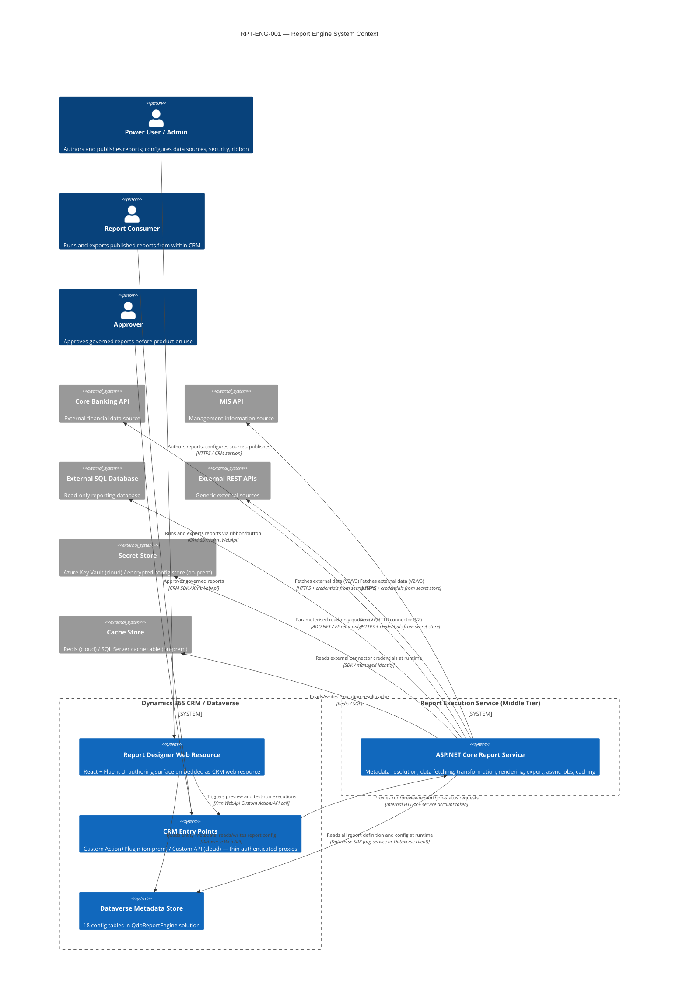
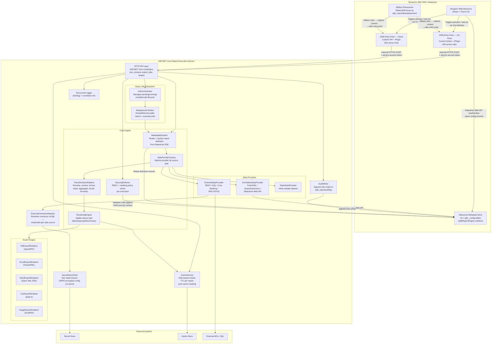
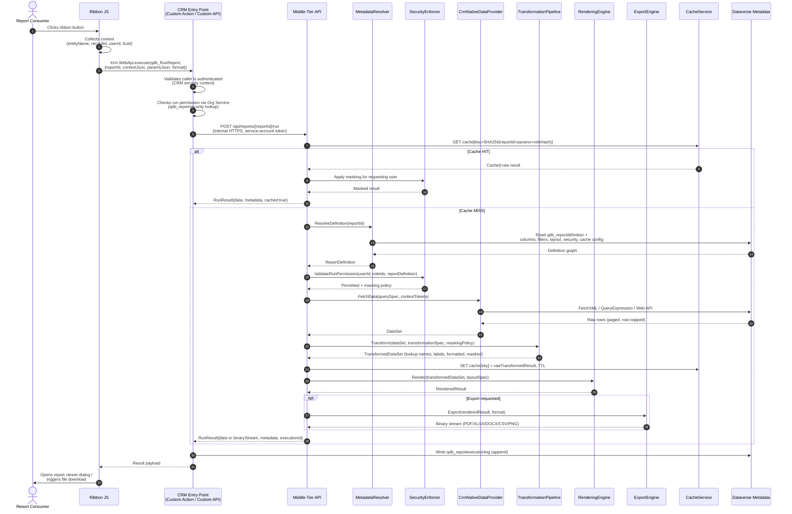

# Phase 3 — Core Architecture
# Workstream 1 of 4: System Architecture

| | |
|---|---|
| **Engagement ID** | RPT-ENG-001 |
| **Project** | report-engine |
| **Document** | Phase 3 — Architecture (Workstream 1: Core Architecture) |
| **Version** | 1.0 |
| **Date** | 2026-07-07 |
| **Author** | Architect (Maqsad AI) |
| **Status** | Draft — pending Phase 3 CEO gate |
| **Input documents** | phase-1-ceo.md (C-1..C-9), phase-2-ba.md (BRD v1.0), dependencies.md |
| **Dataverse solution** | `QdbReportEngine` / publisher prefix `qdb_` |

---

## System Overview

The Report Engine is a **metadata-driven, configuration-first reporting platform** embedded inside Dynamics 365 CRM (on-premise 9.x and Dataverse cloud). It is structured as three cooperating tiers: a React + Fluent UI **designer web resource** that reads and writes report definitions to a **Dataverse metadata store** (18 config tables), and an **ASP.NET Core middle-tier execution service** that reads those definitions at run time to fetch, transform, and render results. All heavy work — export rendering, external data calls, async job orchestration, caching — executes in the middle tier, never in the CRM plugin sandbox. Thin CRM entry points (Custom Action + IPlugin on-prem; Custom API on cloud) act exclusively as authenticated proxies between the CRM session and the internal middle tier.

---

## 1. System Context Diagram



---

## 2. Component Architecture

### 2.1 Component Diagram



### 2.2 Component Responsibilities

| Component | Tier | Responsibility |
|---|---|---|
| Designer Web Resource | CRM (browser) | Authoring surface; reads entity metadata from Dataverse; reads/writes report config records; triggers preview/test-run via CRM entry points; never calls the middle tier directly |
| Ribbon Placements | CRM (client JS) | Collects execution context (entityName, recordId, userId, buId, selectedIds) and calls the appropriate entry point |
| CRM Entry Points (on-prem / cloud) | CRM (server) | Authenticate caller via CRM security model; extract and validate context; relay request to middle tier over internal HTTPS; return result or jobId; enforce the 2-minute ceiling by detecting async need up front |
| Dataverse Metadata Store | Dataverse | Single source of truth for all report definitions, versions, security rules, cache config, ribbon placement, audit/execution logs; portable across on-prem and cloud |
| MetadataResolver | Middle tier | Reads and deserialises the full report definition from Dataverse at execution time; applies short-lived in-process cache (30 s) for repeated preview calls |
| SecurityEnforcer | Middle tier | Server-side RBAC check per execution: validates run permission, export permission, data-source access, business unit scope; applies masking policy |
| DataProviderFactory | Middle tier | Selects the correct IDataProvider implementation for each configured source type; composes results from multiple sources (V2+) |
| CrmNativeDataProvider | Middle tier | Executes FetchXML, QueryExpression, or Dataverse Web API queries against the Dataverse metadata-resolved configuration; handles paging, row cap enforcement |
| TransformationPipeline | Middle tier | Applies ordered transformations: lookup resolution, option-set label resolution, date/currency/number formatting, null handling, rename, aggregation, grouping, masking; evaluates NCalc formula fields (V2) |
| RenderingEngine | Middle tier | Applies the configured layout type (tabular, grouped, summary) to the transformed dataset; produces a structured result model passed to the export engine |
| Export Engine | Middle tier | Converts the result model to the requested format via the appropriate IExportRenderer; all five renderers (PDF/Excel/CSV/Word/Image) use the same input contract |
| JobOrchestrator | Middle tier | Creates, claims, tracks, and completes async job records in qdb_reportexecutionlog; surfaces partial results and failed sources |
| Background Worker | Middle tier | IHostedService that polls for Pending jobs, claims one at a time (optimistic lock via status CAS), executes the full pipeline, and stores results |
| CacheService | Middle tier | Role-keyed result cache (see §9); TTL-configurable per report; serves cached raw results; masking is always re-applied at retrieval time |
| AuditWriter | Middle tier | Writes append-only records to qdb_reportauditlog and qdb_reportexecutionlog; no UPDATE or DELETE ever issued on these tables |
| SecretStoreClient | Middle tier | Retrieves external connector credentials at runtime; never caches secrets in memory beyond the request lifetime |
| ExternalConnectorRegistry | Middle tier | Resolves connector configuration from qdb_externalconnector; validates credential availability before execution |

---

## 3. Runtime Execution Flows

### 3.1 Synchronous (Interactive) Path — CRM-Native Light Reports

Applies when: source type is CRM-native only (FetchXML / QueryExpression / Web API), estimated data volume is within threshold, and the report definition does not require external connector calls.



**2-minute ceiling enforcement:** The CRM entry point sets a configurable timeout on the middle-tier HTTP call (default: 90 seconds, leaving 30-second buffer before the 2-minute sandbox limit). If the synchronous call exceeds this threshold, the entry point cancels the HTTP request and falls through to the async path (see §3.2), returning a jobId to the caller instead of an inline result.

### 3.2 Asynchronous (Staged) Path — Heavy and External-Source Reports

Applies when: the report uses external connectors, large result sets, complex multi-source joins, or the synchronous timeout threshold is breached.

```mermaid
sequenceDiagram
    autonumber
    actor User as Report Consumer
    participant RIB as Ribbon JS
    participant EP as CRM Entry Point
    participant API as Middle-Tier API
    participant JO as JobOrchestrator
    participant DS as Dataverse
    participant BW as Background Worker
    participant MR as MetadataResolver
    participant DP as DataProviderFactory
    participant EXT as ExternalDataProvider
    participant SECRET as SecretStoreClient
    participant TP as TransformationPipeline
    participant RE as RenderingEngine
    participant EXP as ExportEngine
    participant CACHE as CacheService

    User->>RIB: Clicks ribbon button
    RIB->>EP: Xrm.WebApi.execute(qdb_RunReport,<br/>{reportId, contextJson, paramsJson, format})
    EP->>EP: Validates caller; checks run permission
    EP->>API: POST /api/reports/{reportId}/run
    API->>CACHE: Check cache — MISS
    API->>JO: CreateJob(reportId, userId, roleIds, paramsJson, format)
    JO->>DS: INSERT qdb_reportexecutionlog<br/>{status=Pending, jobId=GUID, ...}
    DS-->>JO: jobId
    JO-->>API: JobCreated{jobId}
    API-->>EP: AsyncResult{jobId, statusUrl}
    EP-->>RIB: {jobId, pollInterval}
    RIB->>User: "Report is being prepared…" (progress indicator)

    Note over BW,DS: Background Worker (IHostedService) polls continuously
    BW->>DS: Query qdb_reportexecutionlog<br/>WHERE status=Pending ORDER BY createdon
    DS-->>BW: [jobId, reportId, userId, params, ...]
    BW->>DS: UPDATE status=Running, claimedOn=now<br/>(optimistic concurrency on ETag)
    BW->>MR: ResolveDefinition(reportId)
    MR->>DS: Read full definition graph
    DS-->>MR: ReportDefinition (including externalConnector refs)

    par CRM source fetch
        BW->>DP: FetchCrmData(crmSourceSpec)
        DP->>DS: FetchXML / QueryExpression
        DS-->>DP: CRM rows
    and External source fetch (V2+)
        BW->>DP: FetchExternalData(connectorId)
        DP->>EXT: Execute(connectorSpec)
        EXT->>SECRET: GetCredentials(connectorId)
        SECRET-->>EXT: Credential
        EXT->>EXT: Call external API with retry + circuit-breaker
        alt External source success
            EXT-->>DP: ExternalRows
        else External source failure / timeout
            EXT-->>DP: PartialResult{sourceId, status=FAILED, error}
        end
    end

    BW->>TP: Transform(allSources, transformSpec, maskingPolicy)
    TP-->>BW: TransformedDataSet + resultQuality{FULL|PARTIAL|FAILED_PARTIAL}
    BW->>RE: Render(transformedDataSet, layoutSpec)
    RE-->>BW: RenderedResult
    BW->>EXP: Export(renderedResult, format)
    EXP-->>BW: Binary artifact
    BW->>CACHE: SET cache[key] = rawResult, TTL
    BW->>DS: UPDATE qdb_reportexecutionlog<br/>{status=Completed, resultQuality, resultRef}
    Note over BW,DS: resultRef = Dataverse Annotation attachment GUID<br/>OR Azure Blob SAS URL

    loop Polling (consumer)
        RIB->>EP: Xrm.WebApi.execute(qdb_GetJobStatus, {jobId})
        EP->>API: GET /api/jobs/{jobId}/status
        API->>DS: Read qdb_reportexecutionlog WHERE jobId
        DS-->>API: {status, resultQuality, resultRef}
        API-->>EP: {status, resultQuality}
        EP-->>RIB: {status}
        alt Status = Completed
            RIB->>EP: Xrm.WebApi.execute(qdb_FetchJobResult, {jobId})
            EP->>API: GET /api/jobs/{jobId}/result
            API->>CACHE: GET or read resultRef
            API->>API: Apply masking for requesting user
            API-->>EP: Result binary / JSON
            EP-->>RIB: Result
            RIB->>User: Opens viewer / triggers download
        else Status = Failed
            RIB->>User: Error message + partial result indicator
        end
    end
```

**Partial/failed external result surfacing:** The `resultQuality` field on qdb_reportexecutionlog carries one of `FULL | PARTIAL | FAILED_PARTIAL`. The rendered result includes a `_sourceStatus` array: one entry per data source with `{sourceId, displayName, status, errorSummary}`. The report viewer renders a banner when `resultQuality != FULL` listing which sources were unavailable.

---

## 4. On-Prem vs Cloud Strategy

### 4.1 Comparison Table

| Concern | On-Prem (CRM 9.x) | Dataverse Cloud | Identical? |
|---|---|---|---|
| Metadata store | Dataverse (same) | Dataverse (same) | **Yes** |
| Report definitions | qdb_ tables (same) | qdb_ tables (same) | **Yes** |
| Designer web resource | CRM web resource (same) | CRM web resource (same) | **Yes** |
| CRM entry point type | Custom Action + IPlugin | Custom API + Plugin | No — see §5 |
| CRM SDK in entry point | Microsoft.CrmSdk.CoreAssemblies | Microsoft.PowerPlatform.Dataverse.Client | No |
| Middle-tier hosting | IIS on Windows Server | Azure App Service (B2/P1v3 min) | No |
| Middle-tier SDK for Dataverse | Microsoft.CrmSdk.XrmTooling | Microsoft.PowerPlatform.Dataverse.Client | No (abstracted) |
| Export library code | Same ASP.NET Core assemblies | Same ASP.NET Core assemblies | **Yes** |
| Job persistence | qdb_reportexecutionlog in Dataverse (same) | qdb_reportexecutionlog in Dataverse (same) | **Yes** |
| Cache store | SQL Server cache table (secondary) | Azure Redis Cache (preferred) | No — same interface |
| Secret store | DPAPI-encrypted config / HashiCorp Vault | Azure Key Vault + Managed Identity | No — same ISecretStoreClient interface |
| Auth: entry point → middle tier | Service account + internal network mTLS | Entra ID Managed Identity bearer token | No — configured per target |
| Solution packaging | Managed solution (.zip, PAC CLI) | Managed solution (.zip, PAC CLI) | **Yes** |
| Deployment | PAC CLI + IIS Deploy | PAC CLI + `az webapp` / Azure DevOps | No — pipeline differs |

### 4.2 Abstraction Points

Three interfaces abstract the per-target divergence. The middle-tier core engine is **never** aware of which target it is running on.

```
IDataverseConnectionFactory
    OnPremConnectionFactory   → Microsoft.Xrm.Sdk.Client.OrganizationServiceProxy
    CloudConnectionFactory    → Microsoft.PowerPlatform.Dataverse.Client.ServiceClient

ICacheStore
    SqlServerCacheStore       → IDistributedCache over SQL Server
    RedisCacheStore           → IDistributedCache over Redis (StackExchange.Redis)

ISecretStoreClient
    DpapiSecretStoreClient    → DPAPI-decrypted config file (on-prem)
    KeyVaultSecretStoreClient → Azure Key Vault SDK + Managed Identity (cloud)
```

Configuration key `ReportEngine:Target` = `"OnPrem" | "Cloud"` selects the concrete implementations via DI registration in `Program.cs`. No other code branch on target.

### 4.3 On-Prem → Cloud Migration Path

The migration is a packaging and infrastructure change, not a schema or logic change.

| Migration step | Work required |
|---|---|
| 1. Export QdbReportEngine managed solution | `pac solution export` — identical on both targets |
| 2. Import into Dataverse cloud environment | `pac solution import` |
| 3. Update `appsettings.ReportEngine.json` `Target=Cloud` | Middle-tier config change |
| 4. Deploy middle tier to Azure App Service | CI/CD pipeline swap |
| 5. Register cloud Custom APIs against the existing Plugin assembly | PAC CLI registrar / Plugin Registration Tool |
| 6. Reconfigure secret store references in qdb_externalconnector | Point to Key Vault URIs |
| 7. Validate export rendering parity | Spike test (CEO condition C-7) |
| 8. Smoke-test 5 representative reports | Functional sign-off |

No report definition records require modification. No metadata schema changes. The only touching points are the DI target selection, the middle-tier host config, and the CRM entry point registration.

### 4.4 Export Rendering Parity Spike (CEO Condition C-7)

Before Phase 4 begins, a **time-boxed spike** (max 2 days) must produce a single ASP.NET Core test project that runs all five export renderers (QuestPDF, ClosedXML, Open XML SDK, CSV, ScottPlot) against a fixture dataset and produces artefacts on:

- Windows Server 2019/2022 (on-prem target)
- Linux container (Ubuntu 22.04 — Azure App Service default)

The spike passes if all five formats produce correct output on both OS targets. Any failures are escalated as blockers before Phase 4 sign-off.

---

## 5. CRM Entry Point Design

### 5.1 Design Principles

The entry points are **always thin**. They do exactly five things and nothing else:

1. Accept the incoming request parameters.
2. Validate the caller is authenticated (CRM session context is authoritative).
3. Determine whether the request will run synchronously or async (using the configured threshold).
4. Relay the request to the middle tier via internal HTTPS.
5. Return the result or jobId to the caller; write an execution log record.

They never: parse a report definition, execute a query, render an output, or do any work that could approach the 2-minute ceiling.

### 5.2 On-Prem: Custom Action + IPlugin

```
Custom Action Name: qdb_RunReport
Request parameters:
  reportId          (string, GUID)
  contextJson       (string, JSON: {entityName, recordId, selectedIds[], userId, buId})
  parametersJson    (string, JSON: user-supplied runtime params)
  format            (string: RUN | PDF | XLSX | DOCX | CSV | PNG)
  async             (bool: caller hint; engine may override)

Response parameters:
  executionId       (string, GUID — always returned)
  mode              (string: SYNC | ASYNC)
  resultJson        (string, JSON result payload — SYNC only)
  jobId             (string, GUID — ASYNC only)
  statusPollUrl     (string — ASYNC only; Custom Action name for polling)
  errorCode         (string)
  errorMessage      (string)
```

Plugin step: `PostOperation`, `Synchronous`, registered on the Custom Action message. The plugin reads `ReportEngineMiddleTierUrl` from an environment variable or Dataverse Environment Variable (`qdb_rpt_middle_tier_url`). It calls the middle tier using `HttpClient` obtained via `IOrganizationService` context's executing user identity impersonation pattern.

**2-minute ceiling logic (within the plugin):**

```
configuredSyncTimeoutMs = EnvironmentVariable("qdb_rpt_sync_timeout_ms") ?? 90000
if (async == true OR estimatedComplexity == HEAVY):
    mode = ASYNC → create job record → return jobId immediately
else:
    call middle tier with timeout = configuredSyncTimeoutMs
    if (timeout exceeded):
        create job record → return jobId (async fallback)
    else:
        return inline result
```

Complexity heuristic is determined by the middle tier on the first "complexity probe" call (lightweight metadata read, returns `{estimatedComplexity: LIGHT|HEAVY}`), which adds ~100ms before the main execution decision.

### 5.3 Cloud: Custom API

```
Custom API Unique Name:   qdb_RunReport
Binding Type:             Global
Plugin Type:              Bound to same Plugin assembly as on-prem
Is Function:              No (action)
```

The Custom API registers the same input/output parameters as the Custom Action. The plugin code is **identical** to the on-prem plugin; the only difference is the SDK package referenced (`Dataverse.Client` vs `CrmSdk`). A preprocessor constant `#if ONPREM / #if CLOUD` isolates the SDK references; the business logic is shared.

Second Custom API for job status polling:

```
Custom API Unique Name:   qdb_GetJobStatus
Request parameters:       jobId (string, GUID)
Response parameters:      status (string: Pending|Running|Completed|Failed)
                          resultQuality (string: FULL|PARTIAL|FAILED_PARTIAL)
                          completedOn (string, ISO datetime)
                          errorSummary (string)
```

### 5.4 Message Contracts (High Level)

Middle-tier internal HTTP contracts (detailed OpenAPI specs are Workstream 4):

| Method | Path | Purpose |
|---|---|---|
| POST | /api/reports/{reportId}/run | Synchronous run (returns result or 202 with jobId) |
| POST | /api/reports/{reportId}/preview | Designer preview (draft or published; limited rows) |
| GET | /api/jobs/{jobId}/status | Poll async job status |
| GET | /api/jobs/{jobId}/result | Fetch completed async result (masked per requesting user) |
| GET | /api/health | Health check: {status, version, timestamp, targets} |

Auth on all middle-tier endpoints: Bearer token (Entra ID on cloud; internal service-account HMAC token on-prem). The CRM entry point acquires/generates this token — the browser never holds it.

---

## 6. Ribbon Integration Design

### 6.1 Architecture

Ribbon buttons are **configuration-driven**, not hardcoded. `qdb_reportribbonplacement` records drive button generation.

```
qdb_reportribbonplacement
├── qdb_reportdefinitionid  (lookup → qdb_reportdefinition)
├── qdb_placementtype       (optionset: Form | HomeGrid | SubGrid | Dashboard | SiteMap)
├── qdb_entitylogicalname   (string: e.g. "account")
├── qdb_formid              (string, GUID — Form placements only)
├── qdb_subgridname         (string — SubGrid placements only)
├── qdb_ribbonlabel         (string: button display text)
├── qdb_iconwebresourcename (string: icon web resource logical name)
├── qdb_sequence            (int: button ordering)
├── qdb_scoperoles          (string, JSON array of CRM role GUIDs)
├── qdb_scopebusinessunits  (string, JSON array of BU GUIDs)
├── qdb_isactive            (boolean)
```

A **RibbonDiff generator** (a C# console tool, part of the solution build process) reads all active placement records and produces the `customizations.xml` / `RibbonDiff` XML for inclusion in the QdbReportEngine solution. This tool is run as part of the CI pipeline before `pac solution pack`.

### 6.2 Context Collection (Client JS)

A shared TypeScript web resource (`qdb_rpt_ribbon_handler.js`) is referenced by every button's command action:

```typescript
// Context resolution per placement type:
// Form:     Xrm.Page.data.entity.getId()
//           Xrm.Page.data.entity.getEntityName()
// HomeGrid: gridContext.getSelectedRows() → selectedIds[]
// SubGrid:  subGridControl.getSelectedRows()
// All:      Xrm.Utility.getGlobalContext().getUserId()
//           Xrm.Utility.getGlobalContext().userSettings.businessUnitId

function launchReport(reportId: string, placementType: string): void {
    const ctx = collectContext(placementType);       // → contextJson
    const params = collectRuntimeParams(reportId);   // prompts if params defined
    Xrm.WebApi.execute('qdb_RunReport', {
        reportId, contextJson: JSON.stringify(ctx),
        parametersJson: JSON.stringify(params), format: 'RUN'
    }).then(result => openReportDialog(result));
}
```

The report viewer opens via `Xrm.Navigation.navigateTo` as a custom page (cloud) or `Xrm.Navigation.openWebResource` (on-prem), passing the executionId or jobId as a query parameter.

### 6.3 Role Visibility Rules

Ribbon button `EnableRule` and `DisplayRule` functions in the command definition check the user's roles against `qdb_scoperoles` at render time using `Xrm.Utility.getGlobalContext().userSettings.roles`. A button is hidden if the runner's roles have no intersection with the placement's scope roles. This is a convenience check only — the server-side entry point always re-validates.

---

## 7. Designer Web-Resource UI Architecture

### 7.1 Panel Structure

The designer is a single-page React application (`qdb_rpt_designer.html` web resource), structured as a multi-step wizard with a persistent preview panel.

```
┌─────────────────────────────────────────────────────────────────────┐
│  [Back]  Report Name    ○ Draft  ●  Step 3 of 10    [Save] [Publish]│
├──────────────────────────┬──────────────────────────────────────────┤
│  Step Panel (left ~40%)  │  Preview Panel (right ~60%)              │
│  ─────────────────────   │  ─────────────────────                   │
│  Step 1: Header          │  [Run Preview]  ↻  Last run: 14:23       │
│  Step 2: Data Source     │                                          │
│  Step 3: Columns  ←      │  Preview table (Fluent DataGrid)         │
│  Step 4: Filters         │  Showing 50 of ~1,240 rows               │
│  Step 5: Parameters      │  ⚠ DRAFT — not published                │
│  Step 6: Sort & Group    │                                          │
│  Step 7: Transformations │                                          │
│  Step 8: Layout          │                                          │
│  Step 9: Export Settings │                                          │
│  Step 10: Security       │                                          │
│  Step 11: Ribbon         │                                          │
│  Step 12: Versions       │                                          │
└──────────────────────────┴──────────────────────────────────────────┘
```

### 7.2 State Management

State management uses **React Context + useReducer** (YAGNI — no Redux or Zustand until demonstrated need). Two contexts:

```
ReportDefinitionContext
  └── state: ReportDefinition (full draft in memory)
  └── dispatch: ReportDefinitionAction (UPDATE_HEADER, ADD_COLUMN, SET_FILTER, ...)

ExecutionContext
  └── state: {status, previewResult, lastRunAt, executionId}
  └── dispatch: {START_PREVIEW, PREVIEW_SUCCESS, PREVIEW_ERROR}
```

The `ReportDefinition` in state is the canonical in-memory representation. Every step panel reads from and dispatches to this context. On save, the designer serialises the definition and POSTs/PATCHes to the Dataverse Web API.

### 7.3 Metadata Reads

The designer reads entity metadata directly from Dataverse Web API (the logged-in CRM user's token is used automatically for web resource HTTP calls):

```
GET [org]/api/data/v9.2/EntityDefinitions
GET [org]/api/data/v9.2/EntityDefinitions(LogicalName='{entity}')/Attributes
GET [org]/api/data/v9.2/RelationshipDefinitions
```

These calls respect the user's read permissions — the entity picker shows only entities the author can read (FR-020). Entity and attribute metadata is fetched once per designer session and held in `useMemo` / module-level cache.

### 7.4 Filter Designer Integration

The filter step embeds `react-querybuilder` with the `@react-querybuilder/fluent` adapter:

```typescript
// Filter step converts fields to QueryBuilder fields schema
const fields = reportColumns.map(col => ({
    name: col.logicalName,
    label: col.displayName,
    inputType: mapCrmTypeToBuildType(col.dataType),
    operators: getOperatorsForType(col.dataType),
    values: col.optionSetValues,  // for optionset fields
}));

// On rule group change → convert to engine filter model
const handleQueryChange = (query: RuleGroupType) => {
    dispatch({ type: 'SET_FILTER', payload: convertQueryToFilterSpec(query) });
};
```

`convertQueryToFilterSpec` converts the react-querybuilder JSON format to the internal filter specification model stored in `qdb_reportfilter` records. The middle-tier `FetchXmlQueryBuilder` then converts the filter spec to FetchXML at execution time.

### 7.5 Preview

Preview calls flow through the CRM entry point (not directly to the middle tier). The designer calls:

```typescript
Xrm.WebApi.execute('qdb_RunReport', {
    reportId: currentReportId,  // null for unsaved drafts → POST inline definition
    parametersJson: JSON.stringify(testParams),
    format: 'RUN',
    previewMode: true,          // limits rows to 50; uses draft definition
    definitionJson: isDraft ? JSON.stringify(currentDefinition) : undefined,
})
```

The middle tier honours `previewMode: true` by capping rows at 50 and skipping the cache write.

---

## 8. Security and Governance Model

### 8.1 RBAC Architecture

Every enforced check is **server-side** in the middle-tier SecurityEnforcer. Client-side checks (entity picker, column picker, button visibility) are UX convenience only and are never trusted.

```
SecurityEnforcer.ValidateExecution(request):
  1. Resolve user's CRM security roles from Dataverse (cached 60 s per user)
  2. Read qdb_reportsecurity for the report:
       - runRoles[]    → user must have at least one intersecting role
       - exportRoles[] → additional check if format != RUN
       - ownerUserId   → checked for publish/unpublish operations
       - approverUserId → checked for governed report lifecycle
  3. Validate report status = Published (BR-1) — drafts rejected for consumer runs
  4. Validate business unit scope (if BU restriction configured)
  5. Resolve masking policy: list of column logical names to mask for this user
  6. Validate data-source access (V2: each source has its own role list)
  7. Return: SecurityContext{permitted, maskingPolicy, exportPermitted}
```

### 8.2 Draft / Published Gate (BR-1)

A report in `Draft` status can only be executed by:
- The report owner (test-run in the designer)
- A user with the `QDB Report Admin` security role

All other execution attempts are rejected with error `RPT-SECURITY-001: Report is not published`.

### 8.3 Approver / Owner Segregation (BR-3)

For reports where `qdb_reportsecurity.isGoverned = true`, the publish action requires:
- `approverId != ownerId` — system rejects if the same user attempts to self-approve
- Approval record in `qdb_reportauditlog` before status transitions to Published
- The CRM entry point validates this rule at publish-request time before calling the middle tier

### 8.4 Masking Enforcement (BR-5)

Masking is applied in `TransformationPipeline` as the **last step before any output** is produced. It is applied again on cache retrieval (cached data is stored unmasked; the SecurityEnforcer re-applies masking when serving from cache based on the requesting user's current masking policy — this handles policy changes without cache invalidation).

```
maskingPolicy.maskedColumns = [
    {logicalName, maskType: FULL | PARTIAL_LAST4 | HASH}
]

// TransformationPipeline final step:
foreach (row in dataSet):
    foreach (mask in maskingPolicy.maskedColumns):
        row[mask.logicalName] = applyMask(row[mask.logicalName], mask.maskType)
```

Masking configuration is stored in `qdb_reportcolumn.qdb_issensitive` + `qdb_masktype`. A column marked sensitive is **always** masked for users without the unmasked-data role, regardless of report configuration.

### 8.5 Append-Only Audit (BR-4)

`qdb_reportauditlog` and `qdb_reportexecutionlog` are written to by `AuditWriter` only. The Dataverse security role for the middle-tier service account grants `Create` on these tables and **no** `Write` or `Delete` privilege. Any attempt to update or delete an audit record fails at the Dataverse privilege layer.

Audit events written:
- Report created, modified, published, unpublished, cloned, deleted
- Version snapshot created, restored
- Approver assigned, approval granted/rejected
- Report executed (who, when, params hash, source, rowCount, duration, outcome, resultQuality)
- Export triggered (who, when, format)
- Security configuration changed

### 8.6 NCalc Sandbox (CEO Condition C-5)

NCalc is configured with an explicit allow-list:

```csharp
var expression = new Expression(formulaText)
{
    Options = EvaluateOptions.IgnoreCase
};

// Allow only these built-in functions — all others throw EvaluationException
var allowedFunctions = new HashSet<string>
    { "if", "round", "ceiling", "floor", "abs", "min", "max",
      "len", "left", "right", "mid", "concat", "trim",
      "isnull", "coalesce", "now", "today", "year", "month", "day" };

expression.EvaluateFunction += (name, args) => {
    if (!allowedFunctions.Contains(name.ToLower()))
        throw new SecurityException($"Function '{name}' is not permitted in formula expressions");
};

// Parameters are field values only — no .NET type injection
expression.Parameters["fieldName"] = rowValue;
```

No reflection, no assembly loading, no .NET type resolution. Parameter values are primitive (string, decimal, DateTime, bool). The `NCalcExpressionValidator` runs at designer save time to reject disallowed functions before they reach the execution engine.

### 8.7 External Credential Handling (CEO Condition C-9)

```
qdb_externalconnector
├── qdb_name              (string: connector display name)
├── qdb_connectortype     (optionset: REST | SQL | CoreBanking | MIS)
├── qdb_endpointurl       (string: base URL — no credentials embedded)
├── qdb_authtype          (optionset: ApiKey | OAuth2ClientCredentials | Basic | None)
├── qdb_credentialref     (string: secret name in Key Vault / config store)
├── qdb_fieldmapjson      (string: JSON field → column mapping)
├── qdb_timeoutms         (int: per-connector timeout)
├── qdb_maxretrys         (int)
├── qdb_circuitbreakerthreshold (int: failures before open)
```

The `qdb_credentialref` field stores only the **name** of the secret in the store, never the secret itself. `SecretStoreClient` resolves the actual credential at runtime per execution. Credentials are never logged, never included in error messages, and are held in memory for the duration of one HTTP call only.

---

## 9. Cross-Cutting Concerns

### 9.1 Caching Strategy

**Cache key:** `SHA-256(reportId | sorted(paramJson) | roleSetHash)`

`roleSetHash` is a deterministic hash of the user's sorted CRM security role GUID list. This allows cache sharing across users with identical role sets (common in large deployments with a defined role taxonomy).

**Cache storage:**
- On-prem: `IDistributedCache` implementation backed by SQL Server `qdb_reportcache_store` table (Microsoft.Extensions.Caching.SqlServer)
- Cloud: Azure Redis Cache (`StackExchange.Redis`; `IDistributedCache` wrapper)

Both are injected via the same `ICacheStore` interface — the core engine is unaware of which is active.

**TTL:** Per-report, stored in `qdb_reportcache.qdb_ttlseconds`. Default 900 s (15 min). Admin can set to 0 (no cache) or up to 86400 s (24 h) for heavy external reports.

**Masking and cache:** Raw (unmasked) transformed results are cached. Masking is applied on retrieval by `SecurityEnforcer.ApplyMasking(cachedResult, currentUserMaskingPolicy)`. This means policy changes take effect immediately without cache invalidation, and a single cache entry serves all users with the same role set regardless of their individual masking policies.

**Cache invalidation:** TTL-based only (V1). V2 adds: explicit invalidation on report definition change (write to audit log triggers cache key bust via a Dataverse plugin on qdb_reportdefinition update).

**Preview bypass:** Preview executions (`previewMode: true`) never read from or write to the cache.

### 9.2 Logging and Observability

All structured logging uses **Serilog** in the middle tier with sinks to: console (structured JSON), local file (on-prem), and Application Insights (cloud).

Every log entry carries:
```json
{
  "timestamp": "ISO8601",
  "level": "Information|Warning|Error",
  "correlationId": "GUID — propagated from X-Correlation-ID header",
  "service": "QdbReportEngine",
  "operation": "RunReport|FetchData|RenderPdf|...",
  "reportId": "GUID",
  "userId": "GUID",
  "executionId": "GUID",
  "durationMs": 1234,
  "rowCount": 450,
  "resultQuality": "FULL",
  "error": null
}
```

No secrets, no raw parameter values, no sensitive field values appear in logs. The `parametersJson` is logged with sensitive parameters replaced by `***MASKED***` based on the parameter type configuration.

Health endpoint: `GET /api/health` returns:
```json
{
  "status": "Healthy|Degraded|Unhealthy",
  "version": "1.0.0",
  "timestamp": "ISO8601",
  "checks": {
    "dataverse": "Healthy",
    "cache": "Healthy",
    "secretStore": "Healthy",
    "backgroundWorker": "Healthy|Idle|Degraded"
  }
}
```

### 9.3 Error Handling

All service methods return `Result<T>` (a discriminated union: `Success<T> | Failure<ErrorCode, string>`). No null returns. Exceptions are caught only at system boundaries (API controller, plugin Execute method) and converted to structured error responses.

Error codes are documented constants (e.g., `RPT-DATA-001: FetchXML query timed out`, `RPT-SEC-001: Report not published`, `RPT-EXP-001: PDF rendering failed`). The calling CRM entry point receives these codes and maps them to user-facing messages via the localisation table.

**Retry and circuit breaker (external connectors):**
- Retry: Polly `RetryPolicy` with exponential backoff (3 attempts: 1 s, 2 s, 4 s)
- Circuit breaker: Polly `CircuitBreakerPolicy` — opens after `qdb_circuitbreakerthreshold` consecutive failures; half-open after 30 s
- Timeout: per-connector `qdb_timeoutms`
- On open circuit: return `PartialResult{status=FAILED}` for that source; continue with available sources

### 9.4 Configuration-Not-Code

No hardcoded GUIDs, URLs, thresholds, or business rules in any source file. All runtime-variable values sourced from:

| Value | Source |
|---|---|
| Middle-tier URL | Dataverse Environment Variable `qdb_rpt_middle_tier_url` |
| Sync timeout (ms) | Dataverse Environment Variable `qdb_rpt_sync_timeout_ms` |
| Preview row limit | `appsettings.json` `ReportEngine:PreviewRowLimit` |
| Cache default TTL | `appsettings.json` `ReportEngine:DefaultCacheTtlSeconds` |
| Secret store name/vault URI | Environment variable `REPORT_ENGINE_VAULT_URI` |
| Per-report TTL | `qdb_reportcache.qdb_ttlseconds` in Dataverse |
| Per-connector timeout | `qdb_externalconnector.qdb_timeoutms` in Dataverse |
| Masking rules | `qdb_reportcolumn.qdb_issensitive` + `qdb_masktype` in Dataverse |

---

## 10. Architecture Decision Records

### ADR-RPT-001: Build the Metadata Engine; Adopt Point Libraries Only

**Status:** Accepted — 2026-07-07
**Context:** The GitHub research phase found no OSS report engine that satisfies the full constraint set: Dynamics 365 CRM integration, metadata-driven authoring (not template-file-centric), ASP.NET Core middle tier, dual on-prem/cloud target, and all five export formats in V1. jsreport (Node.js, LGPL), Carbone (CCL, template-centric), Stimulsoft (commercial, opaque), and BIRT (Java) were all rejected on stack, license, or capability grounds.

**Decision:** Build the metadata-driven report engine in-house using the ASP.NET Core middle tier. Adopt nine battle-tested point libraries for specific rendering primitives: NCalc (formulas), QuestPDF (PDF), Open XML SDK (Word), ClosedXML (Excel), ScottPlot (chart-to-PNG), Dataverse ServiceClient + CrmSdk (Dataverse connectivity), react-querybuilder + Fluent (filter UI), Fluent UI DataGrid (column/preview grid). Build a thin `FetchXmlQueryBuilder` and export engine coordinator in-house.

**Consequences:**
- We own the core engine and can evolve it without license or vendor constraints.
- Build effort is higher than wholesale adoption, but scoped precisely to requirements.
- Point library choices are individually well-maintained and MIT/open licensed (with the QuestPDF commercial license caveat documented).
- Risk: the engine is custom — defects are our responsibility. Mitigation: comprehensive unit + integration tests; clean-code standards enforced throughout.

**Alternatives rejected:** jsreport (Node.js mismatch); Carbone (CCL, template-file-centric, not metadata-driven); building on SSRS (defeats the purpose — SSRS is what we are replacing).

---

### ADR-RPT-002: ASP.NET Core as the Middle-Tier Report Execution Service

**Status:** Accepted — 2026-07-07
**Context:** The Maqsad AI constitution default backend stack is Node.js + TypeScript + Fastify. However, the constitution requires an ADR for any deviation. The CRM on-premise context mandates C# / Organization Service SDK (Article X). The adopted rendering libraries are all .NET-native (QuestPDF, ClosedXML, Open XML SDK, ScottPlot). The middle tier must also host NCalc (MIT, .NET) for formula evaluation. Bridging all these .NET libraries to a Node.js process would require a subprocess boundary, adding latency and failure surface. The client's platform team already operates .NET on-prem.

**Decision:** Deviate from the Node.js default. Build the middle-tier report execution service as an **ASP.NET Core Web API** (.NET 8 LTS, C#). This is a single deviation from the constitution default, justified by: (a) all rendering dependencies are .NET-native; (b) Dynamics CRM SDK is .NET-native; (c) the client platform is Windows/.NET on-prem; (d) eliminating a cross-runtime IPC boundary reduces failure surface.

**Consequences:**
- DevOps pipeline must include a .NET build step (dotnet publish, Docker image, or IIS WebDeploy).
- Clean-code standards (Article II common.md) apply to C# equally — same principles, C# idioms.
- Future Node.js services (if needed for other Maqsad AI engagements) remain unaffected.
- ADR index updated; C-7 spike validated on both Windows and Linux Docker.

**Alternatives rejected:** Node.js + node-ffi to call .NET assemblies (complex, fragile, unsupported), Node.js + subprocess for each render (high latency, poor error handling), separate Node.js API with .NET renderer sidecar (two services to deploy and operate for no benefit).

---

### ADR-RPT-003: Async/Staged Execution with Dataverse-Backed Job Queue

**Status:** Accepted — 2026-07-07
**Context:** CEO condition C-6 requires a defined async/staged execution model. Heavy reports (external sources, large row sets, complex rendering) cannot complete within the ~2-minute CRM plugin ceiling (NFR-002). Options considered: (a) Hangfire with SQL Server; (b) Azure Service Bus + Azure Functions; (c) Dataverse-backed job queue + IHostedService. The middle tier must be equally functional on-prem and cloud without separate infrastructure per target.

**Decision:** Use `qdb_reportexecutionlog` as the **job queue and state machine** (status: Pending → Running → Completed | Failed). An `IHostedService` background worker in the ASP.NET Core process polls for Pending records, claims one at a time using Dataverse ETag-based optimistic concurrency (`If-Match: *` header on the status update), executes the pipeline, and stores the result as a Dataverse Annotation attachment linked to the execution record. This pattern works identically on on-prem and cloud Dataverse without additional infrastructure.

**Consequences:**
- No additional queue infrastructure (Service Bus, RabbitMQ, Hangfire database) required in V1.
- Polling interval (configurable, default 5 s) means max job pickup latency of ~5 s — acceptable for heavy reports where users expect to wait minutes.
- At high concurrency (many simultaneous async jobs), Dataverse polling adds read pressure. Mitigation: configurable poll interval; scale middle-tier horizontally (multiple workers claim distinct jobs via optimistic lock).
- V2 can transparently swap to Azure Service Bus by adding an `IJobQueue` abstraction without touching the pipeline; job records remain the source of truth regardless.
- Result storage as Annotation attachment is limited to 128 MB by default Dataverse config. Large exports exceeding this limit are an edge case for V1 (flag as risk R-STORE-001); V2 introduces Azure Blob Storage / file share for large result artefacts.

**Alternatives rejected:** Hangfire — requires an additional SQL Server database (on-prem) or Azure SQL (cloud), adds a third-party dependency, and provides little benefit over the Dataverse queue at V1 concurrency levels. Azure Service Bus — cloud-only, requires additional Azure resource, incompatible with on-prem target without a hybrid relay.

---

### ADR-RPT-004: IExportRenderer Abstraction for On-Prem / Cloud Export Parity (CEO Condition C-7)

**Status:** Accepted — 2026-07-07
**Context:** CEO condition C-7 requires a single abstraction with per-target implementations, validated by an early spike. The five adopted export libraries (QuestPDF, ClosedXML, Open XML SDK, CSV built-in, ScottPlot) are all pure .NET with no OS-specific binaries. The risk (BRD R-4) is that rendering behaviour diverges between Windows (on-prem IIS) and Linux (Azure App Service default OS).

**Decision:** Define a single `IExportRenderer` interface:

```csharp
public interface IExportRenderer
{
    ExportFormat Format { get; }
    Task<ExportResult> RenderAsync(RenderedReport report, ExportOptions options,
                                   CancellationToken cancellationToken);
}
```

Five implementations: `PdfExportRenderer` (QuestPDF), `ExcelExportRenderer` (ClosedXML), `WordExportRenderer` (Open XML SDK), `CsvExportRenderer` (StreamWriter / RFC-4180), `ImageExportRenderer` (ScottPlot). All implementations are **identical** on on-prem and cloud — no per-target branches inside any renderer. The `ExportEngineCoordinator` resolves the correct implementation by `IEnumerable<IExportRenderer>` DI injection keyed on `ExportFormat`. The C-7 spike validates all five renderers on Windows and Linux before Phase 4 sign-off.

**Consequences:**
- Clean extensibility: a new export format (e.g., ODS, HTML) is a new `IExportRenderer` implementation registered in DI — no coordinator changes required (Open/Closed principle).
- The spike is a hard gate: if QuestPDF or ScottPlot behave differently on Linux (GDI+ dependency risk), the spike surfaces this before any production code is written.
- QuestPDF commercial license condition is carried into the go-live checklist.

**Alternatives rejected:** Separate renderer code paths per target (high maintenance cost, divergence risk); adopting a single HTML-to-PDF renderer (e.g., Puppeteer headless) as a universal approach — adds a Node.js / Chromium dependency to a .NET service, complex on-prem packaging.

---

### ADR-RPT-005: NCalc for Sandboxed Formula Evaluation (CEO Condition C-5)

**Status:** Accepted — 2026-07-07
**Context:** CEO condition C-5 is a hard security gate: formula/expression evaluation must be sandboxed, non-Turing-complete, and must never permit arbitrary code execution. DynamicExpresso (compiles C# lambdas — C-5 violation by design), Jint (full JavaScript engine — C-5 violation unless CLR access explicitly blocked and security-reviewed), and custom parser (high build cost) were evaluated.

**Decision:** Adopt **NCalc** (ncalc/ncalc, MIT, 1.1k stars). NCalc parses a closed DSL of arithmetic/logical operators, built-in math functions, and parameters. It has no .NET type resolution, no reflection access, and no assembly loading — it is structurally non-Turing-complete. An explicit allow-list of permitted functions (see §8.6) is enforced via `EvaluateFunction` hook. Parameters are injected as primitive values only. An `NCalcExpressionValidator` validates formula text at designer save time (rejects disallowed functions; checks parameter references against defined columns; type-checks operands).

**Consequences:**
- Formula expressiveness is limited to math/logic/string built-ins — intentional. Power users cannot call arbitrary methods or access objects.
- NCalc's 1.1k stars is near the 1000-star threshold; adoption is justified by: (a) it is the only .NET expression evaluator that satisfies C-5 by structure, not by configuration; (b) it is actively maintained (2026); (c) no viable alternative exists at the constraint boundary.
- If formula requirements grow beyond NCalc's built-in set, extend NCalc's `EvaluateFunction` hook with additional allow-listed custom functions — do not migrate to a Turing-complete evaluator.

**Alternatives rejected:** DynamicExpresso (C-5 violation — compiles C#), Jint (C-5 violation — full JavaScript), custom Antlr grammar parser (high cost, equivalent outcome).

---

### ADR-RPT-006: Dual CRM Entry Point — Custom Action+Plugin (On-Prem) vs Custom API (Cloud)

**Status:** Accepted — 2026-07-07
**Context:** CRM on-prem and Dataverse cloud have different registration models for server-side callable logic. On-prem 9.x supports Custom Actions (registered message + workflow activity / IPlugin step). Dataverse cloud supports Custom APIs (v9.1+ platform feature, native declarative registration). Both expose identical input/output parameter contracts to callers.

**Decision:** Maintain **two separate entry point registrations** with **one shared Plugin assembly**. The plugin code uses a `#if ONPREM / #if CLOUD` preprocessor split only for SDK package references. The business logic (`ProxyToMiddleTier`, `ValidateRunPermission`, `BuildRequestContext`) is in shared classes compiled into both targets. The `QdbReportEngine` solution ships with the plugin assembly and both registration configurations; the deployment pipeline activates the correct one per target environment.

**Consequences:**
- Callers (designer web resource, ribbon JS) always call `qdb_RunReport` — the name is the same on both targets. The web resource code does not branch on target.
- The plugin assembly must be compiled and tested against both SDK packages. CI pipeline runs two build configurations.
- On-prem Custom Action has a slightly higher execution overhead than Custom API (workflow step vs native Custom API dispatch). Acceptable — the entry point is thin; the overhead is immaterial compared to the middle-tier call latency.

**Alternatives rejected:** Single entry point using Dataverse Web API on both targets (on-prem requires org service for server-side operations; Web API is not available in the plugin sandbox on on-prem); maintaining two entirely separate plugin codebases (high maintenance cost, divergence risk).

---

### ADR-RPT-007: Role-Keyed Cache with Post-Retrieval Masking

**Status:** Accepted — 2026-07-07
**Context:** The cache must balance three concerns: (a) efficiency — avoid re-executing the same expensive query for every user; (b) security — never expose unmasked data to a user who should see masked data; (c) masking policy changes must take effect without requiring cache invalidation. User-keyed cache (one entry per user per report+params) eliminates sharing. Report-keyed cache (one entry per report+params, no user component) risks serving stale masking to users whose policy changes.

**Decision:** Key the cache on `SHA-256(reportId | sorted(paramsJson) | roleSetHash)` where `roleSetHash` is a deterministic hash of the sorted list of the user's CRM security role GUIDs. Store **raw transformed, unmasked data** in cache. Apply masking at retrieval time using the requesting user's **current** masking policy (fetched from SecurityEnforcer, cached 60 s per user). This means: (a) users with identical role sets share one cache entry; (b) masking policy changes take effect on the next request without flushing the cache; (c) the cache store never contains user-identifiable output.

**Consequences:**
- Cache hit rate is optimal for organisations with standardised role sets (which is the common case for Dynamics 365 deployments).
- The cache store holds unmasked data — it must be treated as sensitive. Access is restricted to the middle-tier service account only. The cache store (SQL Server table or Redis) must be in a network segment inaccessible from browser clients.
- If a user is assigned a new role that changes their data access (not just masking), the role change updates their `roleSetHash` → cache miss on next request → fresh data fetch. This is correct behaviour.
- Masking overhead at retrieval (~1-5 ms for typical datasets) is negligible compared to cache lookup time savings.

**Alternatives rejected:** User-keyed cache (defeats cache sharing, poor hit rate), post-masking cache storage per role-set (requires invalidation on policy change, complex), no cache (violates NFR-003 scalability requirement for heavy/repeated reports).

---

### ADR-RPT-008: Dashboard Fan-Out Concurrency Control and OBO Query Execution Model

**Status:** Accepted — 2026-07-19 (satisfies Phase-4 authorization condition AUTH-C-1)
**Context:** A V2-Dashboard (Milestone M2.5) loads up to 12 widgets, each **independently bound** to its own entity, query, and aggregation — up to 12 CRM queries per dashboard open, per user. At the DC-1 assumed peak (20 concurrent 12-widget opens; ASSUMPTION-1, QDB-confirmed), a naive fan-out issues **240 simultaneous Dataverse requests against a single service principal — a 4.6× overrun** of Dataverse's ~52-concurrent-request-per-user-identity service-protection limit, causing guaranteed 429 throttling. On-prem 9.x has no cloud-style limit, but 240 concurrent Organization Service connections saturate a typical 100-connection SQL pool. QDB's **DC-2 sign-off permits cloud execution in a permitted Azure region**, making a cloud-first path production-viable while on-prem 9.x remains a supported target. The DC-1 spike (`dc1-fanout-spike.md`) sets the SLA (per-widget P95 ≤ 4 s; dashboard-load P95 ≤ 15 s cold) and requires an approved concurrency model before any `DashboardExecutionService` code is written.

**Decision:** Introduce a dedicated **`DashboardExecutionService`** in the ASP.NET Core middle tier that governs dashboard fan-out. It composes existing components (`IReportDataProvider`, `ICacheStore` per ADR-RPT-007, `IJobOrchestrator`) **without modifying them** — V1 report execution is untouched. It applies six controls:
1. **Delegated (OBO) execution to distribute quota per user identity.** On **cloud**, each dashboard execution acquires the requesting user's delegated Dataverse token via **MSAL On-Behalf-Of**, so the ~52-request limit applies per *individual user*, not per shared service principal. On **on-prem 9.x**, use Organization Service **impersonation** (`CallerId` / `CallerObjectId`) on the service-account connection — same quota-distribution principle, different mechanism (aligns with ADR-RPT-006's dual entry point).
2. **Two-level concurrency caps.** A **per-dashboard `SemaphoreSlim(6)`** (config `Dashboard:MaxConcurrentWidgetQueries`) bounds simultaneous widget fetches for one dashboard open — each user stays at ≤ 6 of their own limit (~11.5%). A **global process `SemaphoreSlim`** (config `Dashboard:MaxConcurrentQueries`, default **40** cloud / **30** on-prem) backstops total concurrent CRM connections across the middle-tier process.
3. **Same-entity request grouping.** Widgets hitting the same entity in one dashboard are coalesced into a single **OData `$batch`** (cloud) / **`ExecuteMultiple` with `ContinueOnError = true`** (on-prem), reducing the 12-widget Customer-360 fixture from 12 requests to ~7.
4. **Role-keyed cache reuse with pre-warm.** Each widget result is cached under `SHA-256(widgetId | sorted(paramsJson) | roleSetHash)` (ADR-RPT-007), pre-warmed by a background job on dashboard publish. **When a Customer-360 entity is user-owned (DC-1b), the widget cache key additionally includes `userId`** for those widgets, preserving row-level correctness.
5. **Progressive (staged) load.** The dashboard returns a skeleton immediately; widgets stream in as queries resolve — perceived latency ≪ worst-case total.
6. **Resilience.** Per-target retry that **honours the Dataverse `Retry-After` header** with exponential backoff, a per-target **circuit breaker**, and **in-flight request coalescing** (dedupe concurrent identical cache-key requests so a burst collapses to one CRM call).

**Consequences:**
- Effective concurrent Dataverse requests per user identity drop from a naive process-wide 240 to **6 per user** (~11.5% of the cloud limit; well within on-prem pool headroom). Zero 429s expected in production at the stated peak.
- **OBO requires app-registration API permissions + admin consent** on cloud, and a **verified impersonation-privileged service account** on on-prem; both must be confirmed at M1 integration (AUTH-C-3 / DC-1c).
- All fan-out logic is isolated in `DashboardExecutionService`, protecting the V1 critical path.
- The **DC-1a load test** (20 concurrent cold-cache 12-widget opens; P95 ≤ 4 s; zero 429s; both targets) is the **M2.5 exit gate** validating this ADR in practice (AUTH-C-5).
- The cache holds unmasked data — inherits ADR-RPT-007's network-segmentation and service-account-only-access constraints.

**Alternatives rejected:** Shared service-principal fan-out (the naive model — guaranteed 4.6× throttling); unbounded parallel fan-out with retry-only (retries amplify load under throttling; no SLA guarantee); client-side fan-out from the browser web resource (exposes tokens/queries, no server-side batching or caching, worse throttling); a single merged mega-query per dashboard (impossible — widgets bind to different entities with different aggregations).

---

## 11. ADR Index

*Updated after every new ADR. Stored at `projects/report-engine/adrs/index.md`.*

| ADR | Title | Status | Date | Decided by |
|---|---|---|---|---|
| ADR-RPT-001 | Build metadata engine; adopt point libraries only | Accepted | 2026-07-07 | Architect |
| ADR-RPT-002 | ASP.NET Core middle-tier execution service (deviation from Node.js default) | Accepted | 2026-07-07 | Architect |
| ADR-RPT-003 | Async/staged execution with Dataverse-backed job queue | Accepted | 2026-07-07 | Architect |
| ADR-RPT-004 | IExportRenderer abstraction for on-prem/cloud export parity | Accepted | 2026-07-07 | Architect |
| ADR-RPT-005 | NCalc for sandboxed formula evaluation (C-5 compliance) | Accepted | 2026-07-07 | Architect |
| ADR-RPT-006 | Dual CRM entry point — Custom Action+Plugin vs Custom API | Accepted | 2026-07-07 | Architect |
| ADR-RPT-007 | Role-keyed cache with post-retrieval masking | Accepted | 2026-07-07 | Architect |
| ADR-RPT-008 | Dashboard fan-out concurrency control and OBO query execution | Accepted | 2026-07-19 | Architect |

---

## 12. Technology Stack

| Layer | Technology | Reason / ADR |
|---|---|---|
| Designer UI | React 18 + TypeScript + Fluent UI v9 (`@fluentui/react-components`) | Power Platform design language (FR-021); CRM web resource standard |
| Filter component | react-querybuilder + `@react-querybuilder/fluent` | Official Fluent adapter; MIT; 1.7k stars; 2026 maintained (dependencies.md) |
| Preview grid | Fluent UI DataGrid (bundled) | Already in stack; no additional dependency (dependencies.md) |
| Designer state | React Context + useReducer | YAGNI — no Zustand/Redux until demonstrated need |
| Metadata store | Dataverse — 18 × `qdb_` tables in QdbReportEngine solution | Single source of truth; portable across on-prem and cloud; CE condition C-8 |
| Middle-tier runtime | ASP.NET Core Web API (.NET 8 LTS) | ADR-RPT-002 — deviation from Node.js default; all rendering libs are .NET |
| PDF export | QuestPDF | 14.1k stars; MIT + commercial (license trap documented); ADR-RPT-004 |
| Excel export | ClosedXML | 5.6k stars; MIT; ADR-RPT-004 |
| Word export | Open XML SDK (DocumentFormat.OpenXml) | 4.6k stars; MIT; ADR-RPT-004 |
| Chart-to-PNG | ScottPlot | 6.7k stars; MIT; headless on Linux; ADR-RPT-004 |
| Formula evaluation | NCalc (NCalc2) | 1.1k stars; MIT; non-Turing-complete; ADR-RPT-005 / C-5 |
| Dataverse SDK (cloud) | Microsoft.PowerPlatform.Dataverse.Client | Official Microsoft SDK; MIT; dependencies.md |
| Dataverse SDK (on-prem) | Microsoft.CrmSdk.CoreAssemblies | Official Microsoft SDK; EULA; dependencies.md |
| Job queue | qdb_reportexecutionlog (Dataverse) + IHostedService | ADR-RPT-003; no extra infra for V1 |
| Cache (cloud) | Azure Redis Cache (IDistributedCache wrapper) | ADR-RPT-007; Standard tier for HA |
| Cache (on-prem) | SQL Server distributed cache (IDistributedCache wrapper) | ADR-RPT-007; same Dataverse SQL Server |
| Secret store (cloud) | Azure Key Vault + Managed Identity | C-9; no credentials in code or config |
| Secret store (on-prem) | DPAPI-encrypted config + ISecretStoreClient | C-9; platform-appropriate; same interface |
| Logging | Serilog (structured) | Observability standard; sinks: console, file, App Insights |
| Resilience | Polly (retry + circuit breaker) | External connector fault tolerance |
| Solution packaging | PAC CLI + managed solution | Constitution Article XI |
| CI/CD | GitHub Actions (cloud) / Azure DevOps (on-prem) | Constitution Article IX / DevOps |

---

## 13. Deployment Architecture

### 13.1 Environments

| Environment | CRM/Dataverse | Middle Tier | Cache | Secret Store |
|---|---|---|---|---|
| Dev | Dataverse sandbox | `dotnet run` local IIS Express | In-memory (non-persistent) | `appsettings.Development.json` DPAPI |
| Test | Dataverse sandbox | Docker container / local IIS | SQL Server table (test) | Key Vault (dev vault) |
| Staging | Dataverse sandbox (clone of prod data) | Azure App Service (B2) / IIS staging | Redis (Basic) / SQL Server | Key Vault (staging vault) |
| Production | Dataverse production | Azure App Service (P1v3) / IIS prod | Redis (Standard) / SQL Server (HA) | Key Vault (prod vault) |

### 13.2 CI/CD Pipeline Outline

```
[PR → main]
  1. dotnet build --configuration Release (both OnPrem + Cloud targets)
  2. dotnet test (unit tests — 80% coverage gate)
  3. npm test (designer web resource — Vitest)
  4. C-7 spike render test (all 5 formats on Linux runner)
  5. pac solution build (validates solution manifest)

[merge to main]
  6. pac solution export (pack solution zip)
  7. dotnet publish → Docker image or WebDeploy package
  8. Deploy to Test environment
  9. Integration test suite (Playwright + Supertest)
  10. Manual gate: QA sign-off

[release tag]
  11. pac solution import --environment staging
  12. Deploy middle tier to staging
  13. Smoke test
  14. Manual gate: CEO/PM approval
  15. pac solution import --environment production
  16. Deploy middle tier to production (blue-green or slot swap)
```

---

## 14. Architectural Risks

| ID | Risk | Likelihood | Impact | Mitigation |
|---|---|---|---|---|
| R-ARCH-001 | 2-minute ceiling breached by a synchronous report that the complexity probe incorrectly classified as LIGHT | Medium | High | Conservative LIGHT threshold; 90s HTTP timeout in entry point with async fallback; monitor p95 sync latency; tune threshold post-pilot |
| R-ARCH-002 | QuestPDF commercial license required (organisation revenue >$1M) and not budgeted | Low | Medium | Go-live checklist item; fallback: PdfSharp/MigraDoc (MIT) if QuestPDF licensing is blocked; evaluate during contract sign-off |
| R-ARCH-003 | Export library divergence on Linux (GDI+ / platform-native font rendering difference between Windows and Linux containers) | Medium | High | C-7 spike is a hard gate before Phase 4; QuestPDF uses its own rendering stack (not GDI+); ScottPlot is headless; risk is primarily in font availability — bake fonts into Docker image |
| R-ARCH-004 | Dataverse Annotation attachment limit (128 MB) exceeded by large export artefacts | Low | Medium | Flag as R-STORE-001; V1 row cap enforcement limits most outputs; V2 introduces Azure Blob / file share for large results |
| R-ARCH-005 | Dataverse polling by IHostedService creates contention at high async job concurrency | Low | Medium | Optimistic lock (ETag) prevents double-claim; configurable poll interval; horizontal scale adds more workers; V2 migrates to Service Bus if threshold is reached |
| R-ARCH-006 | Designer calls routing through CRM entry point (not direct to middle tier) adds visible latency to preview | Medium | Low | Preview uses 50-row cap; typical sync latency 300-800ms for light CRM data; acceptable for design-time UX; monitor and raise to architecture if preview P95 > 3s |
| R-ARCH-007 | NCalc's function allow-list is bypassed by a crafted formula that chains permitted functions to produce unintended side effects | Low | High | NCalc is structurally sandboxed (no .NET type access); the allow-list blocks all I/O and reflection paths; formula is a pure expression — no side effects possible by design; validate with a formal security review of the NCalc allow-list before Phase 5 |
| R-ARCH-008 | Role-keyed cache serves stale data if a user's data access changes (new role grants wider record scope) | Medium | Medium | Role change updates `roleSetHash` → cache miss → fresh data automatically; communicate this to operations: user role changes take effect on the user's next report run |
| R-ARCH-009 | On-prem CRM 9.x build/version (CEO condition C-1) unknown — connectivity between plugin sandbox and middle-tier may require network changes | Medium | High | Middle tier now owns all outbound calls; plugin only makes outbound call to middle tier (intranet). Validate the network path in the C-1 discovery step before Phase 4 begins |
| R-ARCH-010 | Secret store (DPAPI on on-prem) is machine-bound — middle tier cannot scale to multiple nodes without key sharing mechanism | Medium | Medium | DPAPI with a domain service account key shares across domain-joined machines; document as a constraint; evaluate HashiCorp Vault / CyberArk if multi-node on-prem is required |

---

## Skeptic Review

> **CHALLENGE 1 — Synchronous Timeout / Complexity Probe:** The "complexity probe" call (a lightweight metadata read that returns `LIGHT|HEAVY`) adds a round-trip before every synchronous execution. On a cold start or under Dataverse read latency, this could add 200-500ms before the actual work begins. At scale, probing adds up. What is the fallback if the probe itself times out? Is the probe reliable enough to justify its cost for every request, or should the threshold simply be caller-declared (the ribbon JS or designer indicates async intent)?

> **CHALLENGE 2 — Job Queue Scalability (Dataverse Polling):** The Dataverse-backed job queue works for V1 at low concurrency, but the poll-then-claim pattern under contention (e.g., 20 concurrent async jobs) will produce a thundering herd of ETag conflicts on `qdb_reportexecutionlog`. The Background Worker processes one job at a time per instance. Multiple IHostedService workers on the same instance (or horizontal scale) each poll and collide. What is the precise claim isolation strategy — does a single worker hold a configurable semaphore, or is the Dataverse optimistic lock the only guard? Has the Dataverse write rate limit been considered?

> **CHALLENGE 3 — Role-Set Hash Cache Correctness:** The `roleSetHash` assumes a user's role set is stable within a session. If an admin adds a role to a user mid-session, the user's next request produces a different `roleSetHash` (cache miss) and fetches fresh data — correct. But the SecurityEnforcer role cache (60 s per user) means the user could still be served the old role set for up to 60 seconds. For a security-sensitive masking policy change, 60 seconds is an exposure window. Is this acceptable, and has the compliance team been consulted?

> **CHALLENGE 4 — Annotation Attachment at 128 MB:** The 128 MB Dataverse Annotation limit is the *configured* default, not the absolute ceiling, and it varies by Dataverse version. For on-prem 9.x, the limit is controlled by the `MaxUploadFileSize` org setting (default 5 MB for most configurations — not 128 MB). Has the actual on-prem organisation's limit been verified? A 5 MB limit would break Excel exports of any medium-sized dataset. V2 (blob storage) is listed as a future fix, but this could be a V1 blocker, not a V2 concern.

> **CHALLENGE 5 — Plugin → Middle Tier Network Call:** On-prem, the IPlugin makes an outbound HTTP call from within the CRM plugin sandbox. The CRM plugin sandbox on on-prem 9.x has a configurable list of allowed outbound URLs (the deployment allowlist). If the middle-tier URL is not in the CRM deployment's `Allowed URI` list, the HTTP call is blocked by the sandbox — silent failure in the plugin. This is a critical infrastructure prerequisite (CEO condition C-1). The architecture states the dependency but the failure mode (blocked sandbox call with no meaningful error) is not documented. What is the operational procedure if this is discovered in UAT?

> **CHALLENGE 6 — Designer State: React Context at Scale:** React Context + useReducer is chosen (YAGNI principle) for the designer. A report definition can span 12 steps, with potentially hundreds of columns, dozens of filters, multiple parameters, multiple transformation rules, layout config, security config, and ribbon placements — all held in one context. Context re-renders all consumers on any dispatch. At what point does a column re-sort in step 3 cause an unnecessary re-render of the live preview in step 14? Has the context been split into stable (rarely-changing) and volatile (frequently-changing) slices, or will the entire tree re-render on every keypress in the column rename field?

> **CHALLENGE 7 — NCalc Allow-List at 3am:** The allow-list is enforced via an `EvaluateFunction` event hook. If a permitted function (`round`, `min`, etc.) is called with arguments that cause NCalc to internally invoke a delegate that resolves to a .NET type (through an edge case in the NCalc library), the sandbox fails open — not by design, but by implementation. This has not been tested. Who reviews NCalc release notes for security-relevant changes before version updates are applied?

> **CHALLENGE 8 — DPAPI Multi-Node Constraint:** The architecture notes that DPAPI is machine-bound and suggests domain service account key sharing as the mitigation for multi-node on-prem. This is correct only if all middle-tier nodes are joined to the same domain and use the same service account. An on-prem deployment behind a load balancer with multiple IIS nodes using different service accounts will silently fail to decrypt secrets on nodes that did not encrypt them. This is a deployment topology assumption that must be documented as a go-live prerequisite, not left as a footnote in the risk register.

> **CHALLENGE 9 — Ribbon RibbonDiff Generator:** The ribbon button generation relies on a C# console tool that reads active placement records and generates `customizations.xml`. This tool runs in the CI pipeline before `pac solution pack`. If the Dataverse environment is unavailable during CI (e.g., sandbox throttling, authentication failure), the ribbon generation step fails and blocks the entire release pipeline. Has the tool been designed to use a seeded local fixture as a fallback, or does every CI run require live Dataverse access?

> **CHALLENGE 10 — Simplicity Question:** The architecture introduces seven interfaces (`IDataverseConnectionFactory`, `ICacheStore`, `ISecretStoreClient`, `IExportRenderer`, `IDataProvider`, `IExternalConnector`, `IJobOrchestrator`) for extensibility. The constitution states: "Do not create base classes or interfaces for a single implementation." At V1 launch, `IDataverseConnectionFactory` will have two implementations (on-prem + cloud) — valid. `ISecretStoreClient` has two — valid. But `IExternalConnector` will have zero V1 implementations (external connectors are V2+). This interface should not be defined until V2 when a second implementation would justify it. Creating it now violates YAGNI and adds dead code to Phase 4.

These challenges must be addressed before Phase 4 begins.
