# Phase 3 Architecture — Dataverse ERD & Schema (Workstream 2 of 4)

| | |
|---|---|
| **Engagement** | RPT-ENG-001 (report-engine) |
| **Document** | Dataverse ERD + full 18-table schema |
| **Solution** | `QdbReportEngine` · publisher prefix `qdb_` |
| **Targets** | Dynamics 365 on-prem 9.x **and** Dataverse cloud (identical, portable schema) |
| **Date** | 2026-07-07 |

## Conventions (apply to every table — stated once)
- **Primary key:** platform GUID `qdb_<table>id` (Unique Identifier). No integer keys (enterprise rule).
- **Primary name column:** `qdb_name` (Single Line Text) unless noted.
- **Audit columns (platform-provided, on every table):** `createdby`, `createdon`, `modifiedby`, `modifiedon`, `ownerid`. Not repeated in each table below.
- **No hardcoded environment identifiers** in data (BR-9): entity/relationship references are stored by **logical/schema name (text)**, not by metadata GUID, so a definition is portable on-prem↔cloud.
- **Field-level auditing** enabled on `qdb_reportdefinition`, `qdb_reportsecurity`, `qdb_externalconnector` (governance-sensitive).

---

## 1. ERD

```mermaid
erDiagram
    qdb_reportdefinition ||--o{ qdb_reportversion : "has versions"
    qdb_reportdefinition ||--o{ qdb_reportdatasource : "has sources"
    qdb_reportdefinition ||--o{ qdb_reportentitymapping : "maps entities"
    qdb_reportdefinition ||--o{ qdb_reportcolumn : "has columns"
    qdb_reportdefinition ||--o{ qdb_reportfilter : "has filters"
    qdb_reportdefinition ||--o{ qdb_reportparameter : "has parameters"
    qdb_reportdefinition ||--o{ qdb_reportrelationship : "has drilldowns"
    qdb_reportdefinition ||--o{ qdb_reporttransformation : "has transforms"
    qdb_reportdefinition ||--o{ qdb_reportformula : "has formulas"
    qdb_reportdefinition ||--o{ qdb_reportlayout : "has layouts"
    qdb_reportdefinition ||--o{ qdb_reportexportsetting : "has export settings"
    qdb_reportdefinition ||--o{ qdb_reportribbonplacement : "has placements"
    qdb_reportdefinition ||--o{ qdb_reportsecurity : "has ACL rows"
    qdb_reportdefinition ||--o{ qdb_reportexecutionlog : "has executions"
    qdb_reportdefinition ||--o{ qdb_reportauditlog : "has audit rows"
    qdb_reportdefinition ||--o{ qdb_reportcache : "has cached results"
    qdb_reportdefinition }o--|| qdb_reportversion : "current version"
    qdb_reportdatasource }o--o| qdb_externalconnector : "uses connector"
    qdb_reportrelationship }o--o| qdb_externalconnector : "external key via"
    qdb_reportexecutionlog }o--o| qdb_reportversion : "ran version"

    qdb_reportdefinition {
        guid qdb_reportdefinitionid PK
        string qdb_name
        choice qdb_status
        lookup qdb_currentversionid FK
    }
    qdb_reportversion {
        guid qdb_reportversionid PK
        int qdb_versionnumber
        memo qdb_snapshotjson
    }
    qdb_externalconnector {
        guid qdb_externalconnectorid PK
        choice qdb_connectortype
        string qdb_secretreference
    }
```

**Aggregate root:** `qdb_reportdefinition`. All configuration child tables carry a required lookup `qdb_reportid → qdb_reportdefinition` with a parental/cascade-configurable relationship. `qdb_reportversion` holds the immutable serialized snapshot; `qdb_reportdefinition.qdb_currentversionid` points at the live published version. Log/audit/cache tables reference the definition (and version where relevant) but are **not** cascade-deleted from it (retention).

---

## 2. Table schemas

### 2.1 `qdb_reportdefinition` — Report Definition
The aggregate root: identity, ownership, lifecycle, and the main entity a report is built on.

| Display name | Logical name | Type | Req | Notes |
|---|---|---|---|---|
| Report Name | qdb_name | Single Line Text (200) | Y | Primary name |
| Description | qdb_description | Multiple Lines (2000) | N | |
| Category | qdb_category | Choice `qdb_reportcategory` | Y | Operational/Regulatory/Financial/Management/Adhoc |
| Module | qdb_module | Single Line Text (100) | N | Functional area (e.g. Lending, Collections) |
| Owner | ownerid | Owner (systemuser/team) | Y | Platform owner |
| Report Owner (business) | qdb_reportownerid | Lookup → systemuser | Y | Accountable business owner (FR-098) |
| Approver | qdb_approverid | Lookup → systemuser | N | Required for governed reports (BR-3) |
| Status | qdb_status | Choice `qdb_reportstatus` | Y | Draft/Published/Unpublished/Archived |
| Is Governed | qdb_isgoverned | Two Options | Y | Requires approver ≠ author (BR-3) |
| Main Entity Logical Name | qdb_mainentitylogicalname | Single Line Text (128) | Y | e.g. `account` — stored by logical name (BR-9) |
| Current Version | qdb_currentversionid | Lookup → qdb_reportversion | N | The live published snapshot |
| Default Layout | qdb_defaultlayoutid | Lookup → qdb_reportlayout | N | |
| Row Limit | qdb_rowlimit | Whole Number | N | Runaway-query guard (NFR-004); default via config |
| Timeout (sec) | qdb_timeoutseconds | Whole Number | N | Per-report execution ceiling |
| Execution Mode | qdb_executionmode | Choice `qdb_executionmode` | Y | Auto/Sync/Async — Auto lets engine decide |

**Option sets:** `qdb_reportcategory` {Operational, Regulatory, Financial, Management, Adhoc}; `qdb_reportstatus` {Draft, Published, Unpublished, Archived}; `qdb_executionmode` {Auto, Synchronous, Async}.
**Alternate key:** `qdb_name` + `qdb_module` (unique report identity per module).

### 2.2 `qdb_reportversion` — Report Version
Immutable snapshot of a report definition at publish time (BR-2).

| Display name | Logical name | Type | Req | Notes |
|---|---|---|---|---|
| Version Label | qdb_name | Single Line Text | Y | e.g. "v3" |
| Report | qdb_reportid | Lookup → qdb_reportdefinition | Y | |
| Version Number | qdb_versionnumber | Whole Number | Y | Monotonic |
| Snapshot JSON | qdb_snapshotjson | Multiple Lines (1048576) | Y | Full serialized definition (all child config) |
| Published By | qdb_publishedbyid | Lookup → systemuser | N | |
| Published On | qdb_publishedon | DateTime | N | |
| Is Current | qdb_iscurrent | Two Options | Y | Exactly one true per report |
| Change Note | qdb_changenote | Multiple Lines | N | |

**Alternate key:** `qdb_reportid` + `qdb_versionnumber` (unique).

### 2.3 `qdb_reportdatasource` — Report Data Source
One row per source a report reads from; a report may have several (multi-source).

| Display name | Logical name | Type | Req | Notes |
|---|---|---|---|---|
| Name | qdb_name | Single Line Text | Y | |
| Report | qdb_reportid | Lookup → qdb_reportdefinition | Y | |
| Source Type | qdb_sourcetype | Choice `qdb_sourcetype` | Y | See values below |
| Connector | qdb_connectorid | Lookup → qdb_externalconnector | N | Required for external types |
| Query Text | qdb_querytext | Multiple Lines | N | FetchXML / SQL / OData / endpoint path |
| Target Entity | qdb_targetentitylogicalname | Single Line Text (128) | N | For CRM types |
| Sequence | qdb_sequence | Whole Number | Y | Merge order |
| Is Primary | qdb_isprimary | Two Options | Y | The main dataset |
| Join Key (left) | qdb_joinkeyleft | Single Line Text | N | For multi-source combine |
| Join Key (right) | qdb_joinkeyright | Single Line Text | N | |
| Static Dataset JSON | qdb_staticdatasetjson | Multiple Lines | N | For Static source (FR-030) |

**Option set:** `qdb_sourcetype` {CRMView, FetchXML, QueryExpression, WebAPI, CustomAPI, SQL, RESTAPI, Middleware, CoreBanking, MIS, Static}.

### 2.4 `qdb_reportentitymapping` — Report Entity Mapping
Declares each entity a report touches and its alias, so columns/relationships resolve unambiguously.

| Display name | Logical name | Type | Req | Notes |
|---|---|---|---|---|
| Alias | qdb_name | Single Line Text | Y | Alias used by columns/filters |
| Report | qdb_reportid | Lookup → qdb_reportdefinition | Y | |
| Entity Logical Name | qdb_entitylogicalname | Single Line Text (128) | Y | BR-9 (name, not GUID) |
| Role | qdb_role | Choice `qdb_entityrole` | Y | Primary/Related/Lookup/Intersect |
| Parent Mapping | qdb_parentmappingid | Lookup → qdb_reportentitymapping | N | Self-ref for join tree |
| Relationship Schema Name | qdb_relationshipschemaname | Single Line Text | N | CRM relationship name |

**Option set:** `qdb_entityrole` {Primary, Related, Lookup, Intersect}.

### 2.5 `qdb_reportcolumn` — Report Column
Columns selected for output, with display and formatting metadata.

| Display name | Logical name | Type | Req | Notes |
|---|---|---|---|---|
| Column Name | qdb_name | Single Line Text | Y | Header text |
| Report | qdb_reportid | Lookup → qdb_reportdefinition | Y | |
| Entity Mapping | qdb_entitymappingid | Lookup → qdb_reportentitymapping | N | Which alias |
| Source Attribute | qdb_sourceattribute | Single Line Text (128) | Y | Logical attribute name |
| Data Type | qdb_datatype | Choice `qdb_columndatatype` | Y | Text/Number/Currency/Date/Boolean/OptionSet/Lookup |
| Format | qdb_format | Single Line Text | N | e.g. `dd/MM/yyyy`, `#,##0.00` |
| Width (px) | qdb_width | Whole Number | N | |
| Alignment | qdb_alignment | Choice `qdb_alignment` | N | Left/Center/Right |
| Aggregation | qdb_aggregation | Choice `qdb_aggregation` | N | None/Count/Sum/Avg/Min/Max |
| Sequence | qdb_sequence | Whole Number | Y | Column order |
| Is Masked | qdb_ismasked | Two Options | Y | Sensitive-field masking (FR-104) |
| Is Visible | qdb_isvisible | Two Options | Y | Hidden columns still queryable for formulas |

**Option sets:** `qdb_columndatatype` {Text, WholeNumber, Decimal, Currency, DateTime, Boolean, OptionSet, Lookup}; `qdb_alignment` {Left, Center, Right}; `qdb_aggregation` {None, Count, Sum, Avg, Min, Max}.

### 2.6 `qdb_reportfilter` — Report Filter
Author-defined and runtime filters; supports nested AND/OR groups.

| Display name | Logical name | Type | Req | Notes |
|---|---|---|---|---|
| Name | qdb_name | Single Line Text | Y | |
| Report | qdb_reportid | Lookup → qdb_reportdefinition | Y | |
| Entity Mapping | qdb_entitymappingid | Lookup → qdb_reportentitymapping | N | |
| Attribute | qdb_attribute | Single Line Text (128) | Y | |
| Operator | qdb_operator | Choice `qdb_operator` | Y | Full operator set (below) |
| Value | qdb_value | Multiple Lines | N | Literal or JSON list (for In/Between) |
| Parameter | qdb_parameterid | Lookup → qdb_reportparameter | N | Value bound to a runtime param |
| Context Token | qdb_contexttoken | Choice `qdb_contexttoken` | N | CurrentUser/BU/Record/Entity |
| Logical Group | qdb_logicalgroup | Whole Number | N | Grouping index for nesting |
| And/Or | qdb_andor | Choice `qdb_andor` | Y | Combines within group |
| Sequence | qdb_sequence | Whole Number | Y | |

**Option sets:** `qdb_operator` {Equals, NotEquals, Contains, BeginsWith, EndsWith, GreaterThan, LessThan, Between, In, NotIn, IsNull, IsNotNull, LastXDays, ThisMonth, ThisYear}; `qdb_andor` {And, Or}; `qdb_contexttoken` {None, CurrentUser, CurrentBU, CurrentRecord, CurrentEntity}.

### 2.7 `qdb_reportparameter` — Report Parameter
Runtime prompts shown to the report runner.

| Display name | Logical name | Type | Req | Notes |
|---|---|---|---|---|
| Name | qdb_name | Single Line Text | Y | Internal key |
| Report | qdb_reportid | Lookup → qdb_reportdefinition | Y | |
| Prompt | qdb_prompt | Single Line Text | Y | Label shown to runner |
| Parameter Type | qdb_parametertype | Choice `qdb_parametertype` | Y | See values |
| Is Required | qdb_isrequired | Two Options | Y | |
| Default Value | qdb_defaultvalue | Multiple Lines | N | |
| Context Token | qdb_contexttoken | Choice `qdb_contexttoken` | N | Auto-fill from context |
| Lookup Target Entity | qdb_lookuptargetentity | Single Line Text (128) | N | For Lookup type |
| Option Set Name | qdb_optionsetname | Single Line Text | N | For OptionSet type |
| Sequence | qdb_sequence | Whole Number | Y | Prompt order |

**Option set:** `qdb_parametertype` {Text, Number, DateRange, Lookup, OptionSet, MultiSelectOptionSet, Boolean}.

### 2.8 `qdb_reportrelationship` — Report Relationship / Drilldown
Drives multi-level drilldown and joins.

| Display name | Logical name | Type | Req | Notes |
|---|---|---|---|---|
| Name | qdb_name | Single Line Text | Y | |
| Report | qdb_reportid | Lookup → qdb_reportdefinition | Y | |
| Parent Entity | qdb_parententitylogicalname | Single Line Text (128) | Y | |
| Child Entity | qdb_childentitylogicalname | Single Line Text (128) | Y | |
| Relationship Type | qdb_relationshiptype | Choice `qdb_relationshiptype` | Y | 1:N/N:1/N:N/ManualJoin/ExternalKey |
| Relationship Schema Name | qdb_relationshipschemaname | Single Line Text | N | For CRM relationships |
| Parent Key | qdb_parentkey | Single Line Text | N | ManualJoin/ExternalKey |
| Child Key | qdb_childkey | Single Line Text | N | |
| External Connector | qdb_connectorid | Lookup → qdb_externalconnector | N | ExternalKey source |
| Drill Level | qdb_drilllevel | Whole Number | Y | 1 = first drill (V1 supports level 1) |
| Sub-Report | qdb_subreportid | Lookup → qdb_reportdefinition | N | Sub-report drilldown (FR-043) |
| Opens Record | qdb_opensrecord | Two Options | Y | Clickable row → CRM form (FR-044) |

**Option set:** `qdb_relationshiptype` {OneToMany, ManyToOne, ManyToMany, ManualJoin, ExternalKey}.

### 2.9 `qdb_reporttransformation` — Report Transformation
Ordered pipeline steps applied to the result set.

| Display name | Logical name | Type | Req | Notes |
|---|---|---|---|---|
| Name | qdb_name | Single Line Text | Y | |
| Report | qdb_reportid | Lookup → qdb_reportdefinition | Y | |
| Transformation Type | qdb_transformationtype | Choice `qdb_transformationtype` | Y | See values |
| Target Column | qdb_targetcolumn | Single Line Text | N | Column affected/created |
| Config JSON | qdb_configjson | Multiple Lines | N | Step-specific config |
| Sequence | qdb_sequence | Whole Number | Y | Pipeline order |

**Option set:** `qdb_transformationtype` {Rename, Merge, Split, LookupResolve, OptionSetResolve, CurrencyFormat, DateFormat, NumberFormat, ConditionalValue, ValueMapping, Aggregation, Grouping, Pivot, JsonFlatten, ExternalMap, DataMask, NullHandling}.

### 2.10 `qdb_reportformula` — Report Formula
Calculated columns via NCalc (sandboxed — no code exec, C-5).

| Display name | Logical name | Type | Req | Notes |
|---|---|---|---|---|
| Name | qdb_name | Single Line Text | Y | Column name produced |
| Report | qdb_reportid | Lookup → qdb_reportdefinition | Y | |
| Expression | qdb_expression | Multiple Lines | Y | NCalc expression |
| Result Type | qdb_resulttype | Choice `qdb_columndatatype` | Y | Reuses column datatype set |
| Target Column | qdb_targetcolumn | Single Line Text | Y | |
| Sequence | qdb_sequence | Whole Number | Y | After transforms it depends on |

### 2.11 `qdb_reportlayout` — Report Layout
Layout type and page chrome.

| Display name | Logical name | Type | Req | Notes |
|---|---|---|---|---|
| Name | qdb_name | Single Line Text | Y | |
| Report | qdb_reportid | Lookup → qdb_reportdefinition | Y | |
| Layout Type | qdb_layouttype | Choice `qdb_layouttype` | Y | 9 types |
| Show Header | qdb_showheader | Two Options | Y | |
| Show Footer | qdb_showfooter | Two Options | Y | |
| Show Logo | qdb_showlogo | Two Options | Y | |
| Show Page Number | qdb_showpagenumber | Two Options | Y | |
| Show Generated Date | qdb_showgenerateddate | Two Options | Y | |
| Show Generated By | qdb_showgeneratedby | Two Options | Y | |
| Watermark Text | qdb_watermarktext | Single Line Text | N | |
| Page Orientation | qdb_pageorientation | Choice `qdb_orientation` | N | Portrait/Landscape |
| Page Size | qdb_pagesize | Choice `qdb_pagesize` | N | A4/Letter/A3 |
| Layout Config JSON | qdb_layoutconfigjson | Multiple Lines | N | Group headers, totals, breaks, chart config |

**Option sets:** `qdb_layouttype` {Table, Grouped, Summary, CardKPI, MasterDetail, Drilldown, LetterDocument, Dashboard, Chart}; `qdb_orientation` {Portrait, Landscape}; `qdb_pagesize` {A4, Letter, A3, Legal}.

### 2.12 `qdb_reportexportsetting` — Report Export Setting
Enabled export formats and per-format options.

| Display name | Logical name | Type | Req | Notes |
|---|---|---|---|---|
| Name | qdb_name | Single Line Text | Y | |
| Report | qdb_reportid | Lookup → qdb_reportdefinition | Y | |
| Format | qdb_format | Choice `qdb_exportformat` | Y | PDF/Excel/CSV/Word/Image/HTML |
| Is Enabled | qdb_isenabled | Two Options | Y | |
| Filename Template | qdb_filenametemplate | Single Line Text | N | e.g. `{report}_{date}` |
| Options JSON | qdb_optionsjson | Multiple Lines | N | Per-format options |

**Option set:** `qdb_exportformat` {PDF, Excel, CSV, Word, Image, HTML}.

### 2.13 `qdb_reportribbonplacement` — Report Ribbon Placement
Where the report launches from and what context it receives.

| Display name | Logical name | Type | Req | Notes |
|---|---|---|---|---|
| Name | qdb_name | Single Line Text | Y | Button label |
| Report | qdb_reportid | Lookup → qdb_reportdefinition | Y | |
| Location | qdb_location | Choice `qdb_ribbonlocation` | Y | Form/HomeGrid/Subgrid/Dashboard/Sitemap |
| Target Entity | qdb_targetentitylogicalname | Single Line Text (128) | N | Scope to entity |
| Target Form | qdb_targetformid | Single Line Text | N | Scope to a specific form (name/id) |
| Scope Role | qdb_scoperolename | Single Line Text | N | Only show to a role |
| Scope BU | qdb_scopebuid | Lookup → businessunit | N | Only show in a BU |
| Pass Record Id | qdb_passrecordid | Two Options | Y | Context flag |
| Pass Selected Rows | qdb_passselectedrows | Two Options | Y | Grid multi-select |
| Pass User/BU | qdb_passuserbu | Two Options | Y | |

**Option set:** `qdb_ribbonlocation` {Form, HomeGrid, Subgrid, Dashboard, Sitemap}.

### 2.14 `qdb_reportsecurity` — Report Security
Per-principal ACL rows (layered on CRM RBAC, enforced server-side).

| Display name | Logical name | Type | Req | Notes |
|---|---|---|---|---|
| Name | qdb_name | Single Line Text | Y | |
| Report | qdb_reportid | Lookup → qdb_reportdefinition | Y | |
| Principal Type | qdb_principaltype | Choice `qdb_principaltype` | Y | Role/Team/User |
| Principal Ref | qdb_principalref | Single Line Text | Y | Role name / team name / user (by name, BR-9) |
| Can View | qdb_canview | Two Options | Y | |
| Can Run | qdb_canrun | Two Options | Y | FR-102 |
| Can Export | qdb_canexport | Two Options | Y | FR-103 |
| Can Edit | qdb_canedit | Two Options | Y | |
| Can Approve | qdb_canapprove | Two Options | Y | |
| Sequence | qdb_sequence | Whole Number | N | |

**Option set:** `qdb_principaltype` {SecurityRole, Team, User}.

### 2.15 `qdb_reportexecutionlog` — Report Execution Log
One row per execution (BR-11). Append-heavy; not cascade-deleted with the report.

| Display name | Logical name | Type | Req | Notes |
|---|---|---|---|---|
| Correlation Id | qdb_name | Single Line Text | Y | Also alt key |
| Report | qdb_reportid | Lookup → qdb_reportdefinition | Y | |
| Version | qdb_versionid | Lookup → qdb_reportversion | N | Which snapshot ran |
| Run By | qdb_runbyid | Lookup → systemuser | Y | |
| Run On | qdb_runon | DateTime | Y | |
| Parameters JSON | qdb_parametersjson | Multiple Lines | N | Redacted where sensitive |
| Source(s) | qdb_sources | Single Line Text | N | Summary of source types |
| Row Count | qdb_rowcount | Whole Number | N | |
| Duration (ms) | qdb_durationms | Whole Number | N | |
| Outcome | qdb_outcome | Choice `qdb_outcome` | Y | Success/Partial/Failed |
| Export Format | qdb_exportformat | Choice `qdb_exportformat` | N | If exported |
| Error | qdb_error | Multiple Lines | N | Error context (no secrets) |

**Option set:** `qdb_outcome` {Success, Partial, Failed}.
**Alternate key:** `qdb_name` (correlation id) — unique.

### 2.16 `qdb_reportauditlog` — Report Audit Log (APPEND-ONLY)
Change history of report configuration (BR-4). **Enforced append-only:** a plugin blocks Update/Delete on this table; security role grants Create + Read only.

| Display name | Logical name | Type | Req | Notes |
|---|---|---|---|---|
| Name | qdb_name | Single Line Text | Y | Short label |
| Report | qdb_reportid | Lookup → qdb_reportdefinition | Y | |
| Entity Affected | qdb_entityaffected | Single Line Text (128) | Y | Which config table |
| Record Ref | qdb_recordref | Single Line Text | N | Affected row id |
| Action | qdb_action | Choice `qdb_auditaction` | Y | Create/Update/Delete/Publish/Unpublish/Clone/Approve |
| Old Value JSON | qdb_oldvaluejson | Multiple Lines | N | |
| New Value JSON | qdb_newvaluejson | Multiple Lines | N | |
| Changed By | qdb_changedbyid | Lookup → systemuser | Y | |
| Changed On | qdb_changedon | DateTime | Y | |
| Correlation Id | qdb_correlationid | Single Line Text | N | Ties to execution/session |

**Option set:** `qdb_auditaction` {Create, Update, Delete, Publish, Unpublish, Clone, Approve, Reject}.

### 2.17 `qdb_externalconnector` — External Connector
Reusable connection config for external sources. **No secret stored here** — only a Key Vault reference (C-9).

| Display name | Logical name | Type | Req | Notes |
|---|---|---|---|---|
| Name | qdb_name | Single Line Text | Y | |
| Connector Type | qdb_connectortype | Choice `qdb_connectortype` | Y | SQL/RESTAPI/Middleware/CoreBanking/MIS/WebAPI |
| Base URL / Connection | qdb_baseurl | Single Line Text (500) | N | Endpoint or connection descriptor (no creds) |
| Auth Type | qdb_authtype | Choice `qdb_authtype` | Y | ApiKey/OAuth2/Basic/Certificate/ManagedIdentity |
| Secret Reference | qdb_secretreference | Single Line Text | N | Key Vault secret name (NOT the secret) |
| Timeout (sec) | qdb_timeoutseconds | Whole Number | N | |
| Is Active | qdb_isactive | Two Options | Y | |
| Residency Region | qdb_residencyregion | Single Line Text | N | For staged data placement (C-2) |

**Option sets:** `qdb_connectortype` {SQL, RESTAPI, Middleware, CoreBanking, MIS, WebAPI}; `qdb_authtype` {ApiKey, OAuth2, Basic, Certificate, ManagedIdentity}.

### 2.18 `qdb_reportcache` — Report Cache
Cached execution results for the async/staged path (FR-109, C-6).

| Display name | Logical name | Type | Req | Notes |
|---|---|---|---|---|
| Cache Key | qdb_name | Single Line Text (400) | Y | Hash of report+version+params+identity — alt key |
| Report | qdb_reportid | Lookup → qdb_reportdefinition | Y | |
| Version | qdb_versionid | Lookup → qdb_reportversion | N | |
| Payload | qdb_payload | Multiple Lines | N | Small result JSON (large → blob ref) |
| Blob Reference | qdb_blobreference | Single Line Text | N | For large results (Azure Blob / file) |
| Created On | qdb_createdon2 | DateTime | Y | Distinct from platform createdon for control |
| Expires On | qdb_expireson | DateTime | Y | TTL |
| Size (bytes) | qdb_sizebytes | Whole Number | N | |
| Hit Count | qdb_hitcount | Whole Number | N | |
| Identity Hash | qdb_identityhash | Single Line Text | N | Runner identity component of the key |

**Alternate key:** `qdb_name` (cache key) — unique. A scheduled job purges rows past `qdb_expireson`.

> **Note on the cache layer:** In cloud, the primary cache is **Redis** (consistent with DXP token-cache pattern); `qdb_reportcache` is the durable/audit record and the on-prem fallback store. On-prem without Redis uses this table + optional file/blob for large payloads. This split is confirmed in ADR (workstream 1) and the async model (C-6).

---

## 3. Portability & governance notes
- **On-prem ↔ cloud:** identical logical schema. The only environment-specific data is `qdb_externalconnector.qdb_secretreference` (points at the environment's own vault) and `qdb_reportcache` backing store. Report definitions reference entities/attributes/relationships/roles **by name**, so a `qdb_reportversion.qdb_snapshotjson` imports and runs on either target unchanged (C-8, BR-9).
- **Append-only audit** (BR-4): a synchronous plugin on `qdb_reportauditlog` blocks Update/Delete; the "Report Author" and "Report Admin" roles get Create+Read only on that table.
- **Every table** carries platform audit columns + GUID key (BR-10).
- **Indexes/alt keys** added: report identity (`qdb_reportdefinition`: name+module), version (`reportid+versionnumber`), execution (correlation id), cache (cache key). Lookups are auto-indexed by the platform.

## 4. Provisioning
Schema to be provisioned via an idempotent script (PAC CLI / Web API for cloud; on-prem solution import) — **not executed in this phase**. Deferred to Phase 4 build with a deployment runbook, consistent with prior engagements (guardrail: no live-org schema deploy without user approval).
